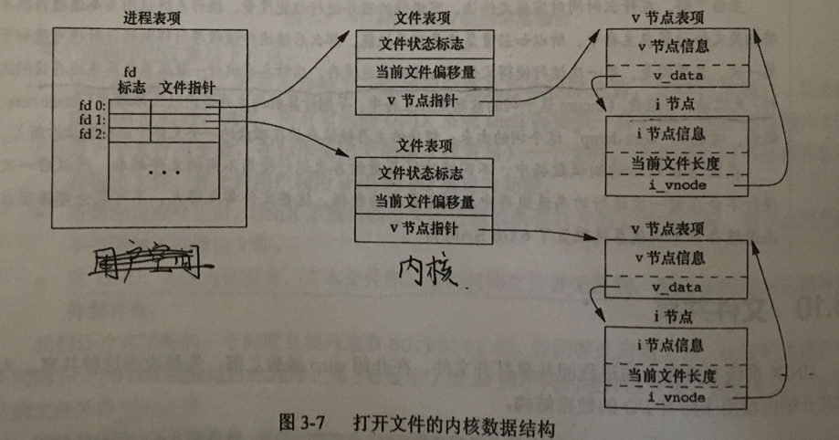
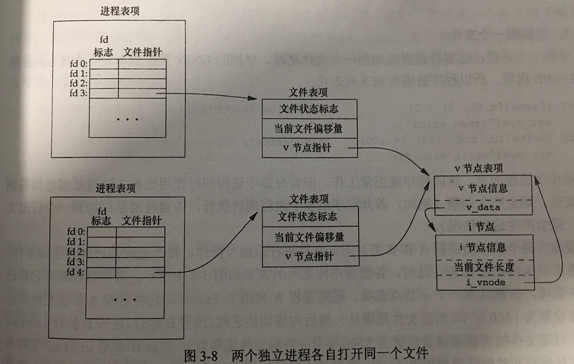

# 文件IO

## 不带缓冲IO
不带缓冲指的是每个read和write都调用内核中的一个系统调用。


## 文件描述符
当打开一个现有或创建一个新文件时，内核向进程返回一个文件描述符，文件描述符是一个非负整数，且只在本进程有效。

UINX系统shell把文件描述符0与进程的标准输入关联，文件描述符1与表述输出关联，文件描述符2与标准错误关联。

## 函数open和openat

```c
#include<fcnlt.h>
int open(const char *path, int oflag, ... /* mode-t mode */);
int openat(int fd, const char *path, int oflag, ... /* mode_t mode */);
/* 成功返回文件描述符，出错返回-1 */
```

对于open函数而言，仅当创建新文件时才使用最后这个参数。path参数时将要打开或创建文件。oflag参数可用来说明此函数的多个选项。用下列一个或多个常量进行或运算构成oflag参数。下面只讨论一些特别的oflag，更详细可参考linux手册。

* OCLOEXEC：把FS_CLOEXEC常量设置为文件描述符标志。
* O_EXCL：如果同时指定了O_CREAT，而文件已经存在，则出错。用次可以测试一个文件是否存在，如果不存在，则创建文件。这将测试文件是否存在和创建文件合并成一个原子操作。
* O_NONBLOCK：如果path引用的时一个FIFO、一个块特殊文件或一个字符特殊文件，则此选项为文件的本次打开操作和后续的I/O操作设置非阻塞方式。
* O_SYNC：使每次write等待物理I/O操作完成，包括由该write操作引起的文件属性更新所需的I/O。
* O_DSYNC：使每次write要等待物理I/O操作完成，与O_SYNC的区别在于仅当文件属性需要更新以反映文件数据变化时，才会影响文件属性。而O_SYNC数据和属性同步更新。

下面程序测试在同一进程多次打开同一个文件内核数据结构。
```c
#include<stdio.h>
#include<fcntl.h>

int main()
{
	int fd;
	if((fd = open("/root/Documents/apue/chapter3/test.txt", O_RDONLY)) < 0)
		printf("can't open this file\n");
	int fd2;
	if((fd2 = open("/root/Documents/apue/chapter3/test.txt", O_WRONLY)) < 0)
		printf("can't open this file2\n");
	printf("fd = %d, fd2 = %d\n", fd, fd2);
	int fd_flag, fd2_flag;
	fd_flag = fcntl(fd, F_GETFL);
	fd2_flag = fcntl(fd2, F_GETFL);
	if((fd_flag & O_ACCMODE) == O_RDONLY)
		printf("fd is read only\n");
	if((fd2_flag & O_ACCMODE) == O_WRONLY)
		printf("fd2 is write only\n");
	return 0;
}
```

这个程序输出：
```shell
fd = 3, fd2 = 4
fd is read only
fd2 is write only
```

这个程序表明在同一进程内打开两次同一个文件，返回的文件描述符不一样，对应的文件表项也不一样，有各自的文件表项，但共享共一个v节点，i节点。

## 函数lseek
默认地，当打开一个文件时，除非指定O_APPEND选项，否则该偏移量被设置为0。可以调用lseek显式地为一个打开文件设置偏移量。

```c
#include<unistd.h>
off_t lseek(int fd, off_t offset, int whence);
/* 若成功返回新的文件偏移量，若出错，返回-1 */
```

如果文件描述符指向的是一个管道、FIFO或网络套接字，则返回-1，并将errno设置ESPIPE。

**lseek仅将当前的文件偏移量记录在内核，它并不引起任何I/O操作。**

文件偏移量可以大于文件的当前长度，在这种情况下，对文件的下次写将加长该文件，并在文件中中间缺失的部分填充空字符\0，即形成空洞。

文件中的空洞并不要求在磁盘上占用存储区，这部分不分配磁盘块，也就是同样长度的亮哥文件，存在空洞的文件占磁盘空间更小。


## 函数read
```c
#include<unistd.h>
sszie_t read(int fd, void *buf, size_t nbytes);
/* 返回读到的字节数，若已到文件尾，返回0，出错返回-1。 */
```

有很多种情况导致实际读到的字节数少于要求读的字节数。
* 读普通文件时，在读到要求字节数之前已到达文件尾端。
* 当从终端设备读时，通常一次最多读一行（可以改变）。
* 当从网络读时，网络中的缓冲机制可能造成返回值少于要求读的字节数。
* 当从管道或FIFO读时，如若管道包含的字节少于所需的数量，只返回实际的字节数。
* 当从某些面向记录的设备（如磁带）读时，一次最多返回一个记录。
* 当一信号造成中断，而已经读了部分数据量时。


## 文件共享
UNIX系统支持不同进程间共享打开文件。先介绍内核用于所有I/O的数据结构。内核使用3种数据结构表示打开文件，它们之间的关系决定了文件共享方面一个进程对另一个进程可能产生的影响。
1. 每个进程在进程表中都有一个记录项，记录项中包含一张打开文件描述符表，可将其视为一个矢量，每个描述符占用一项。与每个文件描述符相关联的是：
* 文件描述符标志
* 指向一个文件表项的指针
2. 内核为所有打开文件维持一张文件表。每个文件表项包含：
* 文件状态标志（读、写、追加、同步和非阻塞等）
* 当前文件偏移量
* 指向该文件v节点表项的指针
3. 每个打开文件（或设备）都有一个v节点（v-node）结构。v节点包含了文件类型和对此文件进行各种操作函数的指针。对于大多数文件，v节点还包含了该文件的i节点（i-node，索引节点）。这些信息是在打开文件时从磁盘读入内存的，因此，文件的所有相关信息都是随时可用的。例如，i节点包含了文件的所有者、文件长度、指向文件实际数据块在磁盘上所在位置的指针等。

**注：Linux没有使用v节点，而是使用了通用i节点结构。虽然两种实现有所不同，但在概念上，v节点与i节点是一样的。两者都指向文件系统特有的i节点结构。**



上图（图1）显示了一个进程对应的3张表之间的关系。该进程有两个不同的打开文件：一个文件从标准输入打开（文件描述符0），另一个从标准输出打开（文件描述符1）。

**创建v节点结构的目的是对在一个计算机系统上的多文件系统类型提供支持。**

Linux没有将相关数据结构分为i节点和v节点，而是采用一个与文件系统相关的i节点和一个与文件系统无关的i节点。

如果两个独立进程各自打开了同一文件，则有如下图（图2）所示的关系。


如上图，之所以每个进程都获得自己的文件表项，是因为这可以使每个进程都有它自己的对该文件的当前偏移量。

根据这些数据结构，对一些操作进行说明。
* 在完成每个write后，在文件表项中的当前文件偏移量增加所写入的字节数。如果这导致当前文件偏移量超出了当前文件长度，则将i节点表项中的当前文件长度设置为当前文件偏移量（即文件加长了）。
* 如果用O_APPEND标志打开一个文件，则相应标志也被设置到文件表项的文件状态标志中。每次对这种具有追加写标志的文件执行写操作时，文件表项中的当前文件偏移量首先会被设置为i节点的当前文件长度。这就保证了每次写都在文件尾端写入（即便使用了lseek改变了文件偏移量）。
* 若一个文件用lseek定位到文件当前的尾端，则文件表项中的当前文件偏移量被设置为i节点表项中的当前文件长度。这和设置O_APPEND不一样，不能保证多进程中对同一个文件在文件尾端写入。例如，进程A利用lseek定位到尾端，那么这个进程的文件表项中的当前文件偏移量也为文件长度，若进程A还没有调用写入函数之前，进程A切换到进程B，进程B也利用lseek定位到尾端，然后调用write写入，此时进程B的文件表项中的当前文件偏移量增大了，i节点的当前文件长度也增大了，但进程A和进程B不是共用一个文件表项，进程A和进程B各自文件表项中的当前文件偏移量并不一样，而他们却共用一个i节点，也就是文件长度变大了，进程A的文件表项中的当前文件偏移量却没有更新，这个偏移量已不再等于文件长度了，如在进程B完成写入后，进程B再次切换进程A，进程A调用write函数进行写入，而此时文件表项中的文件偏移量并不是文件尾端，而是小于文件尾端。因此利用lseek不能保证在多进程中有效追加写，除非把lseek和write合并成原子操作。
* lssek函数只修改文件表项中的当前文件偏移量，不进行任何I/O操作。

可能有多个文件描述符指向同一文件表项。如dup函数复制的文件描述符和原文件描述符就指向同一文件表项。在fork后也会发生同样的情况，此时父进程、子进程各自的每一个文件描述符共享同一个文件表项。

**注意，文件描述符标志和文件状态标志在作用范围方面的区别，前者只用于一个进程的一个描述符，而后者则应用于指向该给定文件表项的任何进程中的所有描述符。**


## 原子操作
### 追到到一个文件
这个可以参考上一节文件共享对lseek和O_APPEND的讨论

### 函数pread和pwrite
该函数允许原子性地定位并执行I/O。
```c
#include<unistd.h>
ssize_t pread(int fd, void *buf, size_t nbytes, off_t offset);
/* 返回读到的字节数，若到尾端，返回0，出错返回-1 */
ssize_t pwrite(int fd, const void *fd, size_t nbytes, off_t offset);
/* 返回已写的字节数，出错返回-1 */
```

调用pread相当于调用lseek后调用read，但是pread又与这种顺序调用有下列重要区别：
* 调用pread时，无法中断其定位和读操作（即把lseek和read合并成原子操作）。
* 不更新当前文件偏移量。

同理，pwrite也有类似的区别，但不完全相同。pwrite会更新当前文件偏移量。

### 创建一个文件
当open函数指定O_CREAT和O_EXCL选项时，会把检查文件是否存在和创建文件合并成原子操作。


## 函数dup和dup2
函数dup和dup2用于复制一个现有的文件描述符。
```c
#include<unistd.h>
int dup(int fd);
int dup2(int fd, int fd2);
/* 返回新的文件描述符，出错返回-1 */
```

由dup返回的新文件描述符一定是当前可用文件描述符中的最小值。对于dup2，可用用fd2参数指定新描述符值。如果fd2已经打开，则先将其关闭。如若fd等于fd2，则dup2返回fd2，而不关闭它，否则fd2的FD_CLOEXEC文件描述符标志就被清除，这样fd2在进程调用exec时打开状态。dup2可用作重定向，如`dup2(fd, STDOUT_FILENOT)`就把标准输出重定向到fd。

这些函数返回的新文件描述符与参数fd共享同一个文件表项，如下图（图3）所示。


每个文件描述符都有它自己的一套文件描述符标志。新的描述符的执行时关闭（close_on_exec）标志总是由dup函数清除。
```c
/* 测试dup和dup2是否清除close-on-exec标志 */
#include<stdio.h>
#include<fcntl.h>
#include<unistd.h>

int main()
{
	int fd;
	if((fd = open("/root/Documents/apue/chapter3/test.txt", O_RDWR) < 0))
		printf("can't open this file\n");
	int fd_flag;
	if((fd_flag = fcntl(fd, F_GETFD) < 0))
		printf("can't get this fd flag\n");
	printf("origin fd flag: %d\n", fd_flag);

	/* 设置close-on-exec标志 */
	if(fcntl(fd, F_SETFD, fd_flag | FD_CLOEXEC) < 0)
		printf("set fd error\n");
	int new_fd_flag;
	if((new_fd_flag = fcntl(fd, F_GETFD)) < 0)
		printf("can't get new fd flag\n");
	printf("new fd flag: %d\n", new_fd_flag);

	/* dup复制描述符 */
	int dup_fd;
	if((dup_fd = dup(fd)) < 0)
		printf("can't duplicate this file\n");
	int dup_fd_flag;
	if((dup_fd_flag = fcntl(dup_fd, F_GETFD) < 0))
		printf("can't get newfd flag\n");
	printf("dup fd flag: %d\n", dup_fd_flag);

	/* dup2复制描述符 */
	int dup2_fd;
	if((dup2_fd = dup2(fd, 10)) < 0)
		printf("can't dup2 this fd\n");
	int dup2_fd_flag;
	if((dup2_fd_flag = fcntl(dup2_fd, F_GETFD)) < 0)
		printf("cant't get dup2 fd flag\n");
	printf("dup2 fd flag: %d\n", dup2_fd_flag);
	return 0;
}
```
运行上面代码得到的运行结果：
```shell
origin fd flag: 0
new fd flag: 1
dup fd flag: 0
dup2 fd flag: 0
```
可以看出，打开文件默认的文件描述符标志close-on-exec是清除的（值为0），当调用`fcntl(fd, F_SETFD, fd_flag | FD_CLOEXEC)`设置close-on-exec标志后，文件描述符标志close-on-exec是设置的（值为1），而执行dup和dup2，文件描述符标志close-on-exec是清除的。也就是说dup和dup2函数会清除close-on-exec标志。

复制一个描述符的另一种方式是使用fcntl函数，如
1. `dup(fd);`等效于`fcntl(fd, F_DUPFD, 0);`
2. `dup2(fd, fd2);`等效于`close(fd);fcntl(fd, F_DUPFD, fd2);`

在第二种情况下，dup2并不完全等同于close和fcntl。主要区别如下：
* dup2是一个原子操作，包含了close和fcntl函数调用。
* dup2和fcntl有一些不同的errno。


## 函数sync、fsync和fdatasync
传统的UNIX系统实现在内核中设有缓冲区高速缓存或页高速缓存，大多数磁盘I/O都通过缓冲区进行。当我们向文件写入数据时，内核通常先将数据复制到缓冲区中，然后排入队列，后面再写入磁盘。这种方式被称为**延迟写**。

为了保证磁盘上实际文件系统与缓冲区中内容的一致性，UNIX提供了sync、fsync和fdatasync函数：
```c
#include<unistd.h>
int fsync(int fd);
int fdatasync(int fd);
/* 若成功返回0，出错返回-1 */
void sync(void);
```

* sync只是将所有修改过的块缓冲区排入写队列，然后就返回，它并不等待实际写磁盘操作完成。通常，update系统守护进程周期性调用（一般每隔30秒）sync函数，保证定期冲洗内核的块缓冲区。
* fsync函数只对由文件描述符fd指定的一个文件起作用，并且等待写磁盘操作结束才返回。
* fdatasync类似fsync，但只影响文件的数据部分。而除数据外，fsync还会同步更新文件的属性。


## 函数fcntl
fcntl函数可以改变已经打开文件的属性。
```c
#include<fcntl.h>
int fcntl(int fd, int cmd, ... /* int arg */);
/* 成功返回的值取决于cmd，出错返回-1 */
```

fcntl函数有以下5种功能：
* 复制一个已有的文件描述符（cmd=F_DUPFD或F_DUPFD_CLOEXEC）。
* 获取/设置文件描述符标志（cmd=F_GETFD或F_SETFD）。
* 获取/设置文件状态标志（cmd=F_GETFL或F_SETFL）。
* 获取/设置异步I/O所有权（cmd=F_GETOWN或F_SETOWN）。
* 获取/设置记录锁（cmd=F_GETLK、F_SETLK或F_SETLKW）。

具体cmd参考linux手册。


## 函数ioctl
ioctl函数一直时I/O操作的杂物箱。终端I/O是使用ioctl最多的地方。
```c
#include<unistd.h>  /* System V */

#include<sys/ioctl.h>  /* BSD and Linux */

int ioctl(int fd, int request, ...);
/* 成功，根据情况返回值，失败返回-1 */
```

每个设备驱动程序可以定义它自己专用的一组ioctl命令，系统则为不同种类的设备提供通用的ioctl命令。下图总结了FreeBSD支持的通用ioctl命令的一些类别。

|   类别    |  常量名  |       头文件       | ioctl数 |
| -------- | ------- | ----------------- | ------- |
| 盘标号    | DIOxxx  | <sys/disklabel.h> | 4       |
| 文件I/O   | FIOxxx  | <sys/filio.h>     | 14      |
| 磁盘I/O   | MTIOxxx | <sys/mtio.h>      | 11      |
| 套接字I/O | SIOxxx  | <sys/sockio.h>    | 73      |
| 终端I/O   | TIOxxx  | <sys/ttycom.h>    | 43      |
图 FreeBSD中通用的ioctl操作


## /dev/fd
较新的系统都提供名为/dev/fd的目录，其目录项是名为0、1、2等的文件。打开文件/dev/fd/n等效于复制描述符n（假设描述符n是打开的）。

在`fd=open("/dev/fd/0", mode);`调用中，大多数系统忽略它所指定的mode，而另外一些系统则要求mode必须是所引用的文件（这里指的的标准输入）初始打开时所使用的打开模式的一个子集。因此这等效于`fd=dup(0)`，所以描述符0和fd共享同一文件表项。例如描述符0先前被打开为只读，那么对fd只能进行读操作。即使系统忽略打开模式，而且`fd = open("/dev/fd/0", O_RDWD);`是成功的，仍然不能对fd进行写操作。

**注，Linux实现中的/dev/fd是个例外。它把文件描述符映射成指向底层物理文件的符号链接。因此返回的新文件描述符的模式和/dev/fd文件描述符的模式其实不相关。**

/dev/fd文件主要由shell使用，它允许使用路径名作为调用参数的程序，能用处理其他路径名的相同方式处理标准输入和输出。例如，cat(1)命令对其命令行参数采取了一种特殊处理，它将单独的一个字符"-"解释为标准输入。

## 习题
1. 当读/写磁盘文件时，本章中描述的函数确实是不带缓冲机制的吗？请说明原因。
所有磁盘I/O都要经过内核的块缓存区（也称为内核的缓冲区高速缓存）。唯一例外的时对原始磁盘设备I/O，但是我们不考虑这种情况。既然read或write的数据都要被内核缓冲，那么术语**不带缓冲的I/O**指的是在用户的进程中对这个函数不会自动缓冲（在内核中还是会缓冲），每次read或write就要调用一次系统调用。

2. 编写一个和dup2功能相同的函数，要求不调用fcntl函数，并且有正确的出错处理。
这里的实现是比较简单的，没有考虑多进程、多线程等的情况：

```c
#include<stdio.h>
#include<fcntl.h>
#include<unistd.h>
#include<stdlib.h>
#include<string.h>

int same_dup2(int fd, int newfd);

int main()
{
	printf("复制标准错误输出描述符，并令新的描述符为10\n");
	int fd;
	if((fd = same_dup2(2, 10)) < 0)
		printf("复制文件描述符失败\n");
	printf("复制文件描述符成功，新的文件描述符为: %d\n", fd);
	return 0;
}

int same_dup2(int fd, int newfd)
{
	/* 如果fd等于newfd，直接返回fd */
	if(fd == newfd)
		return fd;

	/* 先关闭newfd，不管其是否有效 */
	close(newfd);

	/* 数组存储暂时打开的文件描述符 */
	int *temp_fds;
	if((temp_fds = (int *)malloc((newfd + 1) * sizeof(int))) == NULL)
	{
		printf("malloc error\n");
		exit(1);
	}
	/* 初始化temp_fds */
	memset(temp_fds, -1, (newfd + 1) * sizeof(int));

	int index = 0;
	for(int i = 0; i <= newfd; i++)
	{
		int temp_fd;
		if((temp_fd = dup(fd)) < 0)
		{
			/* 关闭多余的文件描述符，这可以写成一个函数，下面的判断也可以利用，
			 * 这里暂时偷懒。*/
			for(int j = 0; j < newfd; j++)
			{
				int temp_fd2;
				temp_fd2 = *(temp_fds +j);
				if(temp_fd2 == -1)
					break;
				close(temp_fd2);
			}
			free(temp_fds);
			printf("dup error\n");
			return -1;
		}
		if(temp_fd == newfd)
		{
			/* 关闭多余的文件描述符 */
			for(int j = 0; j < newfd; j++)
			{
				int temp_fd2;
				temp_fd2 = *(temp_fds + j);
				if(temp_fd2 == -1)
					break;
				close(temp_fd2);
			}
			free(temp_fds);
			return temp_fd;
		}
		else
		{
			*(temp_fds + index) = temp_fd;
			index++;
		}
	}
	return -1;
}
```

3. 假设一个进程执行下面3个函数调用：
```c
fd1 = open(path, oflags);
fd2 = dup(fd1);
fd3 = open(path, oflags);
```
画出进程文件描述符表，文件表项和v节点之间的关系图。对fcntl作用于fd1来说，F_SETFD命令会影响那个一个文件描述符？F_SETFL呢？

每次调用open函数就分配一个新的文件表项。但是因为两次打开的是同一个文件，则两个文件表项指向相同的v节点。调用dup引用已存在的文件表项（此处指fd1的文件表项），见下图。当F_SETFD作用于fd1时，只影响fd1的文件描述符标志；F_SETFL作用于fd1时，则影响fd1及fd2指向的文件表项。


4. 许多程序中都包含下面一段代码：
```c
dup2(fd, 0);
dup2(fd, 1);
dup2(fd, 2);
if (fd > 2)
    close(fd);
```
为了说明if语句的必要性，假设fd是1，画出每次调用dup2时3个描述符项及相应的文件表项的变化情况。然后画出fd为3的情况。

如果fd是1，执行dup2(fd, 1)返回1，但没有关闭文件描述符1。调用3次dup2之后，3个描述符指向相同的文件表项，所以不需要关闭描述符（因为0、1、2是shell默认打开的文件描述符）。如果fd为3，调用3次dup2后，有4个描述符指向相同的文件表项，这种情况下需要关闭描述符3。

5. 在Bourne shell、Bourne-again shell和Korn shell中，`digit1>&digit2`表示要将描述符digit1重定向至描述符digit2的同一文件。请说明下面两个命令的区别。
```shell
./a.out > outfile 2>&1
./a.out 2>&1 > outfile
```
（提示：shell从左到右处理命令行。）

第一条语句首先设置标准输出到outfile，然后执行dup将标准输出复制到描述符2（标准错误）上，其结果是是将标准输出和标准错误设置为同一个的文件，即描述符1和2指向同一个文件表项，都指向outfile的文件表项。
第二条语句由于首先执行dup，所以描述符2成为终端（假设命令是交互执行的），标准输出重定向到outfile。结果是描述符1指向outfile的文件表项，描述符2指向终端（标准输出）的文件表项。

6. 如果使用追加标志打开一个文件以便读、写，能否仍用lseek在任一位置开始读？能否用lseek更新文件中任一部分的数据？请编写一段程序验证。
```
test.txt
this is a test1!
this is a test2!
```

验证程序
```c
#include<stdio.h>
#include<fcntl.h>
#include<sys/types.h>
#include<unistd.h>

int main(void)
{
        int fd;
        if((fd = open("/root/Documents/apue/chapter2/test.txt", O_RDWR | O_APPEND)) < 0)
                printf("error in open test.txt\n");
        off_t pos;
        if((pos = lseek(fd, 2, SEEK_SET)) == -1)
                printf("can't seek this file\n");
        printf("read from postion %ld\n", pos);
        char buf[100];
        /* test read */
        read(fd, buf, 100);
        printf("%s", buf);
        /* test write */
        if((pos = lseek(fd, 0, SEEK_SET)) == -1)
                printf("can't seek this file\n");
        char content[] = "hello world!\n";
        printf("begin to write from 0\n");
        write(fd, content, sizeof(content));
        if((pos = lseek(fd, 0, SEEK_SET)) == -1)
                printf("can't seek this file\n");
        read(fd, buf, 100);
        printf("%s", buf);
        close(fd);
        return 0;
}
```

输出结果
```sh
read from postion 2
is is a test1!
this is a test2!
begin to write from 0
this is a test1!
this is a test2!
hello world!
```

这表明追加方式打开，仍然可以通过lseek在任一位置开始读。但不能通过lseek更新文件中任一部分的数据。
**实际上，lseek会更新文件表项中的当前文件偏移量，read会从当前文件偏移量开始读取。而指明APPEND追加方式打开后，write在写入之前会把i节点的文件当前长度更新到文件表项中的当前文件偏移量，然后再读取当前文件偏移量，在该位置开始写入，因此每次write都只能写到尾端。**