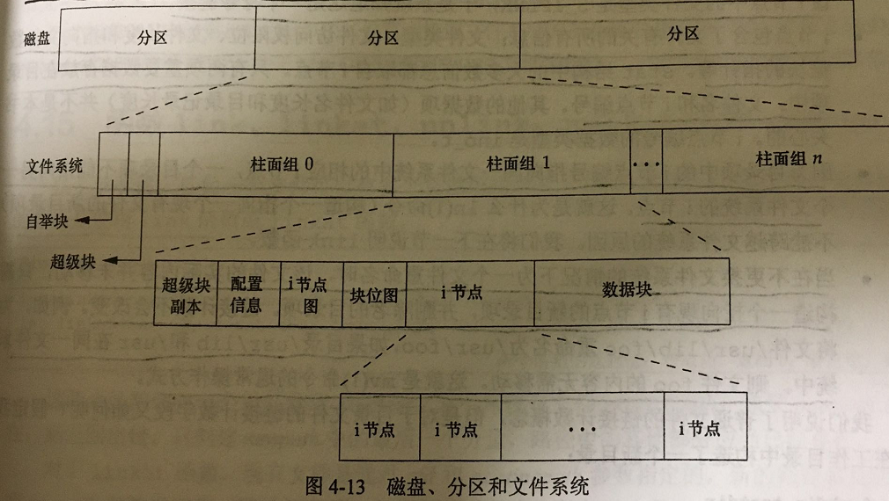
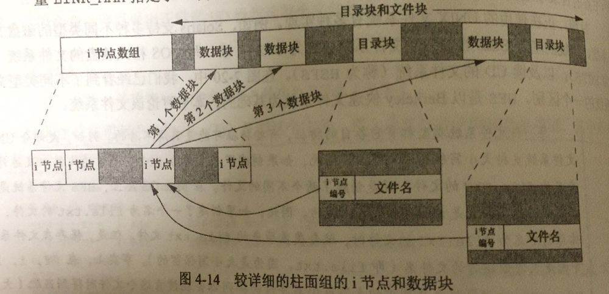
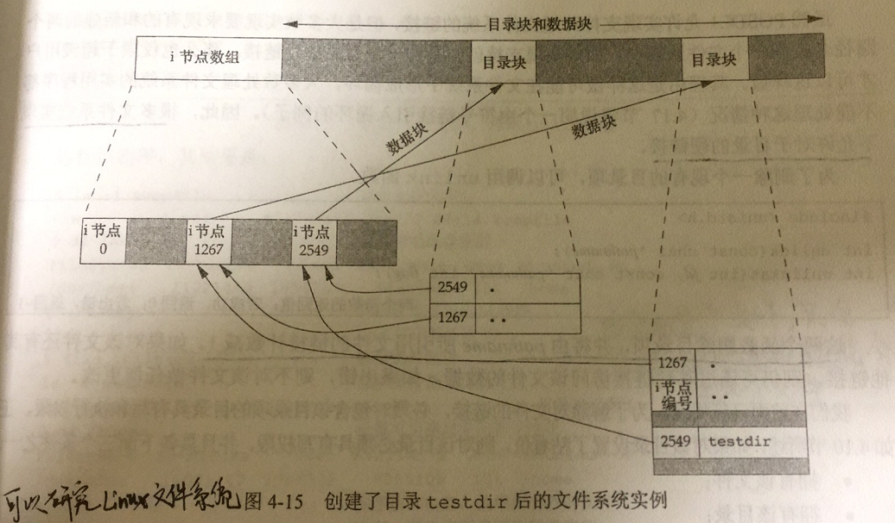

# 文件和目录

## 函数stat、fstat、fstatat和lstat
```c
#include<sys/stat.h>
int stat(const char *restrict pathname, struct stat *restrict buf);
int fstat(int fd, struct stat *buf);
int lstat(const char *restrict pathname, struct stat *restrict buf);
int fstatat(int fd, char *restrict pathname, struct stat *restrict buf, int flag);
```

lstat不跟随符号链接，返回的是符号链接文件的有关信息。fstatat函数为一个相对于当前打开目录（由fd参数指向）的路径名返回文件统计信息，flag参数参数控制着是否跟随着一个符号链接。当AT_SYMLINK_NOFOLLOW标志被设置时，fstatat不会跟随符号链接，而是返回返回符号链接本身的信息。否则，在默认情况下，返回的时符号链接指向的实际文件信息。如果fd的参数值时AT_FDCWD，并且pathname是一个绝对路径，fd参数就会被忽略。

第二个参数buf所指向的结构体基本形式是：
```c
struct stat {
    mode_t st_mode;  /* 文件类型 & 模式（权限） */
    ino_t st_ino;  /* i-node号（序列号） */
    dev_t st_dev;  /* 设备号（文件系统） */
    dev_t st_rdev;  /* 设备号（特别的文件 */
    nlink_t st_nlink;  /* 链接数 */
    uid_t st_uid;  /* 文件所属者用户ID */
    gid_t st_gid;  /* 文件所属组ID */
    off_t st_size;  /* 文件大小（字节），只针对普通文件 */
    struct timespec st_atime;  /* 最近访问时间 */
    struct timespec st_mtime;  /* 最近修改时间 */
    struct timespec st_ctime;  /* 最近改变时间 */
    blksize_t st_blksize;  /* 最佳I/O块大小 */
    blkcnt_t st_blocks;  /* 分配的磁盘块号 */
};
```

三个时间的区别：
* 最近访问时间：最近一次访问文件内容的时间。
* 最近修改时间：最近一次修改文件内容的时间。
* 最近改变时间：最近一次改变文件属性（如文件访问权限等）的时间。

利用stat函数测试文件test.txt
```c
#include<stdio.h>
#include<sys/stat.h>
#include<fcntl.h>

int main(void)
{
        struct stat st;
        int fd, flag;
        if((fd = open("test.txt", O_RDWR)) < 0)
                fprintf(stderr, "can't open this file\n");
        if((flag = fstat(fd, &st)) < 0 )
                fprintf(stderr, "can't stat this file\n");
        /* print this file info */
        printf("file type & mode: %d\n", st.st_mode);
        printf("i-node number: %ld\n", st.st_ino);
        printf("device number(file system): %ld\n", st.st_dev);
        printf("device number for special files: %ld\n", st.st_rdev);
        printf("number of links: %ld\n", st.st_nlink);
        printf("user ID of owner: %d\n", st.st_uid);
        printf("group ID of owner: %d\n", st.st_gid);
        printf("size in bytes, for regular files: %ld\n", st.st_size);
        printf("best I/O block size: %ld\n", st.st_blksize);
        printf("number of disk blocks allocated: %ld\n", st.st_blocks);
        return 0;
}
```

其输出是：
```sh
file type & mode: 33188
i-node number: 5622728
device number(file system): 64768
device number for special files: 0
number of links: 1
user ID of owner: 0
group ID of owner: 0
size in bytes, for regular files: 30
best I/O block size: 4096
number of disk blocks allocated: 8
```

与在shell直接调用stat比较：
```c
  File: ‘test.txt’
  Size: 30        	Blocks: 8          IO Block: 4096   regular file
Device: fd00h/64768d	Inode: 5622728     Links: 1
Access: (0644/-rw-r--r--)  Uid: (    0/    root)   Gid: (    0/    root)
Context: unconfined_u:object_r:admin_home_t:s0
Access: 2020-03-18 22:54:12.128995332 +0800
Modify: 2020-03-18 22:54:12.128995332 +0800
Change: 2020-03-18 22:54:12.128995332 +0800
 Birth: -
```


## 文件类型
（1）普通文件（regular file）。这种文件包含了某种形式的数据，至于是文本还是二进制数据，对于UNIX内核而言并无区别。值得注意的是二进制可执行文件，为了执行程序，内核必须理解其格式，所有二进制可执行文件都遵循一种标准化的格式，这种格式使内核能够确定程序文本和数据的加载位置。
（2）目录文件（directory file）。这种文件包含了其他文件的名字以及指向与这些文件有关信息的指针。对一个目录文件具有读权限的任一进程都可以读该目录的内容（只能读取目录下的文件名字），但只有内核可以直接写目录文件。对目录文件具有执行权限的任一进程都可以对该目录下的所有文件操作（只有对这些文件有权限）。
（3）块特殊文件（block special file）。这种类型的文件提供对设备（如磁盘）带缓冲的访问，每次访问以固定长度为单位进行。
（4）字符特殊文件（character special file）。这种类型的文件提供对设备不带缓冲的访问，每次访问的长度可变。系统中的所有设备要么是字符特殊文件，要么是块特殊文件。
（5）FIFO。这种类型的文件用于进程间通信，有时也称为命名管道（named pipe）。
（6）套接字（socket）。这种类型的文件用于进程间通信。套接字也可以用于在一台宿主机上进程之间的非网络通信。
（7）符号链接（symbolic link）。这种类型的文件指向另一个文件。

文件类型信息包含在sat结构的st_mode成员中。可以用图4-1中的宏确定文件类型。这些宏的参数都是stat结构的st_mode成员。

|     宏     |   文件类型   |
| ---------- | ----------- |
| S_ISREG()  | 普通文件     |
| S_ISDIR()  | 目录文件     |
| S_ISCHR()  | 字符特殊文件 |
| S_ISBLK()  | 块特殊文件   |
| S_ISFIFO() | 管道或FIFO  |
| S_ISLNK()  | 符号链接     |
| S_ISSOCK() | 套接字           |
图4-1 在<sys/stat.h>中的文件类型宏

POSIX.1允许实现将进程间通信（IPC）对象（如消息队列和信号量等）说明为文件。图4-2中的宏可用于从stat结构中确定IPC对象的类型。这些宏与图4-1的不同，它们的参数并非st_mode，而是指向stat结构的指针。

|      宏       |  对象的类型  |
| ------------- | ----------- |
| S_TYPEISMQ()  | 消息队列     |
| S_TYPEISSEM() | 信号量      |
| S_TYPEISSHM() | 共享存储对象 |
图4-2 在<sys/stat.h>中的IPC类型宏


## 设置用户ID和设置组ID
与一个进程相关的ID有6个或更多，如图4-5所示：

|       ID        |                            作用                             |
| --------------- | ----------------------------------------------------------- |
| 实际用户ID      | 打开该进程实际用户，取自口令文件                               |
| 实际组ID        | 打开该进程实际组                                             |
| 有效用户ID      | 用于文件访问权限检查（当在进程中打开文件）                      |
| 有效组ID        | 同上                                                        |
| 附属组ID        | 同上                                                        |
| 保护的设置用户ID | 由exec函数保存，在执行一个程序时包含了有效用户ID和有小组ID的副本 |
| 保存的设置组ID   | 同上                                                        |

在文件模式字（st_mode）中设置一个特殊标志（设置用户ID（set-user-ID）位），可以达到当执行此文件时，将进程有效用户ID设置为文件所有者的用户ID（st_uid）。同理，对于用户组也有一个设置组ID（set-group-ID）位，这可以使某些程序得到额外的权限去做某些事情。设置用户ID位和设置组ID位都包含在文件的st_mode值中，通常用宏S_ISUID和S_ISGID测试。


## 文件访问权限
st_mode值也包含了对文件的访问权限位。所有文件类型（目录、字符特殊文件等）都由访问权限。每个文件有9个访问权限位，可以分成3类，分别是用户、组和其他，如图4-6：

| st_mode屏蔽 |   含义   |
| ----------- | ------- |
| S_IRUSR     | 用户读   |
| S_IWUSR     | 用户写   |
| S_IXUSR     | 用户执行 |
| S_IRGRP     | 组读     |
| S_IWGRP     | 组写     |
| S_IXGRP     | 组执行   |
| S_IROTH     | 其他读   |
| S_IWOTH     | 其他写   |
| S_IXOTH     | 其他执行 |
图4-6 9个访问权限位，取自<sys/stat.h>

图4-6中的3类访问权限以各种方式由不同的函数使用。不同的使用方式如下：
* 用名字打开一类型的文件时，对该名字中包含的每一个目录，包括它可能隐含的当前工作目录都应具有执行权限。对目录具有执行权限代表能访问这个目录，搜索该目录下的文件，而对目录具有读权限代表只能获取该目录下的文件名，并不能搜索和访问这个目录。例如，为了打开/usr/include/stdio.h，需要对目录/、/usr和/usr/include具有执行权限，而对于对文件进行操作，这和文件的自身权限有关。
* 对于一个文件的读权限决定我们是否能够打开现有文件进行读操作。这与open函数的O_RDONLY和O_RDWR标志有关。
* 对于一个文件的写权限决定我们是否能够打开现有文件进行写操作。这与open函数的O_WRONLY和O_RDWR标志有关。
* 为了在open函数中对一个文件指定O_TRUNC标志，必须对该文件具有写权限。
* 为了在一个目录中创建一个新文件，必须对该目录具有写权限和执行权限。
* 为了删除一个现有的文件，必须对包含该文件的目录具有写权限和执行权限。对该文件本身则不需要有读、写权限。
* 如果用7个exec函数中的任何一个执行某个文件，都必须对该文件具有执行权限。该文件还必须是一个普通文件。

进程每次打开、创建或删除一个文件时，内核就进行文件访问权限测试。这四步顺序执行，如果这四个测试都不通过，则拒绝访问。具体如下：
* 若进程的有效用户ID是0（超级用户），则允许访问。
* 若进程的有效用户ID等于文件所有者ID（也就是进程拥有此文件），那么如果所有者适当的访问权限位被设置，则允许访问；否则拒绝访问。
* 若进程的有效组ID或进程的附属组ID之一等于文件的组ID，那么如果组适当的访问权限位被设置，则允许访问；否则拒绝访问。
* 若其他用户适当的访问权限位被设置，则允许访问；否则拒绝访问。


## 新文件和目录的所有权
新文件的用户ID设置为进程的有效用户ID。关于组ID，POSIX.1允许实现选择下列之一作为新文件的组ID：
* 新文件的组ID可以是进程的有效组ID。
* 新文件的组ID可以是它所在目录的组ID。

对于Linux，默认情况下，新文件的组ID取决于它所在的目录的设置组ID位是否被设置。如果该目录的这一位已经被设置，则新文件的组ID设置位目录的组ID；否则新文件的组ID设置位进程的有效组ID。mkdir函数自动地传递一个目录的设置组ID位。


## 函数access和faccessat
当用open函数打开一个文件时，内核以进程的有效用户ID和有效组ID位基础执行其访问权限测试。如果需要按实际用户ID和实际组ID进行访问权限测试，这时就需要access和faccessat函数。

```c
#include<unistd.h>
int access(const char *pathname, int mode);
int faccessat(int fd, const char *pathname, int mode, int flag);
/* 成功返回0，出错返回-1 */
```

如果测试文件是否已经存在，mode为F_OK，否则mode是图4-7所列常量的按位或。

| mode |    说明     |
| ---- | ----------- |
| R_OK | 测试读权限   |
| W_OK | 测试写权限   |
| X_OK | 测试执行权限 |
图4-7 access函数的mode标志，取自<unistd.h>

当pathname是绝对路径或fd参数取值为AT_FDCWD而path参数为相对路径时，faccessat和access是相同的。
flag参数可以改变faccessat的行为，如果flag设置为AT_EACCESS，访问检查用的是调用进程的有效用户ID和有效组ID，而不是实际用户ID和实际组ID。


## 函数umask
umask函数为进程设置文件模式创建屏蔽字，并返回之前的值。

```c
#incldue<sys/stat.h>
mode_t umask(mode_t, cmask);
/* 成功返回之前文件模式创建的屏蔽字 */
```

其中，参数cmask是由图4-6中列出的9个常量（S_IRUSR、S_IWUSR等）中的若干个按位或构成。

如图4-9程序创建了亮哥文件，创建第一个时，umask值为0，创建第二个时，umask值禁止所有组和其他用户的访问权限。

```c
#include<stdio.h>
#include<fcntl.h>
#include<stdlib.h>
#include<sys/stat.h>

#define RWRWRW (S_IRUSR | S_IWUSR | S_IRGRP | S_IWGRP | S_IROTH | S_IWOTH)

int main(void)
{
        umask(0);  /* 取消屏蔽字 */
        if(creat("foo", RWRWRW) < 0)
                fprintf(stderr, "creat error for foo\n");
        umask(S_IRGRP | S_IWGRP | S_IROTH | S_IWOTH);
        if(creat("bar", RWRWRW) < 0)
                fprintf(stderr, "creat error for bar\n");
        exit(0);
}
```

结果如下：

```sh
[root@192 chapter4]# umask
0022
[root@192 chapter4]# ll foo bar
-rw-------. 1 root root 0 Mar 21 16:59 bar
-rw-rw-rw-. 1 root root 0 Mar 21 16:59 foo
```

把屏蔽字设置为0之后，创建的文件权限并没有并屏蔽，如foo文件；但如果把屏蔽字设置为屏蔽组读写和其他读写，即使创建文件时指定权限中存在组读写和其他读写，也会被屏蔽，如bar文件。

** 更改进程的文件模式创建屏蔽字并不影响其父进程的屏蔽字。**

设置umask值以控制锁创建文件的默认权限，该值表示成八进制，一位代表屏蔽。如图4-10：

|  屏蔽位  |                                 含义                                 |
| ------- | ------------------------------------------------------------------- |
| 0400    | 用户读，转换成二进制是100 000 000，即屏蔽用户读，创建的文件没有用户读权限 |
| 0200    | 用户写                                                               |
| 其他同理 | 同理                                                                 |
图4-10 umask文件访问权限位


## 函数chmod、fchmod和fchmodat
chmod、fchmod和chmodat可以更改现有文件的访问权限。

```c
#includ<sys/stat.h>
int chmod(const char *pathname, mode_t mode);
int fchmod(int fd, mode_t mode);
int fchmodat(int fd, const char *pathname, mode_t mode, int flag);
/* 成功返回0，出错返回-1 */
```

当pathname是绝对路径或fd参数是AT_FDCWD而pathname是相对路径时，fchmodat和chmod相同。flag参数可以改变fchmodat的行为，当设置了AT_SYMLINK_NOFOLLOW标志时，fchmodat并不会跟随符号链接。

**为了改变一个文件的权限位，进程的有效用户ID必须等于文件的所有者ID，或者该进程必须具有超级用户权限。**

mode参数和图4-6所列一致，不过多了三个S_IRWXU、S_IRWXG和S_IRWXO分别表示同时设置为用户读写执行、组读写执行和其他读写执行。

**chmod只改变文件的改变时间，并不改变文件的访问和修改时间。**

chmod函数在下列条件下自动清除两个权限位：
* 粘着位。Solaris等系统对用于普通文件的粘着位赋予特殊含义，在这些系统上如果我们试图设置普通文件的粘着位（S_ISVTX），而且又没有超级用户权限，那么mode中的粘着位自动被关闭。这意味着只有超级用户才能设置普通文件的粘着位，目的是防止而异用户设置粘着位，影响系统性能。**注，粘着位对Linux普通文件无意义。**
* 设置组ID位。如果新文件的组ID不等于进程的有效组ID或者进程附属组ID的一个，而且进程没有超级用户权限，那么设置组ID位会自动被关闭。**注，如果没有超级用户权限的进程写一个文件，则设置用户ID位和设置组ID位会自动被清除。


## 粘着位
历史信息请参考apue。如果对一个目录设置了粘着位，只有对该目录具有写权限的用户并且满足下列条件之一，才能删除或重命名该目录下的文件：
* 拥有此文件
* 拥有此目录
* 超级用户

一般目录/tmp和/var/tmp都会设置粘着位，任何用户都可在这两个目录中创建文件。任一用户（用户、组和其他）对这两个目录的权限通常都是读、写和执行。但是用户不能删除或重命名属于其他人的文件，为此在这两个目录的文件模式中都设置了粘着位。在ll中显示标记为t。


## 函数chown、fchown、  fchownat和lchown
这些函数可用于更改文件的用户ID和组ID。如果两个参数owner或group中的任意一个是-1，则对应的ID不变。

```c
#include<unistd.h>
int chown(const char *pathname, uid_t owner, gid_t group);
int fchown(int fd, uid_t owner, gid_t group);
int fchownat(int fd, const char *pathname, uid_t owner, gid_t group, int flag);
int lchown(const char *pathname, uid_t owner, gid_t group);
/* 成功返回0，出错返回-1 */
```

在符号链接情况下，lchown和fchownat（设置了AT_SYMLINK_NOFOLLOW标志）更改符号链接本身的所有者，而不是该符号链接锁指向的文件的所有者。

当pathname是绝对路径或fd参数取值为AT_FDCWD且pathname参数为相对路径时，fchownat和chown相同。


## 文件长度
stat结构成员st_size表示以字节为单位的文件的长度。此字段只对普通文件、目录文件和符号链接有意义。
* 普通文件，其文件长度可以为0，在开始读这种文件时，将得到文件结束（end-of-file）指示。
* 目录文件，文件长度通常是一个数（如16或512）的整数倍。
* 符号连接，文件长度是其所指向文件的文件名实际字节数。

st_blksize和st_blocks分别是对文件I/O较适合的块长度和所分配的实际512字节块块数。为了提高效率，标准I/O库也将试图一次读、写st_blksize个字节。

### 文件空洞
空洞是由所设置的偏移量超过文件尾端，并写入了某些数据造成的。例如对一个文件进行ls，发现文件长度超过8M，但使用du发现文件0.1M，这就表明文件有很多空洞。ls中显示的文件长度是文件字符长度，并不等于实际磁盘大小，可能大于、等于或小于。

**在Linux上，报告的块数单位取决于是否设置了环境变量POSIXLY_CORRECT。当设置了该环境变量，du命令报告的是1024字节块的块数；否则是512字节块的块数。**


## 文件截断
在打开文件时使用O_TRUNC标志可以把文件长度截断为0，但如果需要截断某一部分，则需要下面两个函数：

```c
#include<unistd.h>
int truncate(const char* pathname, off_t length);
int ftruncate(int fd, off_t length);
/* 成功返回0，出错返回-1 */
```

将文件长度截断为length长度。如果文件原来小于length长度，则填充空洞。


## 文件系统
可以把一个磁盘分成一个或多个分区。每个分区可以包含一个文件系统（如图4-13）。i节点时固定长度的记录项，它包含有关文件的大部分信息。


如果更仔细观察一个柱面组的i节点和数据块部分，则可以看到图4-14中所示情况。

* 在图中由两个目录项指向同一个i节点。每个i节点中都由一个链接计数，其值是指向改i节点的目录项数。只有当链接计数减少至0时，才可删除文件（也就是释放该文件占用的数据块）。在stat结构体中，链接计数包含在st_nlink成员中，其基本系统数据类型时nlink_t。这种链接类型称为**硬链接**。
* 另一种链接类型称为**符号链接**。符号链接文件的实际内容（在数据块中）包含了该符号链接所指向的文件的名字（包含路径）。
* i节点包含了文件有关的所有信息：文件类型、文件访问权限位、文件长度和指向文件数据块的指针等。stat结构中的大多数信息都取自i节点。只有两项重要数据存放在目录项中：文件名和i节点编号。
* 因为目录项中的i节点编号指向同一文件系统的相应i节点，一个目录项不能指向另一个文件系统的i节点。这就是硬链接不能跨越文件系统的原因。
* 当在不更换文件系统的情况下为一个文件重命名时，该文件的实际内容并未移动，只需要构造一个指向现有i节点的新目录项，并删除旧的目录项。链接计数不会改变。

上面所说的都是普通文件的链接计数概念，对于目录文件的链接计数字段用以下例子说明：
假设在工作目录中构造一个新目录：`mkdir testdir`。具体如图4-15


编号为2549的i节点，其类型字段表示它是一个目录，链接计数为2。任何一个叶目录（不包含任何其他目录的目录）的链接计数总是2，数值2来自于命名该目录（testdir）的目录项以及该目录中的.项。编号为1267的i节点，其类型字段表示它是一个目录，链接计数大于或等于3。它大于或等于3的原因是，至少有3个目录项指向它：一个是命名它的目录项（在图4-15没有表示出来），第二个是在该目录中的.项，第三个是其子目录testdir中的..项。注意，在父目录中的每一个子目录都使该父目录的链接计数增加1。


## 函数link、linkat、unlink、unlinkat和remove
如上节所述，任何一个文件可以有多个目录项指向其i节点。创建一个指向现有文件的链接的方法是link函数或linkat函数。

```c
#include<unistd.h>
int link(const char *existingpath, const char *newpath);
int linkat(int efd, const char *existingpath, int nfd, const char *newpath, int flag);
/* 成功返回0，出错返回-1 */
```

当现有文件时符号链接时，由flag参数来控制linkat函数是创建指向现有符号链接的链接还是创建指向现有符号链接所指向的文件的链接。**创建新目录项和增加链接计数应当是一个原子操作。**由于容易造成在文件系统中形成循环，很多文件系统实现不允许对于目录的硬链接。

为了删除一个现有的目录项，可以调用unlink函数：

```c
#include<unistd.h>
int unlink(const char *pathname);
int unlinkat(int fd, const char *pathname, int flag);
/* 成功返回0，出错返回-1 */
```

这两个函数删除目录项，并将由pathname所引用文件的链接计数减1。只有当链接计数达到0时，该文件的内容才可被删除。另一个条件也会阻止删除文件的内容——只要由进程打开了该文件，其内容也不能删除。

当AT_REMOVEDIR标志被设置时，unlinkat函数可以类似mkdir一样删除目录。如果这个标志被清除，unlinkat和unlink执行同样的操作。

unlink特性：当创建一个文件，立刻unlink。因为该文件仍旧时打开的，所以不会将其内容删除，只有当进程关闭该文件或终止时，该文件的内容才会被删除。这种特性经常被程序用来确保即使在程序崩溃时，它所创建的临时文件也不会遗留下来。

如果pathname是符号链接，那么unlink删除该符号链接，而不是删除由该链接所引用的文件。给出符号链接名的情况下，没有一个函数能删除由该链接所引用的文件。

remove函数解除对一个文件或目录的链接。对于文件，remove的功能与unlink相同。对于目录，remove的功能和rmdir相同。

```c
#include<unistd.h>
int remove(const char *pathname);
/* 成功返回0，出错返回-1 */
```


## 函数rename和renameat
```c
#include<stdio.h>
int rename(const char *oldname, const char *newname);
int renameat(int oldfd, const char *oldname, int newfd, const char *newname, int flag);
/* 成功返回0，出错返回-1 */
```

* 如果oldname指的是一个文件而不是目录，那么为该文件或符号链接重命名。在这种情况下，如果newname已存在，则它不能引用一个目录。如果newname已存在，而且不是一个目录，则先将该目录项删除然后将oldname重命名为newname。
* 如若oldname指的是一个目录，那么为该目录重命名。如果newname已存在，则它必须引用一个目录，而且该目录应该是空目录（空目录指的是该目录中只有.和..目录）。如果newname存在（而且是一个空目录），则先将其删除，然后将oldname重命名为newname。另外，当为一个目录重命名时，newname不能包含oldname作为其路径前缀。
* 如若oldname或newname引用符号链接，则处理的是符号链接本身，而不是它所引用的文件。
* 不能对.和..重命名。
* 如果oldname和newname相同，不做任何操作。


## 符号链接
符号链接是对一个文件的间接指针，符号链接数据块中存储的是指向另一个文件的路径。硬链接直接指向文件的i节点。引入符号链接的原因是为了避开硬链接的一些限制。
* 硬链接通常要求链接和文件位于同一文件系统中。
* 只有超级用户才能创建指向目录的硬链接（在底层文件系统支持的情况下）。


## 创建和读取符号链接
```c
#include<unistd.h>
int symlink(const char *actualpath, const char *sympath);
int symlinkat(const char *actualpath, int fd, const char *sympath);
/* 成功返回0，出错返回-1 */
```

在创建此符号链接时，并不要求actualpah已经存在。并且，actualpath和sympath并不需要位于同一文件系统。

因为open函数跟随符号链接，所以需要有一种方法打开该链接本身，并读该链接中的名字。readlink和readlinkat函数提供了这种功能。

```c
#include<unistd.h>
ssize_t readlink(const char *restrict pathname, char *restrict buf, size_t bufsize);
ssize_t readlinkat(int fd, const char *restrict pathname, char *restrict buf, size_t bufsize);
/* 成功返回读取的字节数，出错返回-1 */
```

在buf中返回的符号链接内容不以null字节终止。


## 文件时间
每个文件属性所保存的实际精度依赖于文件系统的实现。对每个文件维护3个时间字段，如图4-19：

|  字段   |         说明          |     例子     | ls(1)选项 |
| ------- | --------------------- | ------------ | --------- |
| st_atim | 文件数据的最后访问时间  | read         | -u        |
| st_mtim | 文件数据的最后修改时间  | write        | 默认      |
| st_ctim | i节点状态的最后更改时间 | chmod、chown | -c        |
图4-19 与每个文件相关的3个时间值

**注，系统并不维护对一个i节点的最后一次访问时间，所以access和stat函数并不改变这3个时间的任意一个。**


## 函数futimens、utimensat和utimes
一个文件的访问和修改时间可以用以下几个函数更改。futimens和utimensat函数可以指定纳秒级精度的时间戳。

```c
#include<sys/stat.h>
int futimens(int fd, const struct timespec times[2]);
int utimensat(int fd, const char *path, const stuct timespec times[2], int flag);
/* 成功返回0，出错返回-1 */
```

这两个函数的times数组参数的第一个函数包含访问时间，第二个元素包含修改时间。
时间戳可以按下列4种方式之一指定：
* 如果times参数是一个空指针，则访问时间和修改时间两者都设置为当前时间。
* 如果times参数指向两个timespec结构的数组，任一数组元素的tv_nsec字段的值为UTIME_NOW，相应的时间戳就设置为当前时间，忽略相应的tv_sec字段。
* 如果times参数指向两个timespec结构的数组，任一数组元素的tv_nsec字段的值为UTIME_OMIT，相应的时间戳保持不变，忽略相应的tv_sec字段。
* 如果times参数指向两个timespec结构的数组，且tv_nsec字段的值既不是UTIME_NOW也不是UTIME_OMIT，在这种情况下，相应的时间戳设置为相应的tv_sec和tv_nsec字段的值。

执行这些函数所要求的优先权取决于times参数的值。
* 如果times是一个空指针，或任一tv_nsec字段设为UTIME_NOW，则进程的有效用户ID必须等于该文件的所有者ID；进程对该文件必须具有写权限，或者进程是一个超级用户进程。
* 如果times是非空指针，并且任一tv_nsec字段的值既不是UTIME_NOW也不是UTIME_OMIT，则进程的有效用户ID必须等于该文件的所有者ID，或者进程必须是一个超级用户进程。对文件只具有写权限是不够的。
* 如果times是非空指针，并且两个tv_nsec字段的值都为UTIME_OMIT，就不执行任何的权限检查。

flag参数如果是AT_SYMLINK_NOFOLLOW标志，则符号链接本身的时间就会被修改。默认跟随符号链接。

```c
#include<sys/time.h>
int utimes(const char *pathname, const struct timeval times[2]);
/* 成功返回0，出错返回-1 */
```

times参数是指向包含两个时间戳（访问时间和修改时间）元素的数组的指针，两个时间戳是用秒和微秒表示的。

```c
struct timeval {
    time_t tv_sec;  /* 秒 */
    long tv_usec;  /* 微秒 */
}
```

**注，不能对状态更改时间st_ctime（i节点最近被修改的时间）指定一个值，因为调用utimes函数时，此字段会被自动更新。**


## 函数mkdir、mkdirat和rmdir
```c
#include<sys/stat.h>
int mkdir(const char *pathname, mode_t mode);
int mkdirat(int fd, const char *pathname, mode_t mode);
/* 成功返回0，出错返回-1 */
```

其中，.和..目录项是自动创建的。所指定的文件访问权限mode由进程额文件模式创建屏蔽字（umask的值）修改。

常见的错误是指定与文件的相同的mode（只指定读、写权限）。但是，对于目录通常至少要设置要给执行权限位，以允许访问该目录中的文件名。

```c
#include<unistd.h>
int rmdir(const cahr *pathname);
/* 成功返回0，出错返回-1 */
```

这个函数只能删除空目录（只有.和..的目录）。

如果调用此函数使目录的链接计数为0时，一个或多个进程打开此目录，则在此函数返回前删除最后一个链接及.和..项。另外，在此目录中不能再创新文件。但是再最后一个进程关闭它之前并不释放此目录。


## 读目录
对某个目录具有访问权限的任一用户都可以读该目录，但是，为了防止文件系统产生混乱，只有内核才能写目录。一个目录的写权限位和执行权限位决定了在该目录中能否创建新文件以及删除文件，它们并不表示能否写目录本身。

```c
#include<dirent.h>
DIR *opendir(const char *pathname);
DIR *fdopendir(int fd);
/* 成功返回指针，出错返回NULL */

struct dirent *readir(DIR *dp);
/* 成功返回指针，若在目录尾或出错，返回NULL */

void rewinddir(DIR *dp);

int closedir(DIR *dp);
/* 成功返回0，出错返回-1 */

long telldir(DIR *dp);
/* 返回与dp关联的目录中的当前位置 */

void seekdir(DIR *dp, long loc);
/* loc参数必须使telldir函数返回的值，seekdir会自动移动下一个目录项 */
```

dirent结构与实现有关，至少包含下列两个成员：
```
ino_t d_ino;  /* i节点号 */
char d_name[];  /* 非空文件名 */
```

由opendir和fdopendir返回的指向DIR结构的指针由另外5个函数使用。opendir执行初始化操作，使第一个readdir返回目录中的第一个目录项。DIR结构由fopendir创建时，readdir返回的第一项取决于传给fdopendir函数的文件描述符相关联的文件偏移量。

下面是读取某个目录下所有文件的代码：
```c
#include<stdio.h>
#include<stdlib.h>
#include<dirent.h>

int main(void)
{
        DIR *current_dir;
        if((current_dir=opendir("/root/Documents/apue/chapter4")) == NULL)
        {
                fprintf(stderr, "can't open this dir\n");
                exit(1);
        }
        struct dirent *dir;
        long pos;
        while((dir = readdir(current_dir)) != NULL)
        {
                printf("i-node: %ld, filename: %s\n", dir->d_ino, dir->d_name);
                pos = telldir(current_dir);
                seekdir(current_dir, pos);
        }
        exit(0);
}
```


## 函数chdir、fchdir和getcwd
当前工作目录是进程的一个属性；起始目录则是登录名的一个属性，在登陆时从/etc/passwd获取。

chdir和fchdir函数可以更改当前工作目录：
```c
#include<unistd.h>
int chdir(const char *pathname);
int fchdir(int fd);
/* 成功返回0，出错返回-1 *
```

因为当前工作目录是进程的一个属性，所以它只影响调用chdir的进程本身，而不影响其他进程。

函数getcwd返回当前工作目录的绝对路径。工作原理是：从当前的目录（.）开始，用..找到其上一级，然后读其目录项，直到该目录项中的i节点与工作目录i节点编号相同，这样就找到了对应的文件名，然后逐层上移，直到遇到根，就能得到当前工作目录的绝对路径。
```c
#include<unistd.h>
char *getcwd(char *buf, size_t size);
/* 成功返回buf，出错返回NULL */
```


## 设备特殊文件
st_dev和st_rdev这两个字段经常引起混淆，区别在于：
* 每个文件系统所在的存储设备都由其主、次设备号表示。设备号所用的数据类型是基本系统数据类型dev_t。主设备号标识设备驱动程序，有时编码为与其通信的外设板；次设备号标识特定的子设备。一个磁盘驱动器经常包含若干个文件系统。在同一磁盘驱动上的各文件系统通常具有相同的主设备号，但是次设备号却不同。
* major和minor宏可以用来访问主、次设备号（major(st_dev)、minor(st_dev)）。
* 系统中与每个文件名关联的st_dev值是文件系统的设备号，该文件系统包含了这以文件名以及与其对应的i节点。
* 只有字符特殊文件和块文书文件才有st_rdev值。此值包含实际设备的设备号。


## 文件访问权限位小结
如图4-26

|   常量   |    说明    |                        对普通文件的影响                         |               对目录的影响                |
| -------- | --------- | -------------------------------------------------------------- | ---------------------------------------- |
| S_ISUID  | 设置用户ID | 执行时设置有效用户ID                                             | 未使用                                    |
| S_ISGID  | 设置组ID   | 若组执行行设置，则执行时设置有效组ID；否则使强制性锁起作用（如支持） | 将在目录中创建的新文件的组ID设置位目录的组ID |
| S_ISVTX  | 粘着位     | 在交换区缓存程序正文（若支持）                                    | 阻止在目录中删除和重命名文件                |
| S_IRUSR  | 用户读     | 许可用户读文件                                                  | 许可用户读目录项                           |
| S_IWUSR  | 用户写     | 许可用户写文件                                                  | 许可用户在目录创建和删除文件                |
| S_IXWUSR | 用户执行   | 许可用户执行文件                                                | 许可用户在目录中搜索给定路径名              |
| S_IRGRP  | 组读       | 许可组读文件                                                    | 许可组读目录项                             |
| S_IWGRP  | 组写       | 许可组写文件                                                    | 许可组在目录中创建和文件                    |
| S_IXGRP  | 组执行     | 许可组执行文件                                                  | 许可组在目录中搜索给定路径名                |
| S_IROTH  | 其他读     | 许可其他读文件                                                  | 许可其他读目录项                           |
| S_IWOTH  | 其他写     | 许可其他写文件                                                  | 许可其他在目录中创建和删除文件              |
| S_IXOTH  | 其他执行   | 许可其他执行文件                                                | 许可其他在目录中搜索给定路径名              |


## 习题
1. 用stat函数替换lstat函数，若参数是符号链接，会发生什么变化？
stat函数总是跟随符号链接，所以程序绝不会显示文件类型是符号链接。若符号链接指向一个不存在的文件，stat会出错返回。

2. 如果文件模式创建屏蔽字是777（八进制），结果会怎样？用shell的umask命令验证该结果。
将关闭该文件所有的访问权限。
```sh
[root@192 chapter4]# umask 0777
[root@192 chapter4]# date > temp.foo
[root@192 chapter4]# ll temp.foo
----------. 1 root root 29 Mar 29 11:57 temp.foo
```

3. 关闭一个你所拥有文件的用户读权限，将导致拒绝你访问自己的文件，对此进行验证。
```sh
[junhao@192 Documents]$ date > foo
[junhao@192 Documents]$ chmod u-r foo
[junhao@192 Documents]$ ll foo
--w-rw-r--. 1 junhao junhao 29 Mar 29 12:00 foo
[junhao@192 Documents]$ cat foo
cat: foo: Permission denied
```

4. 创建文件foo和bar后，运行umask小节的程序，将发生什么？
如果用open或creat创建已经存在的文件，则该文件的访问权限位不变。

5. 普通文件的大小可以为0，目录和符号链接的长度是否可以为0？
目录的长度从来不会是0，因为它总是包含.和..两项。符号链接的长度指其路径名包含的字符数，由于路径名中至少有一个字符，所以长度也不为0。

6. 编写一个类似cp(1)的程序，它复制包含空洞文件，但不将字节0写到输出文件去。

```c
#include<fcntl.h>
#include<stdlib.h>
#include<stdio.h>
#include<unistd.h>

int main(int argc, char *argv[])
{
        if(argc <= 2)
        {
                fprintf(stderr, "args must large than two\n");
                exit(1);
        }
        int fd1, fd2;
        if((fd1 = open(argv[1], O_RDONLY)) < 0)
        {
                fprintf(stderr, "can't open first file\n");
                exit(1);
        }
        if((fd2 = open(argv[2], O_WRONLY | O_CREAT, S_IRUSR | S_IWUSR | S_IRGRP | S_IROTH)) < 0)
        {
                fprintf(stderr, "can't open second file\n");
                exit(1);
        }
        char buf[40];
        while(read(fd1, buf, sizeof(buf)) != 0)
        {
                int i, index = 0;
                char tempbuf[40];
                for(i = 0; i < 40; i ++)
                {
                        if(buf[i] == '\0')
                                continue;
                        if(buf[i] == EOF)  /* 这里需要注意，可以某些系统EOF不在char的范围内，此时把tempbuf声明为int类型 */
                                break;
                        tempbuf[index] = buf[i];
                        index++;
                }
                if(write(fd2, tempbuf, index) < 0)
                {
                        fprintf(stderr, "cp error\n");
                        exit(1);
                }
        }
        printf("cp success!\n");
        close(fd1);
        close(fd2);
        exit(0);
}
```

7. 在下面的ls命令输出中，core和core.copy的访问权限不同，如果创建两个文件时umask没有变，说明为什么会发生这种差别。
core文件的访问权限为rw-r--r--，当利用`cat core > core.py`，得到的core.copy文件的访问权限为rw-rw-r--。
当创建新的core文件时，内核对其访问权限有一个默认设置，在本例中时rw-r--r--。这一默认值可能会也可能不会被umask的值修改。shell对创建的重定向的新文件也有一个默认的访问权限，本例中为rw-rw-rw-，这个值总是被当前的umask修改，在本例中umask为02。

8. 在运行以下程序时，使用df(1)命令来检查空闲的磁盘空间。为什么不使用du(1)命令？

```c
#include<stdio.h>
#include<fcntl.h>
#include<stdlib.h>
#include<unistd.h>

int main(void)
{
    if(open("tempfile", O_RDWR) < 0)
    {
        fprintf(stderr, "open error\n");
        exit(1);
     }
     if(unlink("tempfile") < 0)
     {
        fprintf(stderr, "unlink error\n");
        exit(1);
     }
     printf("file unlinked\n");
     sleep(15);
     printf("done\n");
     exit(0);
```

不能使用du的原因是它需要文件名或目录名。只有当unlink函数返回时才释放tempfile的目录项，du .命令没有计算仍然被tempfile占用的空间。本例中只能使用df命令查看文件系统实际可用的空闲空间（把进程还没释放的空间排除了）。

9. unlink函数会修改文件状态更改时间，这是怎样发生的？
如果被删除的链接不是该文件的最后一个链接，则不会删除该文件。此时，文件的状态更改时间被更新。但是，如果删除的链接时最后一个链接，则该文件将被物理删除。这时再去更新文件的状态更改时间就没有意义，因为包含文件所有信息的i节点将会随着文件删除而被释放。

10. 每个进程都有一个根目录用于解析绝对路径名，可以通过chroot函数改变根目录。在手册查询次函数，说明这个函数什么时候有用?
chroot函数被因特网文件传输协议（FTP）程序用于辅助安全性。系统中没有账户的用户（也称匿名FTP）放在一个单独的目录下，利用chroot将此目录当作新的根目录，任何绝对路径名都从这个新的根目录出发进行搜索，就可用阻止用户访问此目录以外的文件。

chroot也用于在另一台机器上构造一个文件系统层次结构的副本，然后修改此副本，不会更改原来的文件系统。这可用于测试新软件包的安装。

chroot只能由超级用户执行，一旦更改了一个进程的根，该进程及其后代进程就再也不能恢复至原先的根。

11. 如何只设置两个时间值中的一个来使用utimes函数？
首先调用stat函数取得文件的3个时间值，然后调用utimes设置期望的值。在调用utimes时我们不希望改变的值应该是stat得到的相应的值。

12. 用cpio(1)和tar(1)命令检查档案文件的格式。3个可能的时间值哪几个是为每一个文件保存的？你认为文件复原时，文件的访问时间是什么？为什么？
cpio和tar存储的只是归档文件的修改时间（st_mtim）。因为文件归档时一定会读它，所以该文件的访问时间对应于创建归档文件的时间，因此没有存储其访问时间。cpio的-a选项可用在读输入文件后重新设置该文件的访问时间，于是创建归档文件不改变文件的访问时间。（但是，重置文件的访问时间确实改变了状态更改时间。）状态更改时间没有存储在文档上，因为即使它曾被归档，在抽取时也不能设置其值。（utimes函数及其相关的futimens和utimensat函数可以更改的仅仅是访问时间和修改时间。

对tar来说，在抽取文件时，其默认方式是复原归档时的修改时间值，但是tar的-m选项则将修改时间设置为抽取文件时的访问时间，而不是复原归档时的修改时间值。对于tar，无论何种情况，在抽取后，文件的访问时间均是抽取文件时的时间。

另一方面，cpio将访问时间和修改时间设置为抽取文件时的时间。默认情况下，它并不试图将修改时间设置为归档时的值。cpio的-m选项将文件的修改时间和访问时间设置为归档时的值。

13. UNIX系统对目录树的深度有限制吗？编写一个程序循环，在每次循环中，创建目录，并将该目录更改为工作目录。确保叶节点的绝对路径名的长度大于系统的PATH_MAX限制。可以调用getcwd得到目录的路径名吗？标准UNIX系统工具是如何处理长路径名的？对目录可以使用tar或cpio命令归档吗？
内核对目录的深度没有内在的限制，但如果路径名的长度超过PATH_MAX，则有许多命令会失败。可以调用getcwd获得路径名。然而，不能使用cpio归档此目录，而tar却可以。

14. 之前了解过/dev/fd特征。如果每个用户都可以访问这些文件，则其访问权限必须为rw-rw-rw-。有些程序创建输出文件时，先删除该文件以确保该文件名不存在，忽略返回码。
```c
unlink(path);
if((fd = creat(path, FILE_MODE) < 0)
    err_sys(...);
```

如果path时/dev/fd/1，会出现什么情况？
/dev目录关闭了一般用户的写权限，以防止普通用户删除目录中的文件名。这就意味着unlink失败。