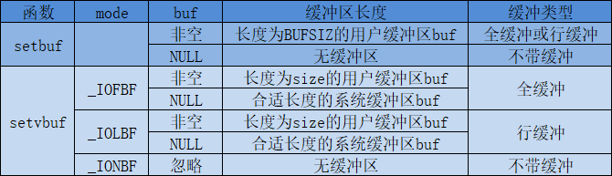
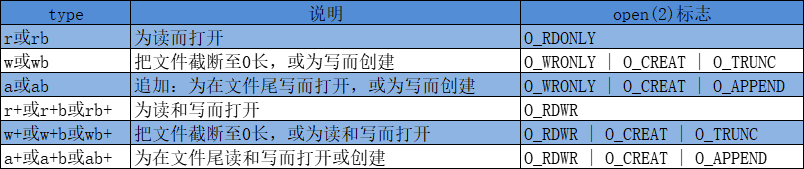
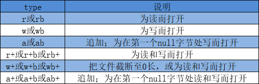

# 标准IO库

标准I/O库处理很多细节，如缓冲区分配、以优化的块长度执行I/O等。
* 文件I/O  fd<=>文件
* 标准I/O  流<=>文件


## 流和FILE对象
文件I/O的函数都是围绕文件描述符的。而对于标准I/O库，它们的操作是围绕流进行的。当用标准I/O库打开或创建一个文件时，我们已使一个流与一个文件相关联。

对于ASCII字符集，一个字符用一个字节表示。对于国际字符集，一个字符可用多个字节表示（如unicode字符集）。标准I/O文件流可用于单字节或多字节（宽）字符集。流的定向决定了所读、写的字符是单字节还是多字节的。当一个流最初被创建时，它并没定向。但若在未定向的流上使用一个多字节I/O函数（见<wchar.h>），则将该流的定向设置为宽定向的。若在未定向的流上使用一个单字节I/O函数，则将该流的定向设为字节定向的。只有两个函数可用改变流的定向。freopen函数清除一个流的定向；fwide函数可用于设置流的定向。

```c
#include<stdio.h>
#include<wchar.h>
int fwide(FILE *fp， int mode);
/* 若流是宽定向的，返回正值；若流是字节定向的，返回负值；若流是未定向的，返回0 */
```

根据mode参数的不同值，fwide函数执行不同的工作。
* 如若mode参数值为负，fwide将试图使指定的流是字节定向的。
* 如果mode参数值为正，fwide将试图使指定的流是宽定向的。
* 如若mode参数值为-。fwide将不试图设置流的定向，但返回的标识该流定向的值。

**注，fwide并不改变已定向流的定向。**


## 标准输入、标准输出和标准错误流
在文件I/O时说过，当通过shell启动一个进程时，默认会打开3个文件描述符，分别是0、1、2（STDIN_FILENO标准输入、STDUT_FILENO标准输出、STDERR_FILENO标准错误）。而对于标准I/O库，默认会打开3个流stdin、stdout和stderr（标准输入、标准输出和标准错误）。


## 缓冲
标准I/O库提供缓冲的目的是尽可能减少read和write调用的次数。提供以下3种类型的缓冲：
* 全缓冲。在这种情况下，在填满标准I/O缓冲区后才进行实际的I/O操作。对于驻留在磁盘上的文件通常是由标准I/O库实施全缓冲的。冲洗（flush）说明标准I/O缓冲区的写操作，如果缓冲区满了，自动冲洗，或者可以调用fflush冲洗一个流。在UNIX环境中，flush有两种意思。在标准I/O库仿麦呢，flush意味着将缓冲区种的内容写到磁盘上（该缓冲区可能只是部分填满）。在终端驱动程序仿麦呢），flush表示丢弃已存储在缓冲区的数据。
* 行缓冲。在这种情况下，当在输入和输出中遇到换行符时，标准I/O库执行I/O操作。当流设计一个终端时（如标准输入和标准输入），通常使用行缓冲。对行缓冲有两个限制。第一，因为标准I/O库用来收集每一行的缓冲区的长度时固定的，所以只要填满了缓冲区，那么即使还没有写一个换行符，也进行I/O操作。第二，任何时候只要通常标准I/O库要求从（a）一个不带缓冲的流，或者（b）一个行缓冲的流（它从内核请求需要数据）得到输入数据，那么就会冲洗所有行缓冲输出流。
* 不带缓冲。标准错误流stderr通常是不带缓冲的，这就使得出错信息可以尽快显示出来，而不管它们是否含有一个换行符。

iSO C要求下列缓冲特征：
* 当且仅当标准输入和标准输出并不指向交互式设备时，它们才是全缓冲的。
* 标准错误绝不会是全缓冲的。

很多系统默认使用下列类型的缓冲：
* 标准错误是不带缓冲的。
* 若是指向终端设备的流，则是行缓冲，否则是全缓冲。

下面两个函数可以更改缓冲类型：
```c
#include<stdio.h>
void setbuf(FILE *restrict fp, char *restrict buf);
int setvbuf(FILE *restrict fp, char *restrict buf, int mode, size_t size);
/* 成功返回0，出错返回非0 */
```

**注，读缓冲区和写缓冲区共用同一个buf缓冲区。**

可以使用setbuf函数打开或关闭缓冲机制。为了带缓冲进行I/O，参数buf必须指向一个长度为BUFSIZ的缓冲区（该常量定义在<stdio.h>中）。通常在此之后该流就是全缓冲的，但是如果该流与一个终端设备相关，那么某些系统也可将其设置为行缓冲的。为了关闭缓冲，将buf设置为NULL。

使用setvbuf，可以精确地说明所需的缓冲类型。这是用mode参数实现的：_IOFBF（全缓冲）、_IOLBF（行缓冲）和_IONBF（不带缓冲）。
* 如果指定一个不带缓冲的流（mode为_IONBF），则忽略buf和size参数。
* 如果指定全缓冲或行缓冲，则buf和size可选择地指定一个缓冲区及其长度。
* 如果该流是带缓冲的，而buf是NULL，则标准I/O库将自动地为该流分配适当长度（通常是BUFSIZ）的缓冲区。

下图列出这两个函数的动作，以及它们的各个选项。



如果在一个函数内分配一个自动变量类的标准I/O缓冲区，则从该函数返回之前，必须关闭流。另外，某些实现将缓冲区的一部分用于存放它自己的管理操作信息，所以可以存放在缓冲区中的实际数据字节数少于size。

任何时候，可以使用fflush强制冲洗一个流：
```c
#include<stdio.h>
int fflush(FILE *fp);
/* 成功返回0，出错返回EOF */
```

**注，如果参数fp为NULL，则将导致所有输出流被冲洗。**


## 打开流
```c
#include<stdio.h>
FILE *fopen(const char *restrict pathname, const char *restrict type);
FILE *freopen(const char *restrict pathname, const char *restrict type, FILE *restrict fp);
FILE *fdopen(int fd, const char *type);
/* 成功返回文件指针，出错返回NULL */
```

这3个函数的区别：
* fopen函数打开路径名为pathname的一个指定的文件。
* freopen函数在一个指定的流上打开一个指定的文件，如若该流已经打开，则先关闭该流。若该流已经定向，则使用freopen清除该定向。此函数一般用于将一个指定的文件打开为一个预定义的流：标准输入、标准输出或标准错误流。
* fdopen函数取一个已有的文件描述符（可能从open、dup、dup2、fcntl、pipe、socket、socketpair或accept函数得到此文件描述符），并使一个标准的I/O流与该描述符相结合。此函数常用于由创建管道和网络通信信道函数返回的描述符。

type参数指定对该I/O流的读、写方式，可以有15种不同的值，如图5-2所示：


使用字符b作为type的一部分，这使得标准I/O系统可以区分文本文件和二进制文件。因为UNIX内核并不会这两种文件进行区分，所以在UNIX系统环境下指定字符b作为type的一部分实际上并无作用。对于fdopen，type参数的意义稍有区别，因为该描述符已被打开，所以fdopen为写而打开并不截断该文件。

当以读和写类型打开一个文件时（type中的+号），具有下列限制：
* 如果中间没有fflush、fseek、fsetpos或rewind，则在输出的后面不能直接跟随输入。
* 如果中间没有fseek、fsetpos或rewind，或者一个输入操作没有到达文件尾端，则在输入操作之后不能直接跟随输出。

**注，在指定w或a类型创建一个新文件时，无法声明该文件的访问权限位。**

POSIX.1要求实现使用如下的权限位集来创建文件：
S_IRUSR | S_IWUSR | S_IRGRP | S_IWGRP | S_IROTH | S_IWOTH |
可以通过调正umask值来限制这些权限。即fopen创建的文件默认权限是rw-rw-rw（假设umask为0）。

除非流引用终端设备，否则按系统默认，流被打开时是全缓冲的。若流引用终端设备，则该流是换行冲的。

fclose函数用于关闭一个打开的流：
```c
#include<stdio.h>
int fclose(FILE *fp);
/* 成功返回0，出错返回EOF */
```

在该文件被关闭之前，冲洗缓冲区中的输出数据。缓冲区中的任何输入数据被丢弃。如果标准I/O库已经为该流自动分配一个缓冲区，则释放此缓冲区。

当一个进程正常终止时（直接调用exit函数，或从main函数返回），则所有带未写缓冲数据的标准I/O流都被冲洗，所有打开i的标准I/O流都被关闭。


## 读和写流
一旦打开了流，则可在3种不同类型的非格式化I/O中进行选择，对其进行读、写操作。
* 每次一个字符的I/O。
* 每次一行的I/O。
* 直接I/O，有时也称二进制I/O、一次一个对象I/O、面向记录的I/O或面向结构的I/O。fread和fwrite函数支持这种类型的I/O。这两个函数常用于从二进制文件中每次读或写一个结构。

这一节主要介绍每次一个字符的I/O。

### 输入函数
以下3个函数可用于一次读一个字符。
```c
#include<stdio.h>
int getc(FILE *fp);
int fgetc(FILE *fp);
int getchar(void);
/* 成功，返回下一个字符，若已达到文件尾端或出错，返回EOF。 */
```

函数getchar等同于getc(stdin)。getc和fgetc的区别是，getc可被实现为宏，而fgetc不能实现为宏。这意味着以下几点：
* getc的参数不应当是具有副作用的表达式，因为它可能会被计算多次。
* 因为fgetc一定是个函数，所以可以得到其地址。这就允许将fgetc的地址作为一个参数传给另一个函数。
* 调用fgetc所需时间很可能比调用getc长。

这3个函数返回整型，理由是，这样就可以返回所有可能的字符值再加上一个已出错或已到达文件尾端的指示值。在<stdio.h>中的常量EOF被要求是一个负值，通常是-1。

注意，不管是出错还是到达文件尾端，这3个函数都返回同样的值。为了区分这两种不同的情况，必须调用ferror或feof。
```c
#include<stdio.h>
int ferror(FILE *fp);
int feof(FILE *fp);
/* 若条件为真，返回非0（真）；否则返回0（假） */

void clearerr(FILE *fp);
```

在大多数实现中，为每个流在FILE对象中维护了两个标志，调用clearerr函数可以清除这两个标志：
* 出错标志；
* 文件结束标志；

从流中读取数据以后，可以调用ungetc将字符在压送回流中。
```c
#include<stdio.h>
int ungetc(int c, FILE *fp);
/* 成功返回c，出错返回EOF */
```

压送回流中的字符以后又可以从流中读出，但读出字符的顺序与压送回的顺序相反。可以进行任何次数的回送，但是一次只能回送一个字符。

回送的字符，不一定必须是上一次读到的字符。不能回送EOF。但是当已经达到文件尾端时，仍可以回送一个字符。下次读将返回该字符，再读则返回EOF。之所以能这样做的原因是，一次成功的ungetc调用会清除该流的文件结束标志。

**用ungetc压送回字符时，并没有将它们写到底层文件中或设备上，只是将它们写回标准I/O库的流缓冲区中。**

### 输出函数
对应上面的每个输入函数都有一个输出函数：
```c
#include<stdio.h>
int putc(int c, FILE *fp);
int fputc(int c, FILE *fp);
int putchar(int c);
/* 成功返回c，出错返回EOF */
```

同理，putchar(c)等同于putc(c, stdout)，putc可被实现为宏，而fputc蹦年实现为宏。


## 每次一行I/O
下面两个函数提供每次输入一行的功能：
```c
#include<stdio.h>
char fgets(char *restrict buf, int n, FILE *restrict fp);
char gets(char *restrict buf);  /* 从标准输入读取 */
/* 成功返回buf；若已到达文件尾端或出错，返回NULL，同理可以使用ferror或feof来检查 */
```

对于fgets，必须指定缓冲长度n。此函数一直读到下一个换行符为止，但是不超过n-1个字符，读入的字符被送入缓冲区。该缓冲区以null字节结尾（这保证得到的时字符串）。如若该行包括最后一个换行符的字符数超过n-1，则fgets只返回一个不完整的行，但是，缓冲区总是以null字节结尾。对fgets的下一次调用会继续读该行。

gets函数不能指定缓冲区的长度，可以导致溢出，不建议使用。另外，gets并不会将换行符存入缓冲区中。

fputs和puts提供每次输出一行的功能：
```c
#include<stdio.h>
int fputs(const char *restrict str, FILE *restrict fp);
int puts(const char *restrict str);
/* 成功返回非负值，出错返回EOF */
```

函数fputs将一个以null字节终止的字符串写到指定的流，尾端的终止符null不写出。注意，这并不一定是每次输出一行，因为字符串不需要换行符作为最后一个非null字节。

puts将一个以null字节终止的字符串写到标准输出，终止符不写出。但是，puts随后又将一个换行符写到标准输出。puts并不像gets不安全，但不建议使用，以免需要记住它再最后是否添加了一个换行符。


## 二进制I/O
二进制I/O用于一次读或写一个完整的结构，而且不会因为null字节或换行符而终结。
```c
#include<stdio.h>
size_t fread(void *restrict ptr, size_t size, size_t nobj, FILE *restrict fp);
size_t fwrite(const void *restrict ptr, size_t size, size_t nobj, FILE *restrict fp);
/* 返回读或写的对象数 */
```

这些函数有以下两种常见的用法：
1. 读或写一个二进制数组。例如，为了将一个浮点数组的第2~5个元素写至一文件上：
```c
float data[10];
if(fwrite(&data[2], sizeof(float), 4, fp) != 4)
    err_sys("fwrite error");
```
其中，指定size为每个数组元素的长度，nobj是写入元素的个数。

2. 读或写一个结构。

```c
struct {
    short count;
    long total;
    char name[NAMESIZE];
} item;

if(fwrite(&item, sizeof(item), 1, fp) != 1)
    err_sys("fwrite error");
```

fread和fwrite返回读或写的对象数。对于读，如果出错或到达文件尾端，则次数字可用少于nobj。在这种情况，应调用ferror或feof以判断究竟是哪一种情况。对于写，如果返回值少于所要求的nobj，则出错。

使用二进制I/O的基本问题是，它只能用于读在同一系统上已写的数据。考虑这种情形，在一个系统上写的数据，要在另一个系统上进行处理。那么这两个函数可能不能正常工作，原因是：
* 在一个结构中，同一成员的偏移量可能随编译程序和系统的不同而不同（由于不同的对齐要求）。
* 用来存储多字节整数和浮点值的二进制格式在不同系统的系统结构间也可能不同。

在不同系统之间交换二进制数据的实际解决办法是使用互认的规范格式，socket通信正是使用这种方式。


## 定位流
有3种方法定位标准I/O流。
1. ftell和fseek函数。假定文件的位置可用存放在一个长整型中。
2. ftello和fseeko函数，使文件偏移量可用不必一定使用长整型。它们使用off_t数据类型代替长整型。
3. fgetpos和fsetpos函数，它们使用一个抽象数据类型fpost_t记录文件的位置，能容纳足够大的偏移量，更好移植。

```c
#include<stdio.h>
long ftell(FILE *fp);
/* 成功返回当前文件位置指示，出错返回-1L */

int fseek(FILE *fp, long offset, int whence);
/* 成功返回0，出错返回-1 */

void rewind(FILE *fp);
```

对于一个二进制文件，其文件位置指示器使从文件起始位置开始度量，并以字节为度量单位。ISO C并不要求一个实现对二进制文件支持SEEK_END规格说明，其原因是某些系统要求二进制文件的长度是某个幻数的整数倍，结尾非实际内容部分则填充0。在UNIX中，对于二进制文件，支持SEEK_END。

对于文本文件，它们的文件当前位置可能不以简单的字节偏移量来度量。这主要是在非UNIX系统中，它们可能以不同的格式存放文本文件。为了定位一个文本文件，whence一定要是SEEK_SET，而且offset只能有两种值：0（后退到文件的起始文件），或是对该文件的ftell返回的值。

使用rewind函数可将一个流设置到文件的起始位置。

除了偏移量的类型是off_t而非以外，ftello和ftell，fseeko和fsekk没有区别：
```c
#include<stdio.h>
off_t ftello(FILE *fp);
/* 成功返回当前文件位置，出错返回(off_t)-1 */

int fseeko(FILE *fp, off_t offset, int whence);
/* 成功会犯0，出错返回-1 */
```

fgetpos和fsetpos能够处理足够大的偏移量：
```c
#include<stdio.h>
int fgetpos(FILE *restrict fp, fpos_t *restirct pos);
int fsetpos(FILE *fp, const fpos_t *pos);
/* 成功返回0，出错返回非0 */
```

fgetops将文件位置指示器的当前值存入由pos指向的对象中。在以后调用fsetpos时，可以使用此值将流重新定位至该位置。


## 格式化I/O
### 格式化输出
```c
#include<stdio.h>
int printf(const char *restrict format, ...);
int fprintf(FILE *restrict fp, const char *restrict format, ...);
int dprintf(int fd, const char *restrict format, ...);
/* 成功返回输出字符数，出错返回负值 */

int sprintf(char *restrict buf, constchar *restict format, ...);
/* 成功返回存入数组的字符数；若编码出错返回负值 */

int snprintf(char *restrict buf, size_t n, const char *restrict format, ...);
/* 若缓冲区足够大，返回将要存入数组的字符数；若编码出错，返回负值 */
```

printf将格式化数据写到标准输出，fprintf写至指定的流，dprintf写至指定的文件描述符，sprintf将格式化字符送入数组buf中。sprintf在该数组的尾端自动加一个null字节，但该字符不包括在返回值中。snprintf用于解决sprintf可能溢出的问题。

下面的5种printf族的变体类型类似上面5种，但是可变参数表（...）替换成arg。
```c
#include<stdarg.h>
#include<stdio.h>
int vprintf(const char *restrict format, va_list arg);
int vfprintf(FILE *restrict fp, const char *restrict format, va_list arg);
int vdprintf(int fd, const char *restrict format, va_list arg);
/* 成功返回输出字符数，出错返回负值 */

int vsprintf(char *restrict buf, constchar *restict format, va_list arg);
/* 成功返回存入数组的字符数；若编码出错返回负值 */

int vsnprintf(char *restrict buf, size_t n, const char *restrict format, va_list arg);
/* 若缓冲区足够大，返回将要存入数组的字符数；若编码出错，返回负值 */
```

format格式化参数的说明请参考文档。

### 格式化输出
```c
#include<stdio.h>
int scanf(const char *restrict format, ...);
int fscanf(FILE *restrict fp, const char *restict format, ...);
int sscanf(const char *restrict buf, const char *restrict format, ...);
/* 成功返回赋值的输入项数，若输入出错或在任一转换前已到达文件尾端，返回EOF */
```

同理，也存在变体：
```c
#include<stdio.h>
int vscanf(const char *restrict format, va_list arg);
int vfscanf(FILE *restrict fp, const char *restict format, va_list arg);
int vsscanf(const char *restrict buf, const char *restrict format, va_list arg);
/* 成功返回赋值的输入项数，若输入出错或在任一转换前已到达文件尾端，返回EOF */
```

format格式化参数的说明请参考文档。


## 实现细节
在UNIX中，标准I/O库最终都要调用文件I/O。每个标准I/O流都由一个与其相关联的文件描述符，可以对一个流调用fileno函数以获得其描述符。
```c
#include<stdio.h>
int fileno(FILE *fp);
/* 返回与该流相关联的文件描述符 */
```


## 临时文件
ISO C标准I/O库提供了两个函数以帮助创建临时文件
```c
#include<stdio.h>
char *tmpnam(char *ptr);
/* 返回唯一路径名的指针 */

FILE *tmpfile(void);
/* 成功返回文件指针，出错返回NULL */
```

tmpnam函数产生一个与现有文件名不同的一个有效路径名字符串。若ptr是NULL，则产生的路径名存放在一个静态区中，指向该静态区的指针作为函数数值返回。后续调用tmpnam时会重写该静态区。如若ptr不是NULL，则认为它应该是指向长度至少是L_tmpnam个字符的数组，所产生的路径名存放在该数组中，ptr也作为函数值返回。

tmpfile创建一个临时二进制文件（类型是wb+），在关闭该文件或程序结束时将自动删除这种文件。

tmpfile函数经常使用的标准UNIX技术是先调用tmpnam产生一个唯一的路径名，然后用该路径名创建一个文件，并立刻unlink它。对一个文件解除连接并不删除其内容，关闭该文件时才删除其内容。

tmpnam存在危险，不建议使用。建议使用mkdtemp和mkstemp：
```c
#include<stdlib.h>
char *mkdtemp(char *template);
/* 成功返回指向目录名的指针，出错返回NULL */

int mkstemp(char *template);
/* 成功返回文件描述符，出错返回-1 */
```

mkdtemp函数创建一个目录，该目录有一个唯一的名字；mkstemp函数创建一个文件，该文件有一个唯一的名字。名字是通过template字符串进行选择的。这个字符串是后6个字符设置为XXXXXX的路径名。函数将这些占位符替换成不同字符来构建一个唯一的路径名。

由mkdtemp函数创建的目录使用下列的访问权限位集：S_IRUSR | S_IWUSR | S_IXUSR。注意，调用进程的文件模式创建屏蔽字可以进一步限制这些权限。

mkstemp函数以唯一的名字创建一个普通文件并且打开该文件，该函数返回的文件描述符以读写方式发开。默认使用权限位S_IRUSR | S_IWUSR。

**与tmpfile不同，mkstemp创建的临时文件并不会自动删除，需要自己解除链接。**

使用tmpnam至少有一个缺点：在返回唯一的路径名和用该名字创建文件之前存在一个时间窗口，在这个时间窗口中，另一进程可以用相同的名字创建文件。因此应该使用tmpfile和mkstemp函数。


## 内存流
内存流也是标准I/O流，虽然仍使用FILE指针进行访问，但其实并没有底层文件。所有的I/O都是通过缓冲区与主存之间来回传送字节来完成的。

```c
#include<stdio.h>
FILE *fmemopen(void *restrict buf, size_t size, const char *restrict type);
/* 成功返回流指针，出错返回NULL */
```

若buf为空，fmemopen函数分配size字节数的缓冲区。在这种情况下，当流关闭时缓冲区会被释放。

type参数控制如何使用流，可能的取值如图5-14所示：


这些取值对应与基于文件的标准I/O流的type参数取值，但其中有些微小的差别：
* 无论何时以追加写方式打开内存流时，当前文件位置设为缓冲区中第一个null字节。如果缓冲区中不存在null字节，则当前位置就设为缓冲区结尾的后一字节。当流并不是以追加写的方式打开时，当前位置设为缓冲区的起始位置。内存流并不适合存储二进制数据（二进制数据在数据尾端之前就可能包含多个null字节）。
* 如果buf参数是一个NULL指针，打开流进行读或者写都没有任何意义。因此此时缓冲区由fmemopen函数分配的，无法获取缓冲区的地址。注，经过测试，仍然可以读和写。这一点有待商榷。其实，类比其他文件I/O，buf更像是文件，实际上还有一个缓冲区，当fflush之后缓冲区的内容才会写至buf里。
* 任何时候需要增加流缓冲区中数据量以及调用fclose、fflush、fseek、fseeko以及fsetpos时都会在当前位置写入一个null字节。

用于创建内存流的其他两个函数分别是open_memstream和oepn_wmemstream：
```c
#include<stdio.h>
FILE *open_memstream(char **bufp, size_t *sizep);  /* 面向字节 */
#include<wchar.h>
FILE *open_wmemestream(wchar_t **bufp, size_t *sizep);  /* 面向宽字节 */
/* 成功返回流指针，出错返回NULL */
```

这两个函数与fmemopen的区别：
* 创建的流只能写打开；
* 不能指定自己的缓冲区，但可以分别通过bufp和sizep参数访问缓冲区地址和大小；
* 关闭流后需要自行释放缓冲区；
* 对流添加字节会增加缓冲区大小。

有一些使用原则：
* 缓冲区地址和长度只有在调用fclose或fflush后有效。
* 这些值只有在下一次流写入或调用fclose前才有效。因为缓冲区可以增长，可能需要重新分配。

因为避免了缓冲区溢出，内存流非常适用于创建字符串。因为内存流只访问主存，不访问磁盘上的文件，所以对于把标准I/O流作为参数用于临时文件的函数来说，会有很大的性能提升。

个人认为内存流优点在于对内存流操作可以像对文件流一样，而且在内存进行，性能更好。例如socket一般使用内存流做缓冲区。


## 习题
1. 用setvbuf实现setbuf。

```c
#include<stdio.h>
#include<unistd.h>

void mysetbuf(FILE *stream, char *buf)
{
        int fd;
        fd = fileno(stream);
        if(isatty(fd))
                setvbuf(stream, buf, _IOLBF, BUFSIZ);
        else if(buf == NULL)
                setvbuf(stream, NULL, _IONBF, 0);
        else
                setvbuf(stream, buf, _IOFBF, BUFSIZ);
}
```

2. 以下程序利用每次一行I/O（fgets和fputs函数）复制文件。若将程序中的MAXLINE改为4，当复制的行超过该最大值时会出现什么情况？

```c
#include<stdio.h>
#include<stdlib.h>

#define MAXLINE 4096

int main(void)
{
        char buf[MAXLINE];

        while(fgets(buf, MAXLINE, stdin) != NULL)
                if(fputs(buf, stdout) == EOF)
                {
                        fprintf(stderr, "output error\n");
                        exit(1);
                }

        if(ferror(stdin))
        {
                fprintf(stderr, "input error\n");
                exit(1);
        }

        exit(0);
```

fgets函数读入数据，直到行结束或缓冲区满（当然会留出一个字节存放终止null字节）。同样，fputs只负责将缓冲区的内容输出直到遇到一个null字节，而不考虑缓冲区中是否包含换行符。所以，如果将MAXLINE设得很小，这两个函数仍然正常工作；只不过缓冲区较大时，函数被执行的次数要多于MAXLINE值设置得较大的时候。

如果这些函数删除或添加换行符（如gets和puts函数的操作），则必须保证对于最长的行，缓冲区都足够大。

3. printf返回0值代表什么？
没有输出任何字符，如`printf("");`。

4. 下面的代码在一些机器上运行正确，而在另外一些机器运行时出错，解释问题所在。

```c
#include<stdio.h>

int main(void)
{
        char c;
        while((c = getchar()) != EOF)
                putchar(c);
        return 0;
}
```

这是个常见的错误。getc以及getchar的返回值是int类型，而不是char类型。由于EOF经常定义为-1，那么如果系统使用的是有符号的字符类型，程序还可以正常工作，但如果使用的是无符号字符类型，那么返回的EOF被保存在字符c后将不再是-1.所以，程序会进入死循环。

5. 对标准I/O流如何使用fsync函数？
先调用fflush后调用fsync。fsync所使用的参数由fileno函数获得。如果不调用fflush，所有的数据仍然在内存缓冲区中，此时调用fsync没有任何效果。

7. 基本BSD的系统提供了funopen的函数调用使我们可以拦截读、写、定位以及关闭一个流的调用。使用这个函数为FreeBSD和Max OS X实现fmemopen。
参考apue
