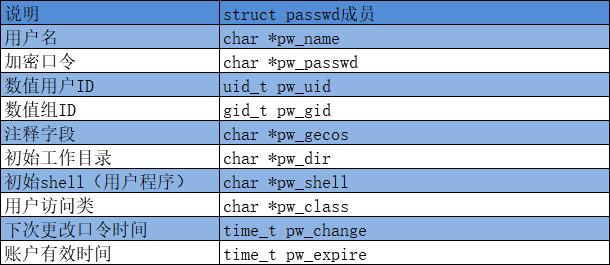
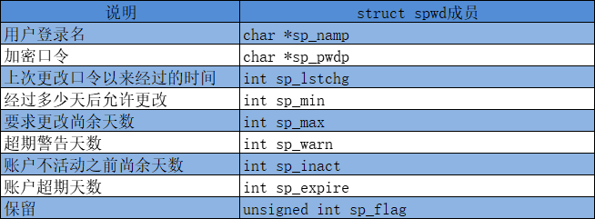
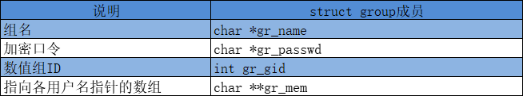
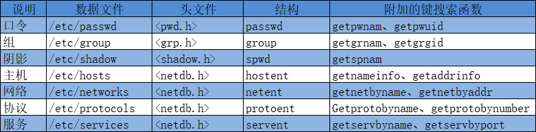
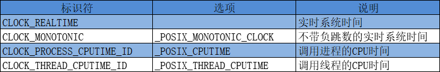
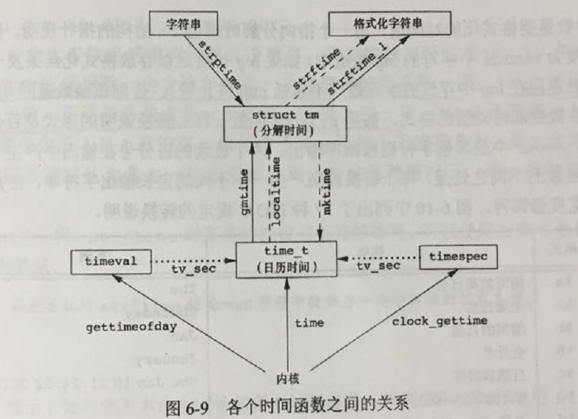

# 系统数据文件和信息

## 口令文件
UNIX系统口令文件包含了图6-1中所示的各字段，这些字段包含在<pwd.h>中定义的passwd结构中，如图6-1，某些字段在某些系统可能不存在。


由于历史原因，口令文件是/etc/passwd，而且是一个ASCII文件。每一行包含图6-1中所示的各字段。字段之间用冒号分隔。如在Linux下，内容可能如下：
```
root:x:0:0:root:/root:/bin/bash
squid:x:23:23::/var/spool/squid:/dev/null
nobody:x:65534:Nobody:/home:/bin/sh
```
关于这些登录项，请注意以下各点：
* 通常有一个用户名为root的登录项，其用户ID是0（超级用户）。
* 加密口令字段包含了一个占位符（通常是'x'）。将加密口令文件存放在一个人人可读的文件中是一个安全性漏洞，所以现在将加密口令字存放在另一个文件中。
* 口令文件项中的某些字段可能为空。
* shell字段包含一个可执行程序名，被用作该用户的登录shell，若为空，取默认值（通常是/bin/sh）。注意squid登录项的该字段是/dev/null。显然，这是一个设备，不是可执行文件，将此用于此处的目的是，阻止任何人以用户squid的名义登录到该系统。
* 为了阻止一个特定的用户登录系统，除使用/dev/null外，还有若干种替代方法。常见的方法是将/bin/false用作登录shell。
* 使用nobody用户名的一个目的是，使任何人都可登录至系统，但其用户ID（65534）和组ID（65534）不提供任何特权。

### getpwuid和getpwnam函数
POSIX.1定义了两个获取口令文件项的函数。在给出用户登录名或数值用户ID后，这两个函数就能查看相关项。
```c
#include<pwd.h>
struct passwd *getpwuid(uid_t uid);
struct passwd *getpwnam(const char *name);
/* 成功返回指针，出错返回NULL */
```

getpwuid函数由ls(1)程序使用，它将i节点中的数字用户ID映射为用户登录名。在键入登录名时，getpwnam函数由login(1)使用。

**注，passwd结构通常是函数内部的静态变量，只要调用任一相关的函数，其内容就会被重写。**

### getpwent、setpwent和endpwent函数
如果需要查看整个口令文件，下面三个函数可以达到这种目的：
```c
#include<pwd.h>
struct passwd *getpwent(void);
/* 成功返回指针，出错或到达文件尾端，返回NULL */

void setpwent(void);
void endpwent(void);
```

调用getpwent时，它返回口令文件中的下一个记录项。函数setpwent反绕它所使用的文件（定位到文件开始处），endpwent则关闭这些文件。因此，调用setpwent后，调用getpwent获取所需记录项后，必须调用endpwent关闭。


## 阴影口令
加密口令是经单向加密算法处理过的用户口令副本。为了防止被获得原始加密口令，某些系统将加密口令存放在另一个通常称为阴影口令的文件中。该文件至少要包含用户名和加密口令。与该口令相关的其他信息也可存放在该文件中，如图6-3：


阴影口令文件不应是一般用户可以读取的。仅有少数几个程序需要访问加密口令，如login(1)和passwd(1)，这些程序常常是设置用户ID为root的程序。

### getspnam、getspent、setspent和endspent函数
以下函数能访问阴影口令文件：
```c
#include<shadow.h>
struct spwd *getspnam(const char *name);
struct spwd *getspent(void);
/* 成功返回指针，出错返回NULL */

void setspent(void);
void endspent(void);
```


## 组文件
UNIX组文件包含了图6-4中所示字段。这些字段包含在<grp.h>中所定义的group结构中：


### getgrgid和getgrnam函数
以下两个函数通过组名或数值组ID获取组结构：
```c
#include<grp.h>
struct group *getgrgid(gid_t gid);
struct group *getgrnam(const char *name);
/* 成功返回指针，出错返回NULL */
```

如果对口令文件进行操作的函数一样，这两个函数通常也返回指向一个静态变量的指针，在每次调用时都重写该静态变量。

### getgrent、setgrent和endgrent函数
搜索整个组文件，需要以下三个函数：
```c
#include<grp.h>
struct group getgrent(void);
/* 成功返回指针，出错返回NULL */

void setgrent(void);
void endgrent(void);
```


## 附属组ID
文件权限检查时不仅将进程的有效组ID与文件组ID相比较，而且也将所有附属组ID与文件的组ID相比较。使用附属组ID的优点是不必再显式地更改组（每个用户只能属于一个实际组，增加附属组可以使其可以属于多个组）。

### getgroups、setgroups和initgroups函数
为了获取和设置附属组ID，提供了下列3个函数：
```c
#include<unistd.h>
int getgroups(int gidsetsize, gid_t grouplist[]);
/* 成功返回附属组ID数量，出错返回-1 */

#include<grp.h>  /* on Linux */
#include<unistd.h>  /* on FreeBSD, Max OS X */
int setgroups(int ngroups, const gid_t grouplist[]);
int initgroups(const char *username, gid_t basegid);
/* 成功返回0，出错返回-1 */
```

getgroups将进程所属用户的各附属组ID填写到数组grouplist中，填写入该数组的附属组ID最多为gidsetsize个。若getsetsize为0，只返回附属组ID数。grouplist中也返回实际组ID。

setgroups可由超级用户调用以便为调用进程设置附属组ID表。

通常只有initgroups函数调用setgroups，initgroups读整个组文件，然后对username确定其组的成员关系。然后，它调用setgroups，以便为该用户初始化附属组ID表。


## 其他数据文件
上面只讨论了口令文件和组文件。实际上还有很多其他文件。一般情况下，对于每个数据文件至少有3个函数：
* get函数：读下一个记录。如口令文件的getpwent函数。一般返回指向一个静态存储类结构的指针，如果需要保存其内容，则需复制它。
* set函数：打开相应数据文件（如果尚未打开），然后反绕该文件（回到文件起始）。
* end函数：关闭相应数据文件

图6-6中列多一些常用的数据文件：



## 登录账户记录
大多数UNIX系统都提供下列两个数据文件：
* utmp文件记录当前登录到系统的各个用户
* wtmp文件跟踪各个登录和注销事件

每次写入这两个文件中的是包含下列结构的一个二进制记录：
```c
struct utmp {
    char ut_lint[8];  /* tty line: "ttyh0", "ttyd0", ...*/
    char ut_name[8];  /* login name */
    long ut_time;  /* second since Epoch */
};  /* 这个结构可能已经更新了 */
```

last(1)命令读wtmp文件并打印所选择的记录。Linux这两个文件分别在/var/run/utmp和/var/log/wtmp。具体请参考文档。

应该使用二进制读这些结构文件：

```c
/*
 * 访问wtmp和utmp文件
 */

#include<stdio.h>
#include<stdlib.h>
#include<utmp.h>

int main(void)
{
        FILE *fp;
        if((fp = fopen("/var/run/utmp", "rb")) == NULL)
        {
                fprintf(stderr, "fopen error\n");
                exit(1);
        }
        struct utmp utmp1;
        while(fread(&utmp1, sizeof(struct utmp), 1, fp))
        {
                printf("ut_type: %d\n", utmp1.ut_type);
                printf("ut_pid: %d\n", utmp1.ut_pid);
                printf("ut_line: %s\n", utmp1.ut_line);
                printf("ut_id: %s\n", utmp1.ut_id);
                printf("ut_user: %s\n", utmp1.ut_user);
                printf("ut_host: %s\n", utmp1.ut_host);
                printf("-----------------------------\n");
        }
        fclose(fp);
        printf("wtmp!!!!!!!!!!!!!!!\n");
        if((fp = fopen("/var/log/wtmp", "rb")) == NULL)
        {
                fprintf(stderr, "fopen error\n");
                exit(1);
        }
        while(fread(&utmp1, sizeof(struct utmp), 1, fp))
        {
                printf("ut_type: %d\n", utmp1.ut_type);
                printf("ut_pid: %d\n", utmp1.ut_pid);
                printf("ut_line: %s\n", utmp1.ut_line);
                printf("ut_id: %s\n", utmp1.ut_id);
                printf("ut_user: %s\n", utmp1.ut_user);
                printf("ut_host: %s\n", utmp1.ut_host);
                printf("-----------------------------\n");
        }
        fclose(fp);
        exit(0);
}
```

## 系统标识
### uname函数
uname函数返回与主机和操作系统有关的信息：
```c
#include<sys/utsname.h>
int uname(struct utsname *name);
/* 成功返回非负值，出错返回-1 */
```

### gethostname函数
BSD派生的系统提供gethostname函数，只返回主机名，通常是TCP/IP网络上主机的名字：
```c
#include<unistd.h>
int gethostname(char *name, int namelen);
/* 成功返回0，出错返回-1 */
```

namelen参数指定name缓冲区的长度，若提供足够的空间，返回的name以null结尾，否则不确定。


## 时间和日期例程
由UNIX内核提供的基本时间服务是计算自协调世界时（UTC）公园1970年1月1日00:00:00这以特定时间以来经过的秒数。UNIX在这方面与其他操作系统的区别是：
* 以协调同一时间而非本地时间计时
* 可自动进行转换，如变换到夏令时
* 将时间和日期作为一个量值保存

### 获取或设置时间戳函数
#### time函数
time函数返回当前时间和日期：
```c
#include<time.h>
time_t time(time_t *calptr);
/* 成功返回时间值，出错返回-1 */
```

时间值作为函数值返回，如果参数非NULL，则时间值也存放在由calptr指向的单元内。返回的是10位时间戳。

#### clock_gettime函数
POSIX.1的实时扩展增加了对多个系统时钟的支持。时钟通过clockid_t类型进行标识。图6-8给出了标准值


clock_gettime函数可用于获取指定时钟的时间，返回的时间放进timespec结构体中，它把时间表示为秒和纳秒，纳秒是秒后面的部分，更精确：
```c
#include<sys/time.h>
int clock_gettime(clockid_t clock_id, struct timespec *tsp);
/* 成功返回0，出错返回-1 */
```

当时钟ID设置为CLOCK_REALTIME时，clock_gettime函数提供了和time函数类似的功能，但精确度更高。

#### clock_getres函数
```c
#include<sys/time.h>
int clock_getres(clockid_t clock_id, struct timespec *tsp);
/* 成功返回0，出错返回-1 */
```

clock_getres函数把参数tsp指向的timespec结构初始化为与clock_id参数对应的时钟精度，这用于获取时间精度。例如精度为1毫秒，则tv_sec字段就是0，tv_nsec字段就是1000000。

#### clock_settime函数
要对特定的时钟设置时间，可以调用clock_settime函数：
```c
#include<sys/time.h>
int clock_settime(clockid_t clock_id, struct timespec *tsp);
/* 成功返回0，出错返回-1 */
```

#### gettimeofday函数
```c
#include<sys/time.h>
int gettimeofday(struct timeval *restirct tp, void *restrict tzp);
/* 总是返回0 */
```

与time相比，gettimeofday提供更高的精度（可到微秒级）。tzp唯一合法值是NULL，某些平台支持用tzp说明时区。tv_sec返回的是10位时间戳。

### 时间戳格式化函数
一旦取得这种上述特定时间经过的描述的整型值（时间戳）后，通常要调用函数将其转换为分解的时间结构，然后调用另一个函数生成人们可读的时间和日期。图6-9说明了各种时间函数之间的关系。（图中以虚线表示的3个函数localtime、mktime和strftime都受到环境变量TZ的影响。点划线表示了如何从时间相关的结构获得日历时间。

两个函数localtime和gmtime将日历时间（时间戳）转换成分解时间，并将这些存放在一个tm结构中：
```c
struct tm {
    int tm_sec;  /* seconds after the minute: [0-60] */
    int tm_min;  /* minutes after the hour: [0-59] */
    int tm_hour;  /* hours after minight: [0-23] */
    int tm_mday;  /* day of month: [1-31] */
    int tm_mon;  /* months since January: [0-11] */
    int tm_year;  /* years since 1900 */
    int tm_wday;  /* days since Sunday: [0-6] */
    int tm_yday;  /* days since January 1: [0-365] */
    int tm_isdst;  /* daylight saving time flag: <0, 0, >0 */
};
```

秒可以超过59的原因是可以表示闰秒。tm_isdst是夏令时标志，如果夏令时生效，则大于0，如果非夏令时，则为0，不可用则小于0。


#### gmtime和localtime函数
```c
#include<time.h>
struct tm *gmtime(const time_t *calptr);
struct tm *localtime(const time_t *calptr);
/* 成功返回指向分解的tm结构的指针，出错返回NULL */
```

localtime和gmtime之前的区别是：localtime将日历时间转换成本地时间（考虑到本地时区和夏令时标志），而gmtime则将日历时间转换成协调统一时间的年、月、日、时、分、秒、周日分解结构。

#### mktime函数
```c
#include<time.h>
time_t mktime(struct tm *tmptr);
/* 成功返回日历时间，出错返回-1 */
```

mktime以本地时间的年、月、日等作为参数，将其变换成time_t值。

#### strftime和strftime_l函数
函数strftime时一个类似与printf的时间值函数。可用多个参数来定制产生的字符串。
```c
#include<time.h>
size_t strftime(char *restrict buf, size_t maxsize, const char *restrict format, const struct tm *restrict tmptr);
size_t strftime_l(char *restrict buf, size_t maxsize, const char *restrict format, const struct tm *restrict tmptr, locale_t locale);
/* 若有空间，返回存入数组的字符串；否则返回0 */
```

strftime_l允许调用者将区域指定为参数，除此之外，这两个函数没有区别。strftime使用通过TZ环境变量指定的区域。

tmptr参数时是格式化的时间值，由一个指向分解时间值tm结构的指针说明。格式化结果存放在一个长度为maxsize个字符的buf数组，如果buf长度足够，返回buf存放的字符数（不包括null字符），否则返回0。

format的格式转换说明参考文档。

#### strptime函数
strptime函数和stftime函数相反，把字符串时间转换成分解时间（struct tm结构）。
```c
#include<time.h>
char *strptime(const char *restrict buf, const char *restrict format, struct tm *restrict tmptr);
/* 返回上一次解析的字符和下一个字符的指针；否则返回NULL */
```


## 习题
1. 如果系统使用阴影文件，那么如何取得加密口令？
通过getspnam和getspent函数获取，但只能拥有超级用户权限获取，其他用户不能获取。

2. 假设你有超级用户权限，并且系统使用了阴影口令，重新考虑上一道题。
同1

3. 编写一程序，它调用uname并输出utsname结构中的所有字段，将该输出与uname(1)命令的输出结构进行比较。

```c
/*
 * uname转换成uname(1)
 */

#include<stdio.h>
#include<stdlib.h>
#include<sys/utsname.h>

int main(void)
{
        struct utsname ptr;
        if(uname(&ptr) < 0)
        {
                fprintf(stderr, "uanme error\n");
                exit(1);
        }
        printf("%s %s %s %s %s", ptr.sysname, ptr.nodename, ptr.release, ptr.version, ptr.machine);
#ifdef _GNU_SOURCE
        printf(" %s\n", ptr.domainname);
#else
        printf("\n");
#endif
        exit(0);
}
```

输出：
```
[root@192 chapter6]# ./ex6-3
Linux 192.168.87.128 3.10.0-957.el7.x86_64 #1 SMP Thu Nov 8 23:39:32 UTC 2018 x86_64
[root@192 chapter6]# uname -a
Linux 192.168.87.128 3.10.0-957.el7.x86_64 #1 SMP Thu Nov 8 23:39:32 UTC 2018 x86_64 x86_64 x86_64 GNU/Linux
```

4. 计算可由time_t数据类型表示的最近时间。如果超过了这一时间将会如何？
time_t类型应该是长整型，如果超过则溢出。

5. 编写一程序，获取当前时间，并使用strftime将输出结果转换为类似data(1)命令的默认输出。将环境变量TZ设置为不同值，观察输出结果。

```c
/*
 * 利用strftime将当前时间转换成date(1)输出格式
 */

#include<stdio.h>
#include<stdlib.h>
#include<time.h>

#define MAXLINE 1024

int main(void)
{
        time_t t;
        time(&t);
        struct tm *tmp;
        tmp = localtime(&t);
        char line[MAXLINE];
        strftime(line, MAXLINE, "%a %b %d %X %Z %Y\n", tmp);
        fputs(line, stdout);
        exit(0);
}
```

