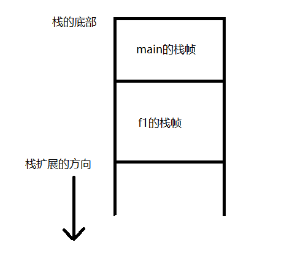

# 进程控制

## 进程标识
每个进程都由一个非负整数标识的唯一的进程ID。因为进程ID标识符总是唯一的，常将其用作其他标识符的一部分以保证其唯一性。进程ID是可复用的，但大多数UNIX系统实现延迟复用的算法。

系统中有一些专用进程，但具体细节随实现而不同：
* ID为0的进程通常是调度进程，常常被称为交换进程（swapper）。该进程是内核的一部分，它并不执行任何磁盘上的程序，因此也被称为系统进程。
* ID为1的进程通常是init进程，在自举过程结束时由内核调用。该进程的程序文件在UNIX早期版本中是/etc/init，在较新的版本时/sbin/init。此进程负责在自举内核后启动一个UNIX系统。init通常读取与系统有关的初始化文件（/etc/rc*文件）或/etc/inittab文件，以及在/etc/init.d中的文件，并将系统引导到一个状态（如多用户）init进程绝不会终止。它是一个普通的用户进程（与交换进程不同，它不是内核中的系统进程），但是它以超级用户特权运行。

每个UNIX系统实现都有它自己的一套提供操作系统服务的内核进程，例如，在某些UNIX的虚拟存储器视线中，进程ID为2是页守护进程（page daemon），此进程负责支持虚拟存储器系统的分页操作。

除了进程ID，每个进程还有一些其他标识符，下列函数返回这些标识符：

```c
#include<unistd.h>
pid_t getpid(void);
/* 返回调用进程的进程ID */

pid_t getppid(void);
/* 返回调用进程的父进程ID */

uid_t getuid(void);
/* 返回调用进程的实际用户ID */

uid_t geteuid(void);
/* 返回调用进程的有效用户ID */

gid_t getgid(void);
/* 返回调用进程的实际组ID */

gid_t getegid(void);
/* 返回调用继承的有效组ID */
```

**注，这些函数都没有出错返回。**


## 函数fork

```c
#include<unistd.h>
pid_t fork(void);
/* 子进程返回0，父进程返回子进程ID，出错返回-1 */
```

子进程和父进程继续执行fork调用之后的指令。子进程是父进程的副本。例如，子进程得到父进程数据空间、堆和栈的副本。注意，这是子进程所拥有的副本。父进程和子进程并不共享这些存储空间。父子进程和子进程共享正文段。

由于在fork之后进场跟随着exec，所以现在的很多实现并不执行一个父进程的数据段、堆和栈的完全副本。作为替代，使用写时复制（Copy-On-Write，COW）技术。这些区域由父进程和子进程共享，而且内核将它们的访问权限改变为只读。如果父进程和子进程中的任一个试图修改这些区域，则内核只修改区域的那块内存制作一个副本，通常时虚拟存储系统中的一”页“。

```c
#include<stdio.h>
#include<stdlib.h>
#include<unistd.h>

int glovar = 6;
char buf[] = "a write to stdout\n";

int main(void)
{
        int var;
        pid_t pid;

        var = 88;
        if(write(STDOUT_FILENO, buf, sizeof(buf) - 1) != sizeof(buf) - 1)
                fprintf(stderr, "write error\n");
        printf("before fork\n");  /* we don;t flush stdout */

        if((pid = fork()) < 0)
                fprintf(stderr, "fork error\n");
        else if(pid == 0)
        {
                glovar++;
                var++;
        }
        else
                sleep(2);

        printf("pid = %ld, glob = %d, var = %d\n", (long)getpid(), glovar, var);
        exit(0);
}
```

执行结果：

```
[root@192 chapter8]# ./8-3
a write to stdout
before fork
pid = 18929, glob = 7, var = 89
pid = 18928, glob = 6, var = 88
[root@192 chapter8]# ./8-3 > temp.out
[root@192 chapter8]# cat temp.out
a write to stdout
before fork
pid = 18940, glob = 7, var = 89
before fork
pid = 18939, glob = 6, var = 88
```

一般来说，在fork之后是父进程先执行还是子进程先执行是不确定的，这取决于内核的调度算法。如果需要控制则需要父子进程同步。

当写标准输出时，将buf长度减去1作为字节数，这是为了避免将终止null字节写出。strlen计算不包含终止null字符的字符串长度，而sizeof则计算包含终止null字节的缓冲区长度。两者之间的另一个差别是，使用strlen需进行一次函数调用，而对于sizeof而言，因为缓冲区已用已知字符串初始化，其长度是固定的，所以sizeof是在编译时时计算缓冲区长度。

由结果可以看出，当输出重定向到文件时，"before fork"打印了两遍，这和标准IO有关，因为输出重定向到文件，因此标准IO是全缓冲的，在fork之前调用了printf一次，但当调用fork时，该行数据仍在缓冲区中，然后在将父进程数据空间复制到子进程时，该缓冲区也被复制到子进程中，此时父进程和子进程各自有了带该行内容的缓冲区。

### 文件共享
对于上面的程序需要注意的另一点是：在重定向父进程的标准输出时，子进程的标准输出也被重定向。实际上，fork的一个特性是父进程的所有打开文件描述符都被复制到子进程中。父进程和子进程每个相同的打开描述符共享一个文件表项。

考虑下述情况，一个进程具有3个不同的打开文件，它们是标准输入、标准输出和标准错误。在从fork返回时，我们有了如图8-2中所示的结构。


重要的一点是，都进程和子进程共享同一个文件偏移量。考虑下述情况：一个进程fork了一个子进程，然后等待子进程终止。假定，作为普通处理的一部分，父进程和子进程都向标准输出进行写操作。如果父进程的标准输出已重定向，那么子进程写到该标准输出时，它将更新与父进程共享的该文件偏移量。在这个例子中，当父进程等待子进程时，子进程写到标准输出；而在子进程终止后，父进程也写到该标准输出上，并且知道其输出会追加在子进程所写数据之后。如果父进程和子进程不共享同一文件偏移量，要实现这种形式的交互就要困难得多，可能需要父进程显式地动作。

如果父进程和子进程写同一描述符指向的文件，但又没有任何形式的同步，那么它们的输出就会互相混合（假定所用的描述符是在fork之前打开的）

在fork之后处理文件描述符有以下两种常见的情况：
* 父进程等待子进程完成。在这种情况下，父进程无需对其描述符做任何处理。当子进程终止后，它曾进行过读、写操作的任一共享描述符的文件偏移量已做了相应的更新。
* 父进程和子进程各自执行不同的程序段。在这种情况下，在fork之后，父进程和子进程各自关闭它们不需使用的文件描述符，这样就不会干扰对方使用的文件描述符。这种方法是网络服务进程经常使用的。

除了打开文件之外，父进程的很多其他属性也由子进程继承，包括：
* 实际用户ID、实际组ID、有效用户ID、有效组ID
* 附属组ID
* 进程组ID
* 会话ID
* 控制终端
* 设置用户ID标志和设置组ID标志
* 当前工作目录
* 根目录
* 文件模式创建屏蔽字
* 信号屏蔽和安排
* 对任一打开文件描述符的执行时关闭（close-on-exec）标志
* 环境
* 连接的共享存储段
* 存储映像
* 资源限制

父进程和子进程之间的区别具体如下：
* fork的返回值不同
* 进程ID不同
* 这两个进程的父进程ID不同
* 子进程的tms_utime、tms_stime、tms_cutime和tms_ustime的值设置为0
* 子进程不继承父进程设置的文件锁
* 子进程的未处理闹钟将被清除
* 子进程的未处理信号集设置为空集

使fork失败的亮哥主要原因是：
* 系统中已经有了太多的进程
* 该实际用户ID的进程总数超过了系统限制。CHILD_MAX规定了每个实际用户ID在任一时刻可拥有的最大进程数。

fork有以下两种用法：
* 一个父进程希望复制自己，使父进程和子进程同时执行不同的代码段。
* 一个进程要执行一个不同的程序。这对shell是常见的情况。在这种情况下，子进程从fork返回后立即调用exec。

某些操作系统将第2种用法中的两个操作（fork之后执行exec）组合成一个操作，称为spawn。UNIX系统将这两个操作分开，因为在很多场合需要单独使用fork，其后并不跟随exec。另外，将这两个操作分开，使得子进程在fork和exec之间可以更改自己的属性，如I/O重定向、用户ID、信号安排等。


## 函数vfork
vfork函数用于创建一个新进程，而该新进程的目的是exec一个新程序。vfork和fork一样都创建一个子进程，但是它并不将父进程的地址空间完全复制到子进程，因为子进程会立即调用exec（或exit），于是也就不会引用该地址空间。不过在子进程调用exec或exit之前，它在父进程的空间中运行。由于较新的fork改为写时复制，因此vfork几乎不再使用。

vfork和fork之间的另一个区别是：vfork保证子进程先运行，在它调用exec或exit之后父进程才可能被调度运行，当子进程调用这两个函数中的任意一个时，父进程会恢复运行。（如果在调用这两个函数之前子进程依赖于父进程的进一步动作，则会导致死锁。）

```c
#include<stdio.h>
#include<stdlib.h>
#include<unistd.h>

int globvar = 6;

int main(void)
{
        int var;
        pid_t pid;

        var = 88;
        printf("before vfork\n");
        if((pid = vfork()) < 0)
                fprintf(stderr, "vfork error\n");
        else if(pid == 0)
        {
                /* 子进程 */
                globvar++;
                var++;
                _exit(0);
        }
        /* 父进程 */
        printf("pid = %ld, glob = %d, var = %d\n", (long)getpid(), globvar, var);
        exit(0);
}
```

执行结果：

```
[root@192 chapter8]# ./8-4
before vfork
pid = 22470, glob = 7, var = 89
```

由结果可知，子进程对变量做了增1操作，结果改变了父进程中的变量值。因为子进程在父进程的地址空间中运行，所以这不令人惊讶。但是其作用的确与fork不同。

**注，因此vfork使用的是父进程的地址空间，因此如果子进程关闭了父进程打开的某些文件描述符，这将会影响到父进程。**


## 函数exit
进程有5种正常的终止及3种异常终止。5种正常终止方式具体如下：
* 在main函数内执行return语句，等效于调用exit。
* 调用exit函数。此函数由ISO C定义，其操作包括调用各终止处理程序（终止处理程序在调用atexit函数时登记），然后关闭所有标准I/O流等。因为ISO C并不处理文件描述符、多进程（父进程和子进程）以及作业控制，所以这一定义对UNIX系统而言是不完整的。
* 调用_exit或_Exit函数。ISO C定义_Exit，其目的是为进程提供一种无需运行终止处理程序或信号处理程序而终止的方法。对标准I/O流是否冲洗，这取决于实现。在UNIX系统中，_Exit和_exit是同义的，并不冲洗标准I/O。_exit函数由exit调用，它处理UNIX系统特定的细节。_exit是由POSIX.1说明的。在大多数UNIX系统实现中，exit(3)是标准C库中的一个函数，而_exit(2)则是一个系统调用。
* 进程的最后一个线程在其启动例程中执行return语句。但是，该线程的返回值不用作进程的返回值。当最后一个线程从其启动例程返回时，该进程以终止状态0返回。推测这意思是在最后一个进程调用return语句。
* 进程的最后一个线程调用ptrhead_exit的参数。在这种情况中，进程终止状态总是0，这与传送给pthread_exit的参数无关。

3种异常终止具体如下：
* 调用abort。它产生SIGABRT信号。这是下一种异常终止的一种特例。
* 当进程接收到某些信号。信号可由进程自身（如调用abort函数）、其他进程或内核产生。
* 最后一个线程对”取消“（cancellation）请求作出响应。默认情况下，”取消“以延迟方式发生：一个线程要求取消另一个线程，若干时间后，目标线程终止。

不管进程如何终止，最后都会执行内核中的同一段代码。这段代码为相应进程关闭所有打开描述符，释放它所使用的存储器等。

对于上述任意一种终止情形，都希望终止进程能够通知其父进程它是如何终止的。对于3个终止函数（exit、_exit和_Exit），实现这一点的方法是，将其退出状态（exit status)作为参数传递给函数。在异常终止情况，内核产生一个指示其异常终止原因的终止状态（termination status）在任意一种情况下，该终止进程的父进程都能用wait或waitpid函数取得其终止状态。

注意，这里使用退出状态和终止状态两个术语以示区别。在最后调用_exit时，内核将退出状态转换成终止状态。父进程能通过WAFEXITED、WIFSIGNALED、WIFSTOPPED和WIFCONTINUED这四个宏获取子进程的终止状态，这四个宏的参数都是子进程的退出状态。

对于父进程已经终止的所有进程，它们的父进程都改变为init进程。其操作过程大致为：在一个进程终止时，内核逐个检查所有活动进程，以判断它是否是正要终止进程的子进程，如果是，则该进程的父进程ID就更改为1（init进程的ID）。这种方法保证每个进程都有一个父进程。

内核为每个终止子进程保存了一定量的信息，所以当终止进程的父进程调用wait和waitpid时，可以得到这些信息。在UNIX术语中，一个已经终止、但是其父进程尚未对其进行善后处理（获取终止子进程的有关信息、释放它仍占用的资源——的进程被称为僵死进程（zombie）。

父进程已终止，其子进程的父进程就会变成init进程，但这不会导致子进程退出时产生僵死，因为进程init进程只要发现有一个子进程终止，就会调用wait函数取得其终止状态，这样了防止在系统中塞满僵死进程。


## 函数wait和waitpid
当一个进程正常或异常终止时，内核就向其父进程发送SIGCHLD信号。系统默认忽略这种信号。当调用wait和waitpid时，会发生：
* 如果其所有子进程都还在运行，则阻塞。
* 如果一个子进程已终止，正等待父进程获取其终止状态，则取得该子进程的终止状态后立刻返回。
* 如果它没有任何子进程，则立刻出错返回。

```c
#include<sys/wait.h>
pid_t wait(int *statloc);
pid_t waitpid(pid_t pid, int *statloc, int options);
/* 成功返回进程ID，出错返回0或-1 */
```

这两个区别如下：
* 在一个子进程终止前，wait使其调用者阻塞，而waitpid有一选项，可使调用者不阻塞。
* waitpid并不等待在其调用之后的第一个终止子进程，它有若干个选项，可以控制它所等待的进程。

如果statloc不是一个空指针，则终止进程的终止状态就存放在它所指向的单元内。如果不关心终止状态，则可将其参数指定为空指针。

这两个函数返回的整型状态字是由实现定义的。其中某些位表示退出状态（正常返回），其他位则指示信号编号（异常返回），有一位指示是否产生了core文件等。终止状态用定义在<sys/wait.h>中的各个宏来查看。有4个互斥的宏可用来取得进程终止的原因，如图8-4


对于waitpid函数中pid参数的作用：
* pid == -1：等待任一子进程。等同于wait函数。
* pid > 0：等待进程ID与pid相等的子进程。
* pid == 0：等待组ID等于调用进程组ID的任一子进程。
* pid < -1：等待组ID等于pid绝对值的任一子进程。

对于wait，其唯一的出错是调用进程没有资金和曾（函数调用被一个信号中断时，也可能返回另一种出错。但是对于waitpid，如果指定的进程或进程组不存在，或者参数pid指定的进程不是调用进程的子进程，都可能出错。

options参数使我们能进一步控制waitpid的操作。此参数或者是0，或者是图8-7中的常量按位或运算的结果。


waitpid函数提供了wait函数没有提供的3个功能：
* waitpid可等待一个特定的进程，而wait则返回任一终止子进程的状态。
* waitpid提供了一个wait的非阻塞版本。
* waitpid通过WUNTRACED和WCONTINUED选项支持作业控制。

如果一个进程fork一个子进程，但不要它等待子进程终止，也不希望子进程处于僵死状态直到父进程终止，实现这一要求的诀窍是调用fork两次。第一个子进程在fork之后立刻exit，则它的子进程（即第二个子进程）的父进程就会变成init进程，因此它不会变成僵死进程。


## 函数waitid
```c
#include<sys/wait.h>
int waitid(idtype_d idtype, id_t id, siginfo_t *infop, int options);
/* 成功返回0，出错返回-1 */
```

waitpid使用两个单独的参数表示要等待的子进程所属的类型。而不是将此与进程ID或进程组ID合成一个参数。id参数的作用与idtype的值相关。该函数支持的idtype类型列在图8-9中。


options参数是由图8-10中各标志的按位或运算。


WCONTINUED、WEIXTED或WSTOPPED这3个常量之一必须在options参数指定。infop参数是指向siginfo结构的指针。该结构包含了造成子进程状态改变有关信号的详细信息。


## 函数wait3和wait4
这两个函数比wait、waitpid和waitid多一个功能，这与附加参数有关，该参数允许内核返回由终止进程及其所有子进程使用的资源概况。
```c
#include<sys/types.h>
#include<sys/wait.h>
#include<sys/time.h>
#include<sys/resource.h>
pid_t wait3(int *statloc, int options, struct rusage *rusage);
pid_t wait4(pid_t pid, int *statloc, int options, struct rusage *rusage);
/* 成功返回进程ID，出错返回-1 */
```

资源统计信息包括用户CPU时间总量、系统CPU时间总量、缺页次数、接收到信号的次数等。


## 函数exec
当进程调用一种exec函数时，该进程执行的程序完全替换为新程序，而新程序则从其main函数开始执行。因为调用exec并不创建新进程，所以前后的进程ID并未改变。exec只是用磁盘上的一个新程序替换了当前进程的正文段、数据段、堆段和栈段。

提供exec使得UNIX系统进程控制原语更加完善。用fork可用创建新程序，用exec可用初始执行新的程序，exit和wait处理终止和等待终止，这些都是基本的进程控制原语。

```c
#include<unistd.h>
int execl(const char *pathname, const char *arg0, ... /* (char *)0 */ );
int execv(const char *pathname, char *const argv[]);
int execle(const char *pathname, const char *arg0, ... /* (char *)0, char *const envp[] */ );
int execve(const char *pathname, char *const argv[], char *const envp[]);
int execlp(const char *filename, const char *arg0, ... /* (char *)0 */ );
int execvp(const char *filename, char *const argv[]);
int fexecve(int fd, char *const argv[], char *const envp[]);
/* 成功不返回，出错返回-1 */
```

这些函数之间的第一个区别是前4个函数取路径名作为参数，后两个参数则取文件名作为参数，最后一个取文件描述符作为参数。当指定filename作为参数时：
* 如果filename中包含/，则就将其视为路径名；
* 否则就按PATH环境变量，在它所指定的各目录中搜寻同名的可执行文件。

如果execlp或execvp使用路径前缀中的一个找到了一个可执行文件，但是该文件不是由链接编辑器产生的机器可执行文件，则就认为该文件是一个shell脚本，于是就试着调用/bin/sh，并以该filename作为shell的输入。

fexecve函数避免了寻找正确的可执行文件，而是依赖调用进程来完成这项工作。调用进程可用使用文件描述符验证所需要的文件并且无竞争地执行该文件。因为该文件描述符已经被验证了，避免了在调用exec之前文件被替换导致恶意攻击。

第二个区别与参数表的传递有关（l表示列表，v表示矢量vector）。函数execl、execlp和execle要求将新程序的每个命令行参数都说明为一个单独的参数。这种参数表以空指针结尾（一般用(char *)0来表示）。对于另外4个函数（execv、execvp、execve和fexecve），则应先构造一个指向各参数的指针数组，然后将该数组地址作为这4个函数的参数。

最后一个区别与新程序传递环境表相关。以e结尾的3个函数（execle，execve和fexecve）可以传递一个指向环境字符串指针数组的指针。其他4个函数则使用调用进程中的environ变量为新程序复制现有的环境。

对打开文件的处理与每个描述符的执行时关闭（close-on-exec）标志值有关。进程中每个打开描述符都有一个执行时关闭标志（FD_CLOEXEC），若设置了此标志，则在执行exec时关闭该描述符；否则该描述符仍打开。系统的默认操作是exec后保持这种描述符打开。

**注意，在exec前后实际用户ID和实际组ID保持不变，而有效ID是否改变则取决于所执行程序文件的设置用户ID位和设置组ID位是否设置。**

在很多UNIX实现中，这7个函数只有execve是内核的系统调用。另外6个只是库函数，它们最终都要调用该系统调用，如图8-15：


## 更改用户ID和更改组ID
可以用setuid函数设置实际用户ID和有效用户ID，可以用setgid函数设置实际组ID和有效组ID。

```c
#include<unistd.h>
int setuid(uid_t uid);
int setgid(gid_t gid);
/* 成功返回0，出错返回-1 */
```

以下是更改用户ID的规则（也适用于组ID），在此假定_POSIX_SAVED_IDS为真，否则以下有关保存的设置用户ID部分均无效：
* 若进程具有超级用户特权，则setuid函数将实际用户ID、有效用户ID以及保存的设置用户ID（saved set-user-ID）设置为uid。
* 若进程没有超级用户权限，但是uid等于实际用户ID或保存的设置用户ID，则setuid只将有效用户ID设置为uid。不更改实际用户ID和保存的设置用户ID。
* 如果上面两条都不满足，则errno设置为EPERM，并返回-1。

关于内核所维护的3个用户ID，还要注意以下几点：
* 只有超级用户进程可以更改实际用户ID。通常，实际用户ID是在用户登陆时，由login(1)程序设置的，而且绝不会改变它。因为login是一个超级用户进程，当它调用setuid时，设置所有3个用户ID。
* 仅当对程序文件设置了设置用户ID位时，exec函数才设置有效用户ID。如果设置用户ID位没有设置，exec函数不会改变有效用户ID，而将维持现有值。任何时候都可以调用setuid，将有效用户ID设置为实际用户ID或保存的设置用户ID。
* 保存的设置用户ID是由exec复制有效用户ID而得到的。如果设置了文件的设置用户ID位，则在exec根据文件的用户ID设置了进程的有效用户ID以后，这个副本就被保存起来了。

图8-18总结了更改这3个用户ID的不同方法：


getuid和geteuid函数只能获取实际用户ID和有效用户ID的当前值，没有可移植的方法获取保存的设置用户ID的当前值。

### 函数setreuid和setregid
setreuid函数是设置实际用户ID和有效用户ID的值，setregid同理设置组相关ID。

```c
#include<unistd.h>
int setreuid(uid_t ruid, uid_t euid);
int setregid(gid_t rgid, gid_t egid);
/* 成功返回0，出错返回-1 */
```

如若其中任一参数的值为-1，则表示相应的ID应当保持不变。

一个非特权用户只能把有效用户ID设置为实际用户ID，否则出错。

### 函数seteuid和setegid
seteuid只更改有效用户ID，setegid只更改有效组ID。

```c
#include<unistd.h>
int seteuid(uid_t uid);
int setegid(gid_t gid);
/* 成功返回0，出错返回-1 */
```

一个非特权用户只能把有效用户ID设置为实际用户ID或保存的设置用户ID。

图8-19 给出了上面所述的更改3个不同用户ID的各个函数：


## 解释器文件
所有UNIX系统都支持解释器文件（interpreter file）。这种文件时文本文件，其起始行的形式是：

```
#! pathname [optional-argument]
```

path通常是绝对路径名，对这种文件的识别是由内核作为exec系统调用处理的一部分来完成的。内核使调用exec函数的进程实际执行的并不是解释器文件，而是在该解释器文件第一行中pathname所指定的文件。

解释器文件使用户得到效率方面的好处，其代价是内核的额外开销（因为识别解释器文件的是内核）。由于下述理由，解释器文件是有用的：
* 有些程序是用某种语言写的脚本，解释器文件可将这一事实隐藏起来。
* 解释器脚本在效率方面也提供了好处。如下的shell脚本：

```sh
awk 'BEGIN {
    for(i = 0; i < ARGC; i++)
        printf "ARGV[%d] = %s\n", i, ARGV[i]
    exit
}' $*
```

这种shell脚本会做更多的工作：内核->exec->shell->exec->awk->...，首先shell读此命令，然后试图execlp此文件，但这个文件不是机器可执行的，于是返回一个错误，execlp就认为该文件是一个shell脚本，然后执行/bin/sh，由shell来执行awk。但是如果这是解释器脚本，则是：内核->exec->awk。
* 解释器脚本使我们可以使用除/bin/sh以外的其他shell来编写shell脚本。


## system函数
```c
#include<stdlib.h>
int system(const char *cmdstring);
/* 返回值见下 */
```

如果cmdstring是一个空指针，则仅当命令处理程序可用时，system返回非0值，这一特征可用确定在一个给定的操作系统上是否支持system函数。

因为system在其实现中调用了fork、exec和waitpid，因此有3种返回值。
* fork失败或者waitpid返回除EINTR之外的出错，则system返回-1，并且设置errno以指示错误类型。
* 如果exec失败（表示不能执行），则其返回值如同shell执行了exit(127)。
* 否则所有3个函数（fork、exec和waitpid）都成功，那么system的返回值是shell的终止状态，其形式已在waitpid中说明。

使用system而不是直接使用fork和exec的优点是：system进行了所需的各种出错处理以及各种信号处理。


## 进程会计
大多数UNIX系统提供了一个选项以进行进程会计（process accounting）处理。启用该选项后，每当进程结束时内核就写一个会计记录。具体参考apue。


## 用户标识
系统通常记录用户登录时使用的名字，用getlogin函数可用获取此登录名。

```c
#include<unistd.h>
char *getlogin(void);
/* 成功返回指向登录名字符串的指针，出错返回NULL */
```

如果调用此函数的进程没有连接到用户登录时所用终端，则函数会失败，这些进程通常时守护进程。


## 进程调度
调度策略和调度优先级是由内核确定的。进程可以通过调用nice值选择以更低优先级运行（通过调整nice值降低它对CPU的占有，因此该进程是“友好的”）。只有特权进程允许提高调度权限。

nice值得范围在0~（2*NZERO）-1之间，nice值越小，优先级越高。NZERO是系统默认得nice值。

```c
#include<unistd.h>
int nice(int incr);
/* 成功返回新的nice值NZERO，出错返回-1 */
```

incr参数被增加到调用进程的nice值上。如果incr太大，系统直接把它降到最大合法值，类似，如果太小，会自动提高到最小合法值。

getpriority函数可以像nice函数那样用于获取进程的nice值，但是getpriority还可以获取一组相关进程的nice值。

```c
#include<sys/resource.h>
int getpriority(int which, id_t who);
/* 成功返回-NZERO~NZERO-1之间的nice值，出错返回-1 */
```

which参数可以取以下三个值之一：PRIO_PROCESS表示进程，PRIO_PGRP表示进程组，PRIO_USER表示用户ID。which参数控制who参数是如何解释的。如果who参数为0，表示调用进程、进程组或者用户（取决于which参数的值）。当which设为PRIO_USER并且who为0时，返回调用进程的实际用户ID。如果which参数作用于多个进程，则返回所有作用进程中优先级最高的（最小的nice值）。

setpriority函数可用于进程、进程组和属于特定用户ID的所有进程设置优先级。

```c
#include<sys/resource.h>
int setpriority(int which, id_t who, int value);
/* 成功返回0，出错返回-1 */
```

value增加到NZERO上，然后变为新的nice值。


## 进程时间
进程有3个度量时间：墙上时钟时间、用户CPU时间和系统CPU时间。任一进程调用times函数获取它自己以及已终止子进程的上述值。

```c
#include<sys/times.h>
clock_t times(struct tms *buf);
/* 成功返回流逝的墙上时钟时间（以时钟滴答数为单位），出错返回-1 */

struct tms {
    clock_t tms_utime;  /* user CPU time */
    clock_t tms_stime;  /* system CPU time */
    clock_t tms_cutime;  /* user CPU time， terminated children */
    clock_t tms_cstime;  /* system CPU time， terminated children */
```

struct tms结构体没有墙上时钟时间，这个时间由函数返回。

所有由此函数返回的clock_t值都用_SC_CLK_TCK转换成秒数。


## 习题
1. 在vfork函数小节中的程序，如果用exit调用代替_exit调用，那么可能会使标准输出关闭，使父进程的printf返回-1。修改该程序以验证是否会产生这种结果。如果并非如此，怎么样处理才能得到类似的结果？
不会。在子进程调用fclose(stdout);得到类似的结果。

2. 如果不是在main函数而是在另一个函数中调用vfork，此后子进程又从该函数返回，将会发生什么？请编写一段测试程序对此进行验证，并且画图说明发生了什么。

```c
#include"apue.h>

static void f1(void), f2(void);

int main(void)
{
    f1();
    f2();
    _exit(0);
}

static void f1(void)
{
    pid_t pid;

    if((pid = vfork()) < 0)
        err_sys("vfork error");
    /* child and parent both return */
}

static void f2(void)
{
    char buf[1000];
    int i;
    for(i = 0; i < sizeof(buf); i++)
        buf[i] = 0;
}
```



当函数f1调用vfork时，父进程的栈指针指向f1函数的栈帧，如图C-9。vfork使得子进程先执行然后从f1返回，接着子进程调用f2，并且f2的栈帧覆盖了f1的栈帧，在f2中的子进程将自动变量buf的值置为0，即将栈中的1000个字节的值都置为0。从f2返回后子进程调用_exit，这时栈中main栈帧以下的内容已经被f2修改了。然后，父进程从vfork调用后恢复继续，并从f1返回。返回信息虽然常常保存在栈中，但是多半可能已经被子进程修改了。对于这个例子，父进程恢复继续执行的结果要依赖于你所使用的UNIX系统的实现特征（如返回信息保存在栈帧中的具体位置、修改动态变量时覆盖了哪些信息等）。通常的结果是一个core文件，但在你的系统中，产生的结果可能不同。

3. 重写以下程序，把wait换成waitid。不调用pr_exit，而从siginfo结构中确定等价的信息。

```c
#include<stdio.h>
#include<stdlib.h>
#include<unistd.h>
#include<sys/wait.h>

void pr_exit(int status)
{
        if(WIFEXITED(status))
                printf("normal termination, exit status = %d\n",
                                WEXITSTATUS(status));
        else if(WIFSIGNALED(status))
                printf("abnormal termination, signal number = %d%s\n",
                                WTERMSIG(status),
#ifdef WCOREDUMP
                                WCOREDUMP(status) ? " (core file generated)" : "");
#else
        "");
#endif
        else if(WIFSTOPPED(status))
                printf("child stopped, signal number = %d\n",
                                WSTOPSIG(status));
}

int main(void)
{
        pid_t pid;
        int status;

        if((pid = fork()) < 0)
                fprintf(stderr, "fork error\n");
        else if(pid == 0)
                exit(7);

        if(wait(&status) != pid)
                fprintf(stderr, "wait error\n");
        pr_exit(status);

        if((pid = fork()) < 0)
                fprintf(stderr, "fork error\n");
        else if(pid == 0)
                abort();

        if(wait(&status) != pid)
                fprintf(stderr, "wait error\n");
        pr_exit(status);

        if((pid = fork()) < 0)
                fprintf(stderr, "fork error\n");
        else if(pid == 0)
                status /= 0;

        if(wait(&status) != pid)
                fprintf(stderr, "wait error\n");
        pr_exit(status);

        exit(0);
}
```

4. 当用$./a.out执行以下程序一次，其输出结果是正确的。但是若将该程序按下列方式执行多次，则其输出不正确。原因是什么？怎样才能更正此类错误？如果子进程首先输出，还会发生此问题吗？

```c
#include"apue.h"

static void charatatime(char *);

int main(void)
{
    pid_t pid;

    TELL_WAIT();

    if((pid = fork()) < 0)
        err_sys("fork error");
    else if(pid == 0)
    {
        WAIT_PARENT();
        charatatime("output from child\n");
    }
    else
    {
        charatatime("output from parent\n");
        TELL_CHILD(pid);
    }
    exit(0);
}

static void charatatime(char *str)
{
    char *ptr;
    int c;

    setbuf(stdout, NULL);
    for(ptr = str; (c = *ptr++) != 0;)
        putc(c, stdout);
}
```

```
$ ./a.out; ./a.out ; ./a.out
output from parent
ooutput from parent
ouotuptut from child
put from parent
output from child
utput from child
```

在该程序中，我们先让父进程输出，但是当父进程输出完毕子进程要输出时，要让父进程终止。是父进程先终止还是子进程先执行输出，要依赖于内核对两个进程的调度（另一个竞争条件）。在父进程终止后，shell会开始执行下一个程序，它也许会干扰子进程的输出。为了避免这种情况，要在子进程完成输出后才终止父进程。用下面的语句替换程序中的fork后面的代码：

```c
else if(pid == 0)
{
    WAIT_PARENT();
    charatatime("output from child\n");
    TELL_PARENT(getppid());
}
else
{
    charatatime("output from parent\n");
    TELL_CHILD(pid);
    WAIT_CHILD();
}
```

由于只有终止父进程才能开始下一个程序，而该程序让子进程先运行，所以不会出现上面的情况。

6. 编写一段程序创建一个僵死进程，然后调用system执行ps(1)命令以验证该进程是僵死进程。

```c
#include"apue.h"

#ifdef SOLARIS
#define PSCMD "ps -a -o pid,ppid,s,tty,comm"
#else
#define PSCMD "ps -o pid,ppid,state,tty,command"
#endif

int main(void)
{
    pid_t pid;

    if((pid = fork()) < 0)
        err_sys("fork error");
    else if(pid == 0)
        exit(0);

    sleep(4);
    system(PSCMD);

    exit(0);
}
```

7. POSIX.1 要求在exec时关闭目录流。按下列方法对此进行验证：对根目录调用opendir，查看在你系统上实现的DIR结构，然后打印执行时关闭标志。接着打开同一目录读并打印执行时关闭标志。