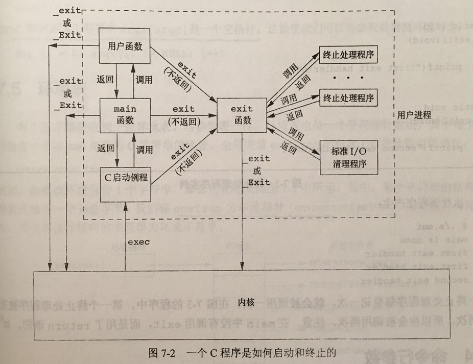
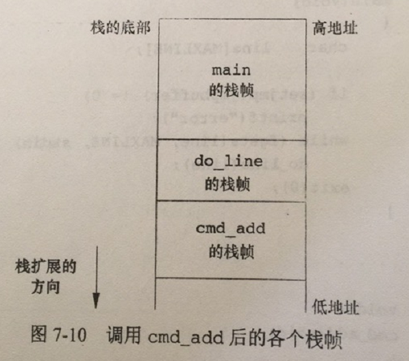

# 进程环境

## main函数
C程序总是从main函数开始执行。main函数的原型是：
```c
int main(int argc, char *argv[]);
```

其中，argc是命令行参数的数目，argv是指向参数的各个指针所构成的数组。

当内核执行C程序时（使用exec函数），在调用main前先调用一个特殊的启动例程。可执行程序文件将此启动例程指定为程序的起始地址——这是由链接编辑器设置的，而链接编辑器则由C编译器调用。启动例程从内核取得命令行参数和环境变量值，然后为按上述方式调用main函数做好安排。


## 进程终止
有8种方式使进程终止（termination），其中5种为正常终止：
1. 从main返回；
2. 调用exit；
3. 调用_exit或_Exit；
4. 最后一个线程从其启动例程（即最后一个线程就是启动例程线程）返回；
5. 从子厚一个线程调用pthread_exit。
异常终止有3种方式：
1. 调用abort；
2. 接到一个信号；
3. 最后一个线程对取消请求做出响应。

上面提及的启动例程是这样编写的，使得从main返回后立即调用exit函数。如果将启动例程以C代码形式表示（实际上通常用汇编语言编写），则它调用main函数的形式可能是：
```c
exit(main(argc, argv));
```

### 退出函数
3个函数用于正常终止一个程序：_exit和_Exit立即进入内核，exit则先执行一些清理处理，然后返回内核。
```c
#include<stdlib.h>
void exit(int status);
void _Exit(int status);

#include<unistd.h>
void _exit(int status);
```

exit函数总是执行一个标准I/O库的清理关闭操作：对于所有打开流调用fclose函数。

3个退出函数都带一个整型参数，称为终止状态（或退出状态，exit status）。如果（a）调用这些函数时不带终止状态，或（b）main执行了一个无返回值的return语句，或（c）main没有声明返回类型为整型，则该进程的终止状态是未定义的。但是，若是main的返回类型是整型，并且main执行到最后一条语句时返回（隐式返回，即不调用这3个退出函数或return），那么该进程的终止状态为0。

main函数返回一个整型值与用该值调用exit是等价的。**只在main函数是等价的，且只和exit等价，和_exit或_Exit不等价**

### 函数atexit
按照IOS C的规定，一个进程可以登记多至32个函数，这些函数将由exit自动调用。我们称这些函数为终止处理程序（exit handler），并调用atexit函数来登记这些函数。
```c
#include<stdlib.h>
int atexit(void (*func)(void));
/* 成功返回0，出错返回非0 */
```

exit调用这些函数的顺序与它们登记时候的顺序相反。同一函数如若登记多次，也会调用多次。

**注，只有调用exit或者main函数调用return时（这和调用exit等价）才会调用这些终止处理程序，调用_exit或_Exit不会调用这些终止处理程序。**

根据IOS C和POSIX.1，exit首先调用各终止处理函数，然后关闭（通过调用fclose）所有打开流。POSIX.1扩展了ISO C标准，如若程序调用exec函数族种的任一个函数，则将清除所有已安装的终止处理程序。

```c
/*
 * 测试exec函数族是否会清除所有已安装的终止处理函数
 */

#include<stdio.h>
#include<stdlib.h>
#include<unistd.h>

static void my_exit1(void)
{
        printf("in my exit1\n");
}

int main(void)
{
        if(atexit(my_exit1) != 0)
                fprintf(stderr, "can't register my_exit1 handler\n");
        /* 调用7-3程序 */
        execl("7-3", "7-3", (char *)0);
        exit(0);
}
```

如上程序，注册的my_exit1终止处理函数会因为execl清除。

图7-2显示了一个C程序是如何启动的，以及它终止的各种方式：


从图可以看出，C启动例程是不调用_exit和_Exit函数的。exit函数实际上还是调用了_exit或_Exit函数，只不过先调用了终止处理程序和标准I/O清理程序。

**注，内核使程序执行的唯一方法使调用一个exec函数。进程自愿终止的唯一方法是显式或隐式地（通过调用exit）调用_exit或_Exit。进程也可非自愿地由一个信号使其终止。（图7-2没有显示）**


## 命令行参数
当执行一个程序时，调用exec的进程可将命令行参数传递给该新程序。ISO C和POSIX.1都要求argv[argc]是一个空指针。


## 环境表
每个程序都接收到一张环境表，与参数表一样，环境表也是一个字符指针数组，其中每个指针包含了一个以null结束的C字符串的地址。全局变量environ则包含了该指针数组的地址：
```c
extern char **environ;
```

例如，如果该环境包含5个字符串，那么它看起来如图7-5中所示。其中，每个字符串的结尾处都显式地有一个null字节。称environ为环境指针（environment pointer），指针数组为环境表，其中各指针指向的字符串为环境字符串。


通常使用getenv和putenv函数来访问特定的环境变量，而不是用environ变量。但是，如果要查看整个环境，则必须使用environ指针。


## C程序的存储空间布局
C程序一直由下列几部分组成：
* 正文段。这是由CPU执行的机器指令部分。通常，正文段是可共享的，所以即使是频繁执行的程序（如文本编辑器、C编译器和shell等）在存储器中也只需有一个副本，另外，正文段通常是只读的，以防止程序由于以外而修改其指令。
* 初始化数据段。也称数据段，包含了程序中需明确地赋初值的变量。如在任何函数之外声明的变量`int maxcount = 99;`。
* 未初始化数据段。也称bss段（block started by symbol），在程序开始执行之前，内核将此段中的数据初始化为0或空指针。如函数外的声明`int sum[1000];`。
* 栈：自动变量以及每次函数调用时所需保存的信息都存放在此段中。每次函数调用时，其返回地址以及调用者的环境信息（如某些机器寄存器的值）都存放在栈上。然后，最近被调用的函数在栈上为其自动和临时变量分配存储空间。通过以这种方式使用栈，C可以实现递归函数。
* 堆。通常在堆中进行动态存储分配。堆位于未初始化数据段和栈之间。

图7-6显示了这些段的一种典型安排方式这是程序的逻辑布图，具体实现不一定按照这种方式。堆顶和栈顶之间未用的虚地址空间很大。


**a.out中还有若干其他类型的段，如包含符号表的段、包含调式信息的段以及包含动态共享库链接表的段等。这些部分并不装载到进程执行的程序映像中。**

从图7-6可以看出，未初始化数据段的内容并不存放在磁盘程序文件中。其原因是，内核在程序开始运行前将它们都设置为0。需要存放在磁盘程序文件的段只有正文段和初始化数据段。

size(1)命令报告正文段、数据段和bss段的长度（以字节为单位）。例如：
```
[root@192 chapter7]# size /usr/bin/cc /usr/bin/bash
   text	   data	    bss	    dec	    hex	filename
 755461	   8528	  81856	 845845	  ce815	/usr/bin/cc
 904335	  35984	  22920	 963239	  eb2a7	/usr/bin/bash
```

第4列和第5列分别以十进制和十六进制表示的3段总长度。


## 共享库
共享库使得可执行文件中不再需要包含公用的库函数，而只需在所有进程都可引用的存储区中保存这种库例程的一个副本。程序第一个执行或者第一次调用某个库函数时，用动态链接方法将程序与共享库函数相链接。这减少了每个可执行文件的长度，但增加了一些运行时间的开销。共享库的另外一个优点是可以用库函数的新版本代替老版本而无需堆使用该库的程序重新链接编辑（假定参数的数目和类型都没有发生变化）。

### 使用非共享库（静态库）
```
[root@192 chapter7]# gcc -static hello.c
[root@192 chapter7]# ll a.out
-rwxr-xr-x. 1 root root 861160 Apr 19 19:20 a.out
[root@192 chapter7]# size a.out
   text	   data	    bss	    dec	    hex	filename
 770816	   6196	   8640	 785652	  bfcf4	a.out
```

可以看出，使用静态库，可执行文件的正文段和数据段长度较大。

### 使用共享库（动态库）
```
[root@192 chapter7]# gcc hello.c
[root@192 chapter7]# ll a.out
-rwxr-xr-x. 1 root root 8480 Apr 19 19:21 a.out
[root@192 chapter7]# size a.out
   text	   data	    bss	    dec	    hex	filename
   1194	    540	      4	   1738	    6ca	a.out
```

可以看出，使用动态库，可执行文件的正文段和数据段的长度显著减少。


## 存储空间分配
ISO C说明了3个用于存储空间动态分配的函数。
* malloc，分配指定字节数的存储区。此存储区中的初始值不确定（未初始化）。
* calloc，为指定数量指定长度的对象分配存储空间。该空间中的每一位（bit）都初始化为0。
* realloc，增加或减少以前分配区的长度。当增加长度时，可能需将以前分配区的内容移到另一个足够大的区域，以便在尾端提供增加的存储区，而新增区域内的初始值不确定。

```c
#include<stdlib.h>
void *malloc(size_t size);
void *calloc(size_t nobj, size_t size);
void *realloc(void *ptr, size_t newsize);
/* 成功返回指向分配空间的起始地址的指针，出错返回NULL */

void free(void *ptr);
```

这3个分配函数所返回的指针一定是适当对齐的，使其可用于任何数据对象。

这些分配例程通常用sbrk(2)系统调用实现，噶系统调用扩充（或缩小）进程的堆。但是大多数malloc和free的实现都不减少进程的存储空间。释放的空间可供以后再分配，但将它们保持在malloc池中而不返回给内核。

### 替代方案
* libmalloc
* vmalloc
* quick-fit
* jemalloc
* TCMalloc
* 函数alloca


## 环境变量
ISO C定义了一个函数getenv，可以用其取环境变量值，但是该标准又称环境的内容是由实现定义的：
```c
#include<stdlib.h>
char *getenv(const char name);
/* 返回与name关联的value指针：若未找到，返回NULL */
```

有时也需要设置或增加环境变量。但影响的只是当前进程及其后生成和调用的任何子进程的环境，但不能影响父进程的环境，这通常是一个shell进程。
```c
#include<stdli.h>
int putenv(char *str);
/* 成功返回0，出错返回非0 */

int setenv(const char *name, const char *value, int rewrite);
int unsetenv(const *name);
/* 成功返回0，出错返回-1 */
```

这3个函数的操作如下：
* putenv的参数str形式是name=value的字符串，将其放到环境表中。如果name已经存在，则先删除原来的定义。
* setenv将name设置为value。如果在环境中name已存在，那么（a）若rewrite非0，则先删除其原来的定义。（b）若rewrite为0，则不删除其鲜藕的定义，name不设置为新的value，而且也不出错。
* unsetenv删除name的定义。即使不存在这种定义也不算出错。

回忆图7-5和图7-6，环境表（指向实际name=value字符串的指针数组）和环境字符串通常存放在进程存储空间的顶部（栈之上）。删除一个字符串很简单——只要现在环境表中找到该指针，然后将所有后续指针都想环境表首部顺次移动一个位置。但是增加一个字符串或修改一个现有的字符串就困难很多。环境表和环境字符串通常占用的是进程地址空间的顶部，所有它不能再想高地址方向（向上）扩展：同时也不能移动在它之下的个栈帧，所以它也不能向低地址方向（向下）扩展。两者组合使得该空间长度不能再增加。
（1）如果要修改一个现有的name
* 如果新value的长度少于或等于现有value的长度，则只要将新字符串复制到源字符串所在的空间中。
* 如果新value的长度大于原长度，则必须调用malloc为新字符串分配空间，然后将新字符串复制到该空间中，接着使环境表中针对name的指针指向新分配区。
（2）如果要增加一个新的name，则操作更加复杂。首先，必须调用malloc为name=value字符串分配空间，然后将该字符串复制到此空间中。
* 如果这时第一次增加一个新name，则必须调用malloc为新的指针表分配空间。接着，将原来的环境表复制到新分配区，并将指向新name=value字符串的指针存放在指针表的表尾，然后又将一个空指针存放在其后，最后使environ指向新的指针表。回忆图7-6，如果原来的环境表位于栈顶之上（这是一种常见情况），那么必须将此表移至堆中。
* 如果这不是第一次增加一个name，则可知以前已调用malloc在堆中为环境表分配了空间，所以只要调用realloc，以分配比原空间多存放一个指针的空间。然后将指向新name=value字符串的指针存放在该表表尾，后面跟一个空指针。


## 函数setjmp和longjmp
在C中，goto语句不能跨越函数，而执行这种类型跳转功能的是函数setjmp和longjmp，这两个函数对于处理发生在很深层嵌套函数调用中的出错情况是非常有用的。
```c
#include<stdio.h>
#include<stdlih>
#include<setjmp.h>

#define TOK_ADD 5

void do_line(char *);
void cmd_add(void);
int get_token(void);

int main(void)
{
        char line[MAXLINE];

        while(fgets(line, MAXLINE, stdin) != NULL)
                do_line(line);
        exit(0);
}

char *tok_ptr;  /* global pointer for get_token() */

void do_line(char *ptr)
{
        int cmd;
        tok_ptr = ptr;
        while((cmd = get_token()) > 0)
        {
                switch(cmd)
                {
                        case TOK_ADD:
                                cmd_add();
                                break;
                }
        }
}

void cmd_add(void)
{
        int token;
        token = get_token();
        /* rest of processing for this cmd */
}

int get_token(void)
{
        /* fetch next token from line pointed to by tok_ptr */
}
```

该程序的骨架部分在读命令、确定命令的类型，然后调用相应函数处理每一条命令这类程序中是非常典型的。图7-10显示了调用cmd_add之后栈的大致使用情况。


这种程序经常会遇到一个问题是，如何处理非致命性的错误。在深层次发生错误，如果不得不以检查返回值的方法逐层返回，那就会变得很麻烦。

解决这种问题的方法就是使用非局部goto——setjmp和longjmp函数。非局部指的是，这不是由普通C语言goto语句在一个函数内实施的跳转，而是在栈上跳过若干调用栈，返回到当前函数调用路径上的某一个函数中。

```c
#include<setjmp.h>
int setjmp(jmp_buf env);
/* 若直接调用返回0，若从longjmp返回，则为非0 */

void longjmp(jmp_buf env, int val);
```

setjmp参数env的类型是一个特殊类型的jmp_buf，这一数据类型是某种形式的数组，其中存放在调用longjmp时用来恢复栈状态的所有信息。因为需要在另一个函数中引用env变量，所以通常将env变量定义为全局变量。

### 自动变量、寄存器变量和易失变量
在main函数中，自动变量和寄存器变量的状态如何。当longjmp返回到main函数时，这些变量的值能否恢复到以前调用setjmp时的值（即回滚到原先值），这是由实现定义的。大多数实现并不回滚这些自动变量和寄存器变量的值。如果有一个自动变量，而又不想使其值回滚，则可定义其具有volatile属性。声明为全局变量或静态变量的值在执行longjmp时保持不变。

```c
#include<stdio.h>
#include<stdlib.h>
#include<setjmp.h>

static void f1(int, int, int, int);
static void f2(void);

static jmp_buf jmpbuffer;
static int gloval;

int main(void)
{
        int autoval;
        register int regival;
        volatile int volaval;
        static int statval;

        gloval = 1;
        autoval = 2;
        regival = 3;
        volaval = 4;
        statval = 5;

        if(setjmp(jmpbuffer) != 0)
        {
                printf("after longjmp:\n");
                printf("gloval = %d, autoval = %d, regival = %d,"
                                " volval = %d, statval = %d\n",
                                gloval, autoval, regival, volaval, statval);
                exit(0);
        }

        gloval =95;
        autoval = 96;
        regival = 97;
        volaval = 98;
        statval = 99;

        f1(autoval, regival, volaval, statval);
        exit(0);
}

static void f1(int i, int j, int k, int l)
{
        printf("in f1(): \n");
        printf("gloval = %d, autoval = %d, regival = %d,"
                        " volval = %d, statval = %d\n",
                        gloval, i, j, k, l);
        f2();
}

static void f2(void)
{
        longjmp(jmpbuffer, 1);
}
```

运行结果如下：

```
# 不带优化编译
[root@192 chapter7]# gcc -W -W 7-10-1.c -o 7-10-1
7-10-1.c: In function ‘main’:
7-10-1.c:18:15: warning: variable ‘regival’ might be clobbered by ‘longjmp’ or ‘vfork’ [-Wclobbered]
  register int regival;
               ^
[root@192 chapter7]# 。/7-10-1
-bash: 。/7-10-1: No such file or directory
[root@192 chapter7]# ./7-10-1
in f1():
gloval = 95, autoval = 96, regival = 97, volval = 98, statval = 99
after longjmp:
gloval = 95, autoval = 96, regival = 97, volval = 98, statval = 99

# 带优化编译
[root@192 chapter7]# gcc -W -W -O 7-10-1.c -o 7-10-1
[root@192 chapter7]# ./7-10-1
in f1():
gloval = 95, autoval = 96, regival = 97, volval = 98, statval = 99
after longjmp:
gloval = 95, autoval = 2, regival = 3, volval = 98, statval = 99
```

从结果可以看出，全局变量、静态变量和易失变量不受优化的影响，在longjmp之后，它们的值是最近所呈现的值。
1. 不优化：这5个变量都存放在存储器中（内存）。
2. 优化后：autoval和regival都存放在寄存器中，而剩下3个变量存放在存储器中（内存）。

**由此可知，如果要编写一个使用非局部变量跳转的可移植程序，则必须使用volatile属性。**

### 自动变量的潜在问题
基本规则是声明自动变量的函数已经返回后，不能再引用这些自动变量。

```c
#include<stdio.h>

FILE *open_data(void)
{
        FILE *fp;
        char databuf[BUFSIZ];

        if((fp = fopen("datafile", "r")) == NULL)
                return NULL;
        if(setvbuf(fp, databuf, _IOLBF, BUFSIZ) != 0)
                return NULL;
        return fp;  /* error */
}

```

当open_data返回时，它在栈上所使用的空间将由下一个被调用函数的栈帧使用。但是，标准I/O函数仍将使用这部分存储空间作为该流的缓冲区。这就产生了冲突和混乱。为了改正这一问题，应在全局存储空间静态地（如static或extern）或者动态地（使用一种alloc函数）为数组databuf分配空间。


## 函数getrlimit和setrlimit
每个进程都由一组资源限制，其中一些可以用getrlimit和setrlimit函数查询和更改。

```c
#include<sys/resource.h>
int getrlimit(int resource, struct rlimit *rlptr);
int setrlimit(int resource, const struct rlimit *rlptr);
/* 成功返回0，出错返回非0 */

struct rlimit{
    rlim_t rlim_cur;  /* soft limit: current limit */
    rlim_t rlim_max;  /* hard limit: max value of rlim_cur */
};
```

在更改资源限制时，须遵循下列3条规则。
* 任何一个进程都可将一个软限制值更改为小于或等于其硬限制值。
* 任何一个进程都可降低其硬限制值，但它必须大于或等于其软限制值。这种降低，对普通用户而言是不可逆的。
* 只有超级用户进程可以提高硬限制值。

常量RLIM_INFINITY指定一个无限量的限制。

resource参数可能的取值如下：
* RLIMIT_AS：进程总的可用存储空间的最大长度（字节）这影响到sbrk和mmap函数。
* RLIMIT_CORE：core文件最大字节数，若其值为0，阻止创建core文件。
* RLIMIT_CPU：CPU时间的最大值（秒），当超过此软限制时，向该进程发送SIGXCPU信号。
* RLIMIT_DATA：数据段最大字节长度。这是图7-6中初始化数据、非初始化以及堆的总和。
* RLIMIT_FSIZE：可创建的文件的最大字节数。当超过此软限制时，则向该进程发送SIGXFSZ信号。
* RLIMIT_MEMLOCK：一个进程使用mlock(2)能够锁定在存储空间中的最大字节长度。
* RLIMIT_MSGQUEUE：进程为POSIX消息队列可分配的最大存储字节数。
* RLIMIT_NICE：为了影响进程调度优先级，nice值。
* RLIMIT_NOFILE：每个进程能打开的最多的文件数。
* RLIMIT_NPORC：每个实际用户ID可拥有的最大子进程数。
* RLIMIT_NPTS：用户可同时打开的伪终端的最大数量。
* RLIMIT_RSS：最大驻内存集字节长度。如果可用的物理存储器非常少，则内核将从进程处取回超过RSS的部分。
* RLIMIT_SBSIZE：在任一给定时刻，一个用户可以占用的套接字缓冲区的最大长度。
* RLIMIT_SIGPENDING：一个进程可排队的信号最大数量。
* RLIMIT_STACK：栈的最大字节长度。
* RLIMIT_SWAP：用户可消耗的交换空间的最大字节数。
* RLIMIT_VMEM：和RLIMIT_AS同义。

资源限制影响到调用进程并由其子进程继承。


## 习题
1. 在Intel x86系统上，使用Linux，如果执行一个输出“hello，world”的程序但不调用exit或return，则程序的返回代码为13（用shell检查），解释其原因。
原因在于printf的返回值（输出的字符数）变成了main函数的返回值。为了验证这一结论，改变打印字符串的长度，然后运行程序，查看返回值是否与新的字符串长度值匹配。

2. 以下程序的printf函数的结果何时才被真正输出？

```c
#include<stdio.h>
#include<stdlib.h>
#include<unistd.h>

static void my_exit1(void);
static void my_exit2(void);

int main(void)
{
        if(atexit(my_exit2) != 0)
                fprintf(stderr, "can't register my_exit2\n");

        if(atexit(my_exit1) != 0)
                fprintf(stderr, "can't register my_exit1\n");
        if(atexit(my_exit1) != 0)
                fprintf(stderr, "can't register my_exit1\n");

        printf("main is done\n");
        return 0;
}

static void my_exit1(void)
{
        printf("first exit handler\n");
}

static void my_exit2(void)
{
        printf("second exit handler\n");
}

```

当程序处于交互运行方式时，标准输出通常处于行缓冲方式，所以当输出换行符时，上次的结果才被真正输出。如果标准输出被重定向一个文件，二标准输出处于全缓冲方法，则当标准I/O清理操作执行时，结果才真正被输出。

3. 是否有方法不使用（a）参数传递，（b）全局变量这两种方法，将main中的参数argc和argv传递给它所调用的其他进程。
由于argc和argv的副本不像environ一样保存在全局变量中，所以在大部多数UNIX系统中没有其他办法。

4. 在有些UNIX系统实现执行程序时访问不到其数据段的0单元，这是一种有意的安排，为什么？
当C程序解引用一个空指针出错时，执行该程序的进程将终止。可以利用这种方法终止进程。

5. 用C语言的typedef为终止处理程序定义一个新的数据类型Exitfunc，使用该类型修改atexit的原型。

```c
typedef void Exitfunc(void);
int atexit(Exitfunc *func);
```

6. 如果用calloc分配分配一个long型的数组，数组的初始值是否为0？如果用calloc分配一个指针数组，数组的初始值是否为空指针？
calloc将分配的内存空间初始化为0。但是ISO C并不保证0值与浮点值或空指针的值相同。

7. 使用size命令查看可执行文件，为什么没有给出堆和栈的大小？
只用通过exec函数执行一个程序时，才会分配堆和栈。即栈和堆是动态分配的。

8. 为什么文件的大小不等于他们各自文本和数据的大小的和？
可执行文件包含了可调式core文件的符号表信息。用strip(1)命令可以删除这些信息。

9. 为什么一个简单的程序，使用共享库以后其可执行文件的大小变化如此巨大？
没有使用共享库时，可执行文件的大部分都被标准I/O库所占用。

10. 之前已经说明不能将一个指针返回给一个自动变量，下面的程序是否正确？

```c
int f1(int val)
{
    int num = 0;
    int *ptr = &num;
    if(val == 0)
    {
        int val;
        val = 5;
        ptr = &val;
    }
    return (*ptr + i);
}
```

这段代码不正确。因为在自动变量val已经不存在以后，代码还通过指针引用这个已经不存在的自动变量。自动变量val在复合语句开始的左花括号之后声明了，但当该复合语句结束时，即在匹配的右花括号之后，自动变量就不存在了。


