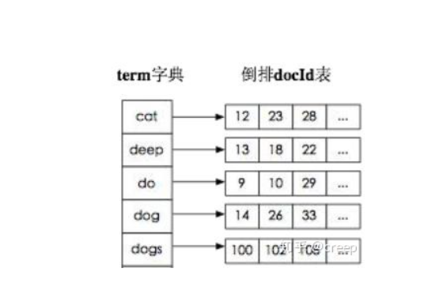
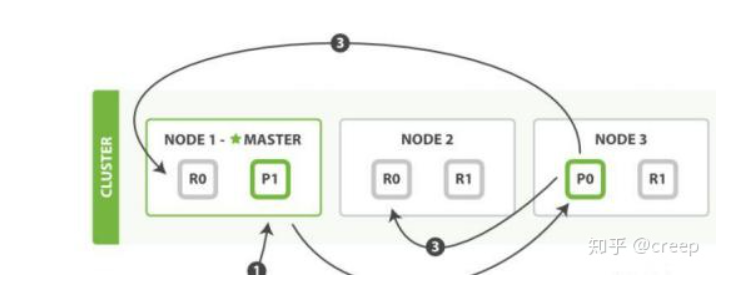
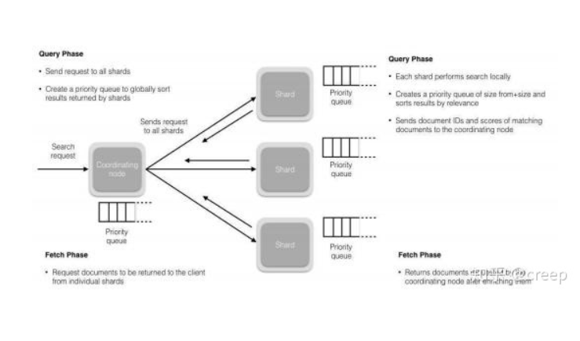
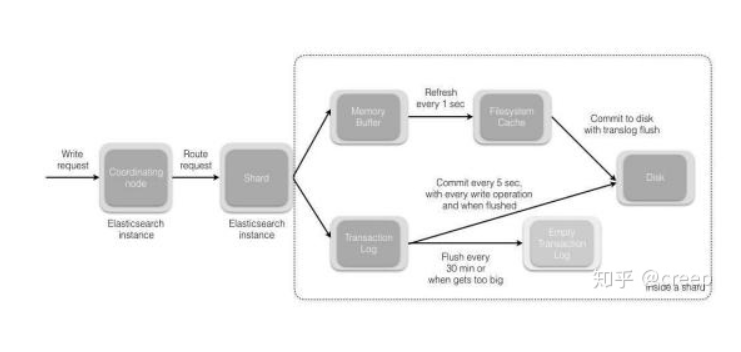

# 面试

## elasticsearch了解多少，说说你们公司es的集群架构，索引数据大小，分片有多少，以及一些调优策略

es集群架构7个结点，根据告警类型分多种，相同类型的根据日期也分（滚动索引)，索引6个分片，每日100w数据。

设计阶段优化策略：
1. 根据业务增量需求，采取基于日期模板创建索引，通过roll over API滚动索引（当现有索引被认为太大或太旧时，滚动索引API会将别名滚动到新的索引；如果现有索引的名称以 - 和数字结尾；)
2. 使用别名进行索引管理（利用滚动索引）
3. 凌晨定时force_merge释放空间，分层合并、字节大小对数合并、文档数量对数合并
4. 采取冷热分离机制，热数据存储到ssd，提交检索效率，冷数据定期进行shrink（收缩）操作，以减少存储
5. 仅针对需要分词的字段设置合理的分词器
6. mapping阶段充分结合各个字段的属性，是否需要检索，是否需要存储等

写入调优
1. 写入前副本数设置为0
2. 写入前关闭refresh_interval，设置为-1，禁用刷新机制
3. 写入过程中，采取bulk批量写入
4. 写入后恢复副本数和刷新间隔
5. 尽量使用自动生成的id

查询调优
1. 禁用通配符
2. 禁用批量terms（成百上千的场景）
3. 充分利用倒排索引机制，能keyword类型尽量keyword
4. 数据量大的时候，可以先基于时间敲定索引再检索
5. 设置合理的路由策略

## elasticsearch的倒排索引是什么
通过分词策略，形成了词和文档的映射关系表，这种词和映射表即为倒排索引。

倒排索引，相反于一篇文章包含了哪些词，它从词出发，记载了这个词在哪些文档中出现过，由两部分组成：词典和倒排表

倒排索引底层实现是基于FST（Finite State Transducer）数据结构。

FST的两个优点：
* 空间占用小。通过对词典中单词前缀和后缀的重复利用，压缩了存储空间。
* 查询速度快，O(n)的查询时间复杂度，n为词的长度

## elasticsearch索引数据多了怎么办，如何调优、部署
动态索引层面
基于模板+时间+rollover api滚动创建索引，举例：设计阶段定义：blog 索引的模板格式为：blog_index_时间戳的形式，每天递增数据。

存储层面
冷热数据分离存储，热数据（比如最近3天或者一周的数据），其余为冷数据。对于冷数据不会再写入新数据，可以考虑定期force_merge加shrink压缩操作，节省存储空间和检索效率。

部署层面
结合es自身支持动态扩展的特点，动态新增机器的方式可以缓解集群压力。注意，如果之前主节点等规划合理，不需要重启集群也能完成动态新增。

## elasticsearch是如何实现master选举
前置条件：
* 只有候选主节点（master：true）的节点才能成为主节点。
* 最小主节点数（min_master_nodes)的目的是防止脑裂。

第一步：确认候选主节点数达标，elasticsearch.yml 设置的值discovery.zen.minimum_master_nodes；
第二步：比较，先判断是否具备master资格，具备候选主节点资格的优先返回，若两节点都为候选主节点，则id小的值会成为主节点。

1、Elasticsearch 的选主是 ZenDiscovery 模块负责的，主要包含 Ping（节点之间通过这个 RPC 来发现彼此）和 Unicast（单播模块包含一个主机列表以控制哪些节点需要 ping 通）这两部分；

2、对所有可以成为 master 的节点（node.master: true）根据 nodeId 字典排序，每次选举每个节点都把自己所知道节点排一次序，然后选出第一个（第 0 位）节点，暂且认为它是 master 节点。

3、如果对某个节点的投票数达到一定的值（可以成为 master 节点数 n/2+1）并且该节点自己也选举自己，那这个节点就是 master。否则重新选举一直到满足上述条件。

## 详细描述一下elasticsearch索引文档的过程
这里的索引文档应该了解为文档写入ES，创建索引的过程。

文档写入包含：单文档写入和bulk写入

第一步：客户向集群某个节点写入数据，发送请求（如果没有指定路由/协调节点，请求的节点扮演路由节点的角色）

第二步：节点1接受到请求后，使用文档id来确定文档属于分片0。请求会被转到另外的节点，假定是节点3。因为分片0的主分片分配到节点3上。

第三步：节点3在主分片执行写操作，如果成功，则将请求并行转发到节点1和节点2的副本分片上，等待结果返回。素有的副本分片都报告成功，节点3将向协调节点（节点1）报告成功，节点1向请求客户端报告写入成功。

那么第二步中文档获取分片的过程呢？
借助路由算法，路由算法就是根据路由和文档id计算目标的分片id的过程。

## 详细描述一下es搜索的过程
搜索拆解为“query then fetch”两个阶段

query阶段：
1. 假设一个索引数据有5主+1副本共10分片，一次请求会命中（主或副本分片中）的一个。
2. 每个分片在本地进行查询，结果返回到本地有序的优先队列中。
3. 第2步骤的结果发送到协调节点，协调节点产生一个全局的排序列表

fetch阶段：
路由节点获取所有文档，返回给客户端

1、搜索被执行成一个两阶段过程，我们称之为 Query Then Fetch；

2、在初始查询阶段时，查询会广播到索引中每一个分片拷贝（主分片或者副本分片）。 每个分片在本地执行搜索并构建一个匹配文档的大小为 from + size 的优先队列。

PS：在搜索的时候是会查询 Filesystem Cache 的，但是有部分数据还在 MemoryBuffer，所以搜索是近实时的。

3、每个分片返回各自优先队列中 所有文档的 ID 和排序值 给协调节点，它合并这些值到自己的优先队列中来产生一个全局排序后的结果列表。

4、接下来就是 取回阶段，协调节点辨别出哪些文档需要被取回并向相关的分片提交多个 GET 请求。每个分片加载并 丰富 文档，如果有需要的话，接着返回
文档给协调节点。一旦所有的文档都被取回了，协调节点返回结果给客户端。

5、补充：Query Then Fetch 的搜索类型在文档相关性打分的时候参考的是本分片的数据，这样在文档数量较少的时候可能不够准确，DFS Query Then Fetch 增加了一个预查询的处理，询问 Term 和 Document frequency，这个评分更准确，但是性能会变差。

## es在部署时，对linux的设置有哪些优化方法
1. 关闭缓存swap
2. 堆内存设置为min（节点内存/2）
3. 设置最大文件句柄数
4. 线程池+队列大小根据业务调整
5. 磁盘存储raid方式

## es中的节点（比如20个），其中的10个选了一个master，另外10个选了另一个master，怎么办？
1. 当集群master候选数量不少于3个时，可以通过设置最少投票通过数量超过候选节点一半以上来解决脑裂问题
2. 当候选数量为两个时，只能修改唯一的一个master候选，其他作为data节点，避免脑裂问题。

## 详细描述es索引文档的过程
协调节点默认使用文档id参与计算（也支持通过routing），以便为路由提供合适的分片。

1. 当分片所在的节点接收到来自协调节点的请求后，会将请求写入memory buffer，然后定时（默认是每个1秒）写入filesystem cache，这个从memory buffer到filesystem cache的过程叫做refresh。
2. 当然在某些情况下，存在memory buffer和filesystem cache的数据可能会丢失，es是通过translog的机制来保证数据的可靠性。其实现机制是接收到请求后，同时也会写入translog中，当filesystem cache中的数据写入磁盘中，才会清除掉，这个过程叫做flush。
3. 在flush过程中，内存中的缓冲将被清除，内容被写入一个新段，段的fsync将创建一个新的提交点，并将内容刷新到磁盘，旧的translog将被删除并开始一个新的translog。
4. flush触发的时机是定时触发（默认30分钟）或者translog变得太多（默认512M时）。

补充：关于lucene的segement
1. lucene索引是由多个段组成，段本身是一个功能齐全的倒排索引。
2. 段是不可变的，允许lucene将新的文档增量地添加到索引中，而不用从头重建索引。
3. 对于每一个搜索请求而言，索引中的所有段都会被搜索，并且每个段会消耗cpu的时钟周、文件句柄和内存。这一位段的数量越多，搜索性能会越低。
4. 为了解决这个问题，es会合并小段到一个较大的段，提交新的合并段到磁盘，并删除那些旧的小段。

## 描述一下es更新和删除文档的过程
1. 删除和更新都是写操作，但是es中的文档是不可变的，因此不能被删除或者改动以展示变更。
2. 磁盘上的每个段都有一个相应的.del文件。当删除请求发送后，文档并没有真的被删除，而是在.del文件中被标记删除。该文档依然能匹配查询，但是会在结果中被过滤掉。当段合并时，在.del文件中被标记为删除的文档将不会被写入新段。
3. 在新的文档被创建时，es会为该文档指定一个版本号，当执行更新时，旧版本的文档在.del文件中被标记为删除，新版本的文档被索引到一个新段。旧版本的文档依然能匹配查询，但是会在结果中被过滤掉。

## 在es中，是怎么根据一个词找到对应的倒排索引？

## 对于gc，在使用es时要注意什么？
1. 倒排词典的索引需要常驻内存，无法gc，需要监控data node上的segment memory增长趋势。
2. 各类缓存，field cache、filter cache，indexing cache，bulk queue等设置合理的大小。
3. 避免返回大量结果集的搜索和聚合。如果需要，采用scan和scroll api来实现。
4. cluster stats驻留内存无法水平扩展，超大规模集群可以考虑分拆成多个集群通过tribe node连接。
5. 对集群的heap使用情况做持续的监控。

## es对大量数据（上亿量级）的聚合如何实现？
es提供的首个近似聚合时cardinality度量。它提供一个字段的基数，即该字段的distinct或者unique值的数目，它是基于HLL算法。HLL会先对输入作哈希运算，然后根据哈希运算的结果中的bits作概率从而得到基数。其特点是：可配置的精度，用来控制内存的使用；小的数据集精度是非常高的；可以通过配置参数，来设置去重需要的固定内存使用量。无论数千还是数十亿的唯一值，内存使用量只与你配置的精确度相关。

## 在高并发情况下，es如何保证读写一致？
1. 通过版本使用乐观并发控制，由应用层来处理具体冲突。
2. 另外对于写操作，一致级别支持quorum/one/all，默认quorum，即只有当大多数分片可用时才允许写操作。但即使大多数可用，也可能存在因为网络等原因导致写入副本失败，这样该副本被认为故障，分片将会在一个不同的节点上重建。
3. 对于读操作，可用设置replication为sync（默认），这使得操作在主分片和副本分片都完成后才会返回；如果设置replication为async，也可以通过设置搜索请求参数_preference为primary来查询主分片，确保文档是最新版本的。

## 如何监控es集群状态
marvel让你可用简单通过kibana监控es。

## 是否了解字典树
Trie的核心思想是空间换时间，利用字符串的公共前缀来降低查询时间的开销来达到提高效率的目的。它有3个基本性质：
1. 根节点不包含字符，其他节点都只包含一个字符。
2. 从根结点到某一个节点，路径上经过的字符连接起来，为该节点对应的字符串。
3. 每个节点的所有子节点包含的字符都不相同。

对于中文的字典树，每个节点的子节点用一个哈希表存储，不浪费空间，且查询时间复杂度为O(1)。

## 拼写纠错如何实现
1. 拼写纠错是基于编辑距离来实现的，编辑距离是一种标准的方法，它用来表示经过插入、删除和替换操作从一个字符串转换到另外一个字符串的最小操作步数；