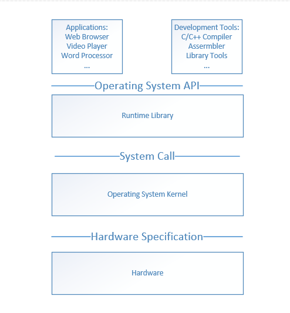
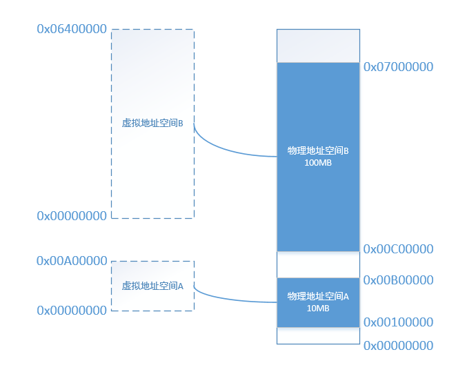
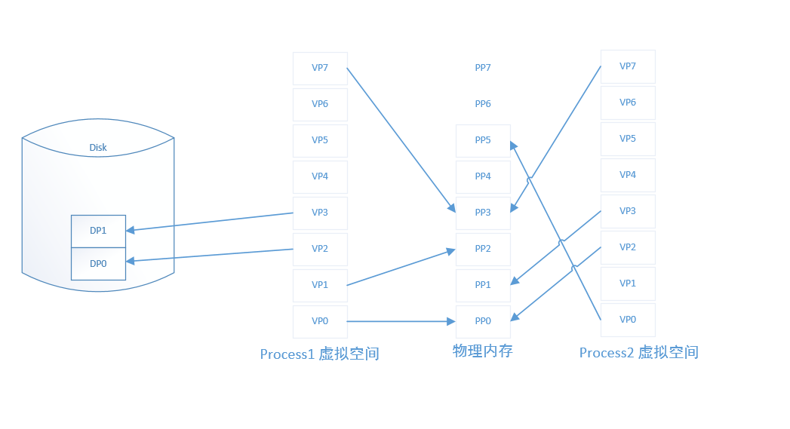

# 操作系统知识

学完这本书，至少掌握以下内容：
* 程序为什么要被编译了之后才能运行
* 编译器在把C语言程序转换成可以执行的机器码的过程中做了什么，怎么做的？
* 最后编译出来的可以执行文件里面是什么？除了机器码还有什么？它们怎么存放的，怎么组织的？
* #include<stdio.h>是什么意思？把sdio.h包含进来意味着什么？C语言库又是什么？它怎么实现的？
* 不同的编译器（Microsoft VC、GCC）和不同的硬件平台（x86、SPARC、MIPS、ARM），以及不同的操作系统（Windows、Linux、UNIX、Solaris），最终编译出来的结果一样吗？为什么？
* Hello World程序是怎么运行起来的？操作系统是怎么装载它的？它从哪儿开始执行，到哪儿结束？main函数之前发生了什么？main函数结束以后又发生了什么？
* 如果没有操作系统，Hello World可以运行吗？如果要在一台没有操作系统的机器上运行Hello World需要什么？应该怎么实现？
* printf是怎么实现的？它为什么可以有不定数量的参数？为什么它能够在终端上输出字符串？
* Hello World程序运行时，它在内存中是什么样子的？

## 计算机软件体系结构
**计算机科学领域的任何问题都可以通过增加一个间接的中间层来解决。**

系统软件体系结构中，各种软件的位置如图：

位于最上层的是应用程序，如网络浏览器，开发工具与应用程序是属于同一个层次的，因为都使用同一个接口，那就是操作系统应用程序编程接口。应用程序接口的提供者是运行库，运行库决定API。例如Linux下的Glibc库提供POSIX的API；WIndows提供WIndows API。

运行库使用操作系统提供的系统调用接口，系统调用接口在实现中往往以软件终端的方式提供，比如Linux使用0x80号中断作为系统调用接口，Windows使用0x2E号中断作为系统调用接口。

操作系统内核层对于硬件层来说是硬件接口的使用者，而硬件是接口的定义者，硬件的接口定义决定了操作系统内核，就是驱动程序如何操作硬件，如何与硬件进行通信。这种接口被叫做硬件规格，由硬件生产商提供。

## 内存分配
早期的计算机，程序是直接运行在物理内存上的，而且是一次分配足够内存，如程序A需要100M内存，则需要一次性分配100M内存，而不管程序A每个时刻都是否需要100M内存。这种简单的内存分配策略有很多问题：
* 地址空间不隔离：所有的程序都直接访问物理地址，程序所使用的内存空间不是相互隔离的。恶意的程序可以很容易改写其他程序的内存数据。
* 内存使用效率高：由于没有有效的内存管理机制，通常要一个程序执行时，监控程序就将整个程序装入内存中然后开始执行。实际上这个程序某一段时间内并不需要那么多内存，这样会造成内存浪费。
* 程序运行的地址不确定：因为内存每次需要装入运行时，需要给它从内存中分配一块足够大的空闲区域，这个空闲区域的位置是不确定的。这给程序的编写造成了麻烦，因为程序在编写时，它访问数据和指令跳转时的目标地址很多都是固定的，这涉及程序的重定位问题。

为了解决这几个问题，**增加中间层，即使用一种间接的地址访问方法**。把程序给出的地址看作一种虚拟地址，然后通过某些映射的方法，将这个虚拟地址转换成实际的物理地址。这样控制好虚拟地址到物理地址的映射过程，就能保证任意一个程序所能访问的物理内存区域跟另外一个程序相互不重叠，以达到地址空间隔离的效果。

### 隔离
作为普通的程序，它需要的是一个简单的执行环境，有一个单一的地址空间、有自己的CPU。地址空间分两种：虚拟地址空间和物理地址空间。物理地址空间可以简单理解为物理内存。虚拟地址空间是指虚拟的地址空间，实际上并不存在，每个进程都有自己独立的虚拟空间，而且每个进程只能访问自己的地址空间，这样就能有效做到进程隔离。

### 分段
为了进行隔离，最开始的做法是分段。基本的思路是把一段与程序所需要的内存空间大小的虚拟空间映射到某个地址空间。比如程序A需要10MB内存，假设有一个地址从0x00000000到0x00A00000的10MB大小的一个假象空间，也就是虚拟空间，然后从实际的物理内存中分配一个相同大小的物理地址，假设物理地址0x00100000到0x00B00000结束的一块空间。然后把这两块相同大小的地址空间一一映射，即虚拟空间中的每个字节相对应于物理空间中的每个字节。这个映射过程由软件设置，比如操作系统来设置这个映射函数，实际的地址转换由硬件（MMU，内存管理单元）完成。比如当程序A访问地址0x00001000时，CPU会将这个地址转换成实际的物理地址0x00101000。那么比如程序A和程序B在运行时，它们的虚拟空间和物理空间映射关系可能下图：

分段的方法解决了上面的第一个和第三个问题。首先是地址隔离，因为程序和A和程序B被映射到两块不同的物理地址空间区域，它们之间没有任何重叠，如果程序A访问虚拟空间的地址超过了0x00A00000这个范围，那么硬件就会判断这是一个非法的访问，拒绝这个地址请求，并将这个请求报告给操作系统或监控程序，由它来决定如何处理。其次是运行时地址确定问题，对于每个程序来说，无论它们被分配到物理地址的哪一个区域，对于程序来说都是透明的，它们不关心物理地址的变化，它们只要按照从地址0x00000000到0x00A00000这个虚拟空间地址来编写程序、放置变量，所以程序不需要重定位。

但是分段并没有解决第二个问题，分段对于内存区域的映射还是按照整个程序为单位，如果内存不足，被换入到磁盘的就是整个程序，这样势必会造成大量的磁盘访问操作，影响速度。为了解决这个问题，应该采用更小粒度的内存分割和映射的方法，使得程序的局部性原理得到充分的利用，大大提供了内存的使用率，这种方法就是分页。

### 分页
分页的基本方法是把地址空间认为地分成固定大小的页，每一页的大小由硬件决定，或硬件支持多种大小的页，由操作系统选择决定页的大小。现在的操作系统基本选择4KB为页大小。假设CPU是32位，那么支持32位的虚拟地址空间，也就是4GB，按4KB每页分的话，总共由1048576个页。物理空间也是同样的分法。

当我们把进程的虚拟地址空间按页分割，把常用的数据和代码页装载到内存中，把不常用的代码和数据保存在磁盘里，当需要用到的时候再把它从磁盘里取出来即可。以下图为例，假设由两个进程Process1和Process2，它们进程中的部分虚拟页面被映射到了物理页面，比如VP0、VP1和VP7被映射到PP0、PP2和PP3；而有部分页面却在磁盘中，比如VP2和VP3位于磁盘的DP0和DP1中；另外还有一些页面如VP4、VP5和VP6可能尚未被用到或访问到，它们暂时处于未使用的状态。此处，虚拟空间的页叫做虚拟页（VP），物理内存中的页叫做物理页（PP），把磁盘中的页叫做磁盘页（DP）。途中的线表示映射关系，可以看到虚拟空间的有些页被映射到同一个物理页，这样就可以实现内存共享。

图中Process1的VP2和VP3不在内存中，但是当进程需要用到这两个页的时候，硬件会捕获到这个消息，产生**页错误**，然后操作系统接管进程（陷入内核态），负责将VP2和VP3从磁盘中读取出来并且装入内存，然后将内存中的这两个页与VP2和VP3之间建立映射关系。

