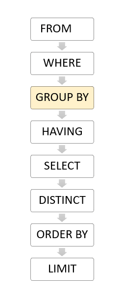

# 基础知识

## Querying Data


## Filtering Data


## Joining Multiple Tables


## Grouping Data
### GROUP BY
group by的执行顺序如图1：




postgresql的group by有个规则：select后所指定的只能是聚合函数或者group by语句所指定的列：
以下语句语法不正确，因为staff_id没有在group by语句中指定：

    select customer_id,staff_id from payment group by customer_id;


### HAVING
where和having的区别：
* where用于过滤行，而且where的执行在having之前，如图1。
* having用于过滤组，利用group by分组后过滤组（一个组可能包含一行或多行）。

由于having的执行在select之前（如图1），因此select中指定的别名不能在having中使用：

    select customer_id,sum(amount) as A from payment group by customer_id having A > 200;  # 错误
    select customer_id,sum(amount) from payment group by customer_id having sum(amount) > 200;  # 正确


## Performing Set Operations
### UNION
两个表相与，这两个表必须满足以下条件：
* 列的顺序和列的个数必须相同。
* 数据类型必须兼容。

union的作用就与数学集合中的与操作一样，效果和full join一样。如果需要获取重复的行，可以使用union all。


### INTERSECT
两个表相交，这两个表必须满足以下条件：
* 列的顺序和列的个数必须相同。
* 数据类型必须兼容。


### EXCEPT
两个表相减，这两个表必须满足以下条件：
* 列的顺序和列的个数必须相同。
* 数据类型必须兼容。

except作用就与数学集合中相减一样，返回集合A中所有集合B没有的元素。在这里就返回A表中所有B表没有的行。


## Grouping sets, Cube, and Rollup
### GROUPING SETS
grouping sets可以在一次获取多个分组结果，是group by的子语句：

    SELECT c1,c2,aggregate_function(c3) FROM table_name GROUP BY GROUPING SETS((c1,c2),(c1),(c2),());

这条语句就能获取按(c1,c2)、(c1)、(c2)分组的结果，()是不分组的结果。

#### GROUPING函数
语法如下：

    GROUPING( column_name | expression)

column_name和xepression必须出现在group by语句后。作用是如果column_name和expression出现在分组集中，则值为0，否则为1。

```SQL
dvdrental=# select grouping(brand) grouping_brand,grouping(segment) grouping_segment,brand,segment,sum(quantity) from sales group by grouping sets((brand),(segment),()) order by brand,segment;
 grouping_brand | grouping_segment | brand | segment | sum
----------------+------------------+-------+---------+-----
              0 |                1 | ABC   |         | 300
              0 |                1 | XYZ   |         | 400
              1 |                0 |       | Basic   | 500
              1 |                0 |       | Premium | 200
              1 |                1 |       |         | 700
(5 rows)
```


### ROLLUP
按层级获取多个分组的结果，如`ROLLUP(c1,c2,c3)`，则相当于进行了`(c1,c2,c3)、(c1,c2)、(c1)、()`分组。实际上等同于`GROUPING  SETS((c1,c2,c3),(c1,c2),(c1),())`。但这对于层级数据分组更有效，如年、月、日。


### CUBE
返回所有组合的分组的结果。如`CUBE(c1,c2,c3)`，等同于`GROUPING SETS((c1,c2,c3),(c1,c2),(c1,c3),(c2,c3),(c1),(c2),(c3),())`。


## Subquery
### Subquery

    select column1,column2 from table where column1 operation subquery;  # operation可以是>、<、!=、in等

执行顺序：
1. 先执行subquery，获取子查询结果。
2. 再执行外部查询。

#### IN
IN后可跟着子查询：

    select column1,column2 from table where column1 in subquery;

#### EXISTS
exists操作并不关系子查询返回的内容，只关心返回行数是否大于0，如果是，则exists返回True，否则返回False。

    select * from table where exists(subquery);

如果subquery返回行数大于0，则exists返回True，那么最终返回table所有行。否则，最终返回空。


### ANY
语法：

    expresion operator ANY(subquery)

这个语法中：
* subquery必须返回一列。
* operator必须是>、>=、=、<、<=、<>中的一个。
* ANY操作返回True如果subquery的任何一个值满足条件，否则返回False。

**注，SOME和ANY是同义词，效果一样。**

当operator为=时，ANY操作和IN效果一样。


### ALL
语法：

    comparison_operator ALL (subquery)

这个语法中：
* operator必须是>、>=、=、<、<=、<>中的一个。
* ALL后必须跟子查询（subquery）。
* ALL操作返回True如果subquery的所有一个值满足条件，否则返回False。


## Common Table Expressions
### CTE
common table expression(cte)是一个**临时**的结果集，也可作为窗口，可以在其他SQL表达式中使用，如SELECT、INSERT、UPDATE或DELETE等。

语法：

```SQL
WITH cte_name (column_list) AS (
    CTE_query_definition
)
statement;
```

典型用法就是简化连接（join）或子查询（subquery）。

优点：
* 提升可读性。
* 创建递归查询。
* 与窗口功能相结合。


### Recursive Query
语法：

```SQL
WITH RECURSIVE cte_name AS(
    CTE_query_definition -- non-recursive term
    UNION [ALL]
    CTE_query definion  -- recursive term
) SELECT * FROM cte_name;
```

说明：
* 非递归术语：执行CTE查询，获取结果集。
* 递归术语：递归术语是一个或多个CTE查询通过UNION或UNION ALL连接非递归术语。递归术语引用的是CTE名（即每次递归输入的都是CTE名）。
* 当结果返回空行，递归结束。

执行递归CTE的步骤：
1. 执行非递归术语创建基本结果集（R0）。
2. 执行递归术语，输入是Ri，输出是Ri+1。例如刚进入递归时，第一次输入是非递归CTE产生的结果集R0，输出结果集R1，第二次输入是R1，输出结果集R2……。
3. 当第二步输出是空行，递归结束。
4. 用UNION或UNION ALL把R0、R1、……、Rn结合成结果集。


## Modifying Data
### INSERT
#### 插入单行

```SQL
INSERT INTO table_name(column1, column2, …)
VALUES (value1, value2, …);
```

可以通过RETURNING获取插入行的某些字段：

```SQL
INSERT INTO table_name(column1, column2, …)
VALUES (value1, value2, …)
RETURNING *;  --*返回插入这一行的所有字段，也可以指定某些字段，如id
```

#### 插入多行

```SQL
INSERT INTO table_name (column_list)
VALUES
    (value_list_1),
    (value_list_2),
    ...
    (value_list_n);
```

同理，也可以通过RETURNING获取插入行的某些字段：

```SQL
INSERT INTO table_name (column_list)
VALUES
    (value_list_1),
    (value_list_2),
    ...
    (value_list_n)
RETURNING * | output_expression;
```


### UPDATE

```SQL
UPDATE table_name
SET column1 = value1,
    column2 = value2,
    ...
WHERE condition;
```

可以通过RETURNING获取更新行的某些字段：

```SQL
UPDATE courses
SET published_date = '2020-07-01'
WHERE course_id = 2
RETURNING *;
```

#### UPDATE jon
有时候需要更新表数据时需要依赖别的表，可以使用UPDATE join语法：

```SQL
UPDATE t1
SET t1.c1 = new_value
FROM t2
WHERE t1.c2 = t2.c2;
```

### DELETE
删除某一行，当不通过where指定某一行时，删除所有行。

```SQL
DELETE FROM table_name
WHERE condition;
```

可以通过RETURNING获取删除行的某些字段：

```SQL
DELETE FROM table_name
WHERE condition
RETURNING (select_list | *)
```

#### DELETE join
当删除某行依赖别的表时，可以使用DELETE jion语法：

```SQL
DELETE FROM table_name1
USING table_expression
WHERE condition
RETURNING returning_columns;

--example
DELETE FROM t1
USING t2
WHERE t1.id = t2.id
```

也可以通过子查询：

```SQL
DELETE FROM contacts
WHERE phone IN (SELECT phone FROM blacklist);
```


### UPSERT
当开启UPSERT时，插入行，如果行已经存在，则更新，反之则插入新行，语法：

```SQL
INSERT INTO table_name(column_list)
VALUES(value_list)
ON CONFLICT target action;
```

target可以是以下情况之一：
* (column_name)  - 列名
* ON CONSTRAINT constraint_name - UNIQUE constraint name，唯一约束名，效果和指定列名一样
* WHERE predicate - WHERE谓词过滤。

action可以是以下情况之一：
* DO NOTHING – 什么都不做。
* DO UPDATE SET column_1 = value_1, .. WHERE condition – 更新表的某些字段。


## Transactions
### TRANSACTIONS
一个事务具有ACID四个特性：
* atomic（原子性）：事务的所有操作要不都完成，要不都不完成。
* consistent（一致性）：确保数据写到数据库是有效的。
* isolated（隔离性）：本事务与其他事务隔离，其他事务在本事务COMMIT之前都看不到变化。
* durable（持久化）：事务一旦COMMIT，数据永久存储在数据库。

开启一个事务有以下语法：

```SQL
BEGIN TRANSACTION
BEGIN WORK
BEGIN
```

提交一个事务有以下语法：

```SQL
COMMIT TRANSACTION
COMMIT WORK
COMMIT
```

回滚一个事务有以下语法：

```SQL
ROLLBACK TRANSACTION
ROLLBACK WORK
ROLLBACK
```


## Import & Export Data
### Import CSV File Into PostgreSQL Table

```SQL
COPY table(column1, column2, ……)
FROM import_path
DELIMITER ','
CSV HEADER;
```

### Export PostgreSQL Table To CSV File

```SQL
COPY persons TO save_path DELIMITER ',' CSV HEADER;
```

如果没有权限把文件导出到服务器磁盘，可以使用\copy把文件导出到本地磁盘：

```SQL
\copy (SELECT * FROM table) to save_path with csv
```


## Managing Databases
### CREATE DATABASE

```SQL
CREATE DATABASE db_name
 OWNER =  role_name
 TEMPLATE = template
 ENCODING = encoding
 LC_COLLATE = collate
 LC_CTYPE = ctype
 TABLESPACE = tablespace_name
 CONNECTION LIMIT = max_concurrent_connection
```

参数说明：
* db_name：数据库名
* role_name：创建角色名
* template：基于哪个数据库作为模板
* encoding：编码
* collate：排序规则，影响ORDER BY等
* ctype：字符分类
* tablespace_name：表空间
* max_concurrent_connection：最大并发连接数


### ALTER DATABASE

```SQL
ALTER DATABASE target_database action;
```

#### Rename database

```SQL
ALTER DATABASE target_database RENAME TO new_database;
```

#### Change owner

```SQL
ALTER DATABASE target_database OWNER TO new_onwer;
```

#### Change tablespace

```SQL
ALTER DATABASE target_database SET TABLESPACE new_tablespace;
```

#### Change session defaults for run-time configuration variables
修改后，之后的会话就会采用这个配置变量覆盖原来配置文件中的变量。

```SQL
ALTER DATABASE target_database SET configuration_parameter = value;
```


### Rename Database
给一个数据库改名，需要执行以下步骤：
1. 关闭与该数据库的连接，也可以连接其他数据库。
2. 通过pg_stat_activity表查询该数据库是否仍有连接，如果有，利用下面语句终止这些连接。
3. 执行ALTER DATABASE更换数据库名。

```SQL
SELECT
    pg_terminate_backend (pid)
FROM
    pg_stat_activity
WHERE
    datname = 'db';
```


### DROP DATABASE

```SQL
DROP DATABASE [IF EXISTS] name;
```

同理，如果仍有用户连接该数据库，要先终止这些连接。


### Copy Database
#### PostgreSQL copy database within the same server

```SQL
CREATE DATABASE targetdb
WITH TEMPLATE sourcedb;
```

作用和以下语句一样：

```SQL
CREATE DATABASE targetdb TEMPLATE=sourcedb;
```

#### PostgreSQL copy database from a server to another
##### 数据量较大
执行以下步骤：
第一步，将源数据库转储为文件：

```
pg_dump -U postgres -O sourcedb sourcedb.sql
```

第二步，把文件复制到远程服务器
第三步，在远程服务器创建数据库：

```SQL
CREATE DATABASE targetdb;
```

第四步，把文件恢复成数据库：

```
psql -U postgres -d targetdb -f sourcedb.sql
```

##### 数据量较少

```
pg_dump -C -h local -U localuser sourcedb | psql -h remote -U remoteuser targetdb
```


### Get Database Object Sizes
#### 获取表大小
使用函数pg_relation_size()获取表大小，返回结果以字节为单位。

```SQL
select pg_relation_size(table_name);
```

也可以使用函数pg_size_pretty()转成换更合理的单位。

```SQL
select pg_size_pretty (pg_relation_size(table_name));
```

pg_relation_size()函数只返回表的大小，不包括索引或者其他对象，获取表的全部大小，可以使用pg_total_relation_size()函数：

```SQL
select pg_size_pretty (pg_total_relation_size(table_name));
```

可以使用以下语句获表大小top5：

```SQL
SELECT
    relname AS "relation",
    pg_size_pretty (
        pg_total_relation_size (C .oid)
    ) AS "total_size"
FROM
    pg_class C
LEFT JOIN pg_namespace N ON (N.oid = C .relnamespace)
WHERE
    nspname NOT IN (
        'pg_catalog',
        'information_schema'
    )
AND C .relkind <> 'i'
AND nspname !~ '^pg_toast'
ORDER BY
    pg_total_relation_size (C .oid) DESC
LIMIT 5
```

#### 获取数据库大小
pg_database_size()函数返回数据库的大小。

```SQL
SELECT
    pg_size_pretty (
        pg_database_size (database_name)
    );
```

#### 获取表索引大小
pg_indexes_size()函数返回表的索引大小。

```SQL
SELECT pg_size_pretty (pg_indexes_size(table_name));
```

#### 获取表空间大小
pg_tablespace_size()函数返回表空间大小。

```SQL
SELECT
    pg_size_pretty (
        pg_tablespace_size ('pg_default')
    );
```

#### 获取值大小
pg_column_size()函数返回值大小。

```SQL
SELECT pg_column_size(1);
```

返回4，表明存储1这个值需要4个字节。如果1改为0.3，则返回8，表明存储0.3这个值需要8个字节。


## Managing Tables
### Data Types
#### Boolean
* 1, yes, y, t, true 都会转换成true。
* 0, no, false, f 都会转换成false。

#### Character
* CHAR(n)：是固定长度的字符，用空格填充。
* VARCHAR(n)：是可变长度的字符，不会用空格填充。
* TEXT：是没有限制长度的可变长度字符。

#### Numeric
##### Integer
* Small integer ( SMALLINT)：是大小为2字节的整型，范围从-32,768到32,767。
* Integer ( INT)：是大小为4字节的整型，范围从-2,147,483,648到2,147,483,647。
* Serial：和Integer一样，但会自增，类似MYSQL的AUTO_INCREMENT。

##### Floating-point number
* float(n)：是单精度类型，精度至少为n，最大8字节。
* real和float8：是4字节单精度类型。
* numeric和numeric(p,s)：是一个实数，p是位数，s是小数位数。

#### Temporal data types
这里说明一下，日期指的是年月日，时间指的是时分秒。

* DATE：只存储日期。
* TIME：只存储一天中的时间值。
* TIMESTAMP：存储日期和时间的时间戳。
* TIMESTAMPTZ：带时区的时间戳。
* INTERVAL：存储时间段。

#### Arrays
数组元素可以是字符串和整型。

#### JSON
提供了两种类型：JSON和JSONB。

* JSON：纯文本存储。
* JSONB：二进制存储，处理更快，且能作为索引，但插入更慢。

#### UUID
uuid类型

#### Special data types

* box：存储长方形
* line：存储组成线的点
* point：存储几何点
* lseg：存储线段
* polygon：存储封闭的几何
* inet：存储IPV4地址
* macaddr：存储MAC地址


### CREATE TABLE

```SQL
CREATE TABLE [IF NOT EXISTS] table_name (
   column1 datatype(length) column_contraint,
   column2 datatype(length) column_contraint,
   column3 datatype(length) column_contraint,
   table_constraints
);
```

table_constraints也支持列约束。

列约束：

* NOT NULL：确保该列非空。
* UNIQUE：确保该表该列的每个值都唯一。
* PRIMARY KEY：一个表有且只有一个主键，但一个主键可以包含多个列。
* CHECK ：检查约束。
* FOREIGN KEY ：引用别的表的列，确保引用完整性。


### SELECT INTO
select into可以根据查询结果集创建一个新表。

```SQL
SELECT
    select_list
INTO [ TEMPORARY | TEMP | UNLOGGED ] [ TABLE ] new_table_name
FROM
    table_name
WHERE
    search_condition;
```

参数说明：

* TEMPORARY和TEMP可选，指定后创建的是临时表。
* UNLOGGED创建一个unlogged表。该表存储在内存中，不会持久化。


### CREATE TABLE AS
create table as可以根据查询结果创建一个新表

```SQL
CREATE [ TEMPORARY | TEMP | UNLOGGED ] TABLE [ IF NOT EXISTS ] new_table_name
AS query;
```

参数说明同上。


### Using PostgreSQL SERIAL To Create Auto-increment Column
序列类型是postgresql的一个伪类型，类似MYSQL的AUTO_INCREMENT。

```SQL
CREATE TABLE table_name(
    id SERIAL
);
```

等同于以下语句：

```SQL
CREATE SEQUENCE table_name_id_seq;

CREATE TABLE table_name (
    id integer NOT NULL DEFAULT nextval('table_name_id_seq')
);

ALTER SEQUENCE table_name_id_seq
OWNED BY table_name.id;
```

提供了三种序列类型：

|    Name     | Storage Size |               Range               |
| --- -------- | ------------ | --------------------------------- |
| SMALLSERIAL | 2 bytes      | 1 to 32,767                       |
| SERIAL      | 	 4 bytes   | 	1 to 2,147,483,647              |
| BIGSERIAL   | 	8 bytes   | 	1 to 9,223,372,036,854,775,807 |


### Sequences
PostgreSQL中的序列是用户定义的模式绑定对象，该对象根据指定的规范生成整数序列。

```SQL
CREATE SEQUENCE [ IF NOT EXISTS ] sequence_name
    [ AS { SMALLINT | INT | BIGINT } ]
    [ INCREMENT [ BY ] increment ]
    [ MINVALUE minvalue | NO MINVALUE ]
    [ MAXVALUE maxvalue | NO MAXVALUE ]
    [ START [ WITH ] start ]
    [ CACHE cache ]
    [ [ NO ] CYCLE ]
    [ OWNED BY { table_name.column_name | NONE } ]
```

参数说明：

* [ AS { SMALLINT | INT | BIGINT } ]：分别对应SMALLSERIAL、SERIAL和BIGSERIAL。
* [ INCREMENT [ BY ] increment ]：增长大小，默认为1。
* [ MINVALUE minvalue | NO MINVALUE ]和[ MAXVALUE maxvalue | NO MAXVALUE ]指定序列最大值。默认是NO MINVALUE和NO MAXVALUE。正序序列最大值和数据类型最大值一致，倒序序列最大值是-1。
* [ START [ WITH ] start ]：从哪个值开始自增，正序序列默认是最小值，倒序序列默认是最大值。
* cache：是否在内存生成缓存，默认无缓存。
* CYCLE | NO CYCLE：是否循环，默认不循环。
* OWNED BY table_name.column_name：指定和哪个表的哪一列关联。

以下语句能够查询数据库中所有序列：

```SQL
SELECT
    relname sequence_name
FROM
    pg_class
WHERE
    relkind = 'S';
```

也可以通过\ds查询所有数据库中所有序列。

删除一个序列：

```SQL
DROP SEQUENCE [ IF EXISTS ] sequence_name [, ...]
[ CASCADE | RESTRICT ];
```


### Identity Column
PostgreSQL版本10引入了新的约束GENERATED AS IDENTITY，该约束使您可以自动为列分配唯一编号，是满足标准SERIAL的变体。

```SQL
column_name type GENERATED { ALWAYS | BY DEFAULT } AS IDENTITY[ ( sequence_option ) ]
```

参数说明：

* type可以是SMALLINT、INT或BIGINT.
* GENERATED ALWAYS指示PostgreSQL始终为身份列生成一个值。如果您尝试将值插入（或更新）到“ GENERATED ALWAYS AS IDENTITY”列中，则PostgreSQL将发出错误。
* GENERATED BY DEFAULT还指示PostgreSQL为Identity列生成一个值。但是，如果您提供用于插入或更新的值，则PostgreSQL将使用该值将其插入到身份列中，而不是使用系统生成的值。


### ALTER TABLE
#### Add a column

```SQL
ALTER TABLE table_name
ADD COLUMN column_name datatype column_constraint;
```

#### Drop a column

```SQL
ALTER TABLE table_name
DROP COLUMN column_name;
```

#### Change the data type of a column

```SQL
ALTER TABLE table_name
ALTER COLUMN column_name [SET DATA] TYPE new_data_type;
```

#### Rename a column

```SQL
ALTER TABLE table_name
RENAME COLUMN column_name
TO new_column_name;
```

#### Set a default value for the column

```SQL
ALTER TABLE table_name
ALTER COLUMN column_name
[SET DEFAULT value | DROP DEFAULT];
```

#### Add a constraint to a column

```SQL
ALTER TABLE table_name
ALTER COLUMN column_name
[SET NOT NULL| DROP NOT NULL];
```

#### Add a constraint to a table

```SQL
ALTER TABLE table_name
ADD CONSTRAINT constraint_name constraint_definition;
```

#### Rename a table

```SQL
ALTER TABLE table_name
RENAME TO new_table_name;
```


### TRUNCATE TABLE
当删除整个表的数据，TRUNCATE TABLE比DELETE更高效。

```SQL
TRUNCATE TABLE table_name1,table_name2,…… [CASCADE];
```

* Use the TRUNCATE TABLE statement to delete all data from a large table.
* Use the CASCADE option to truncate a table and other tables that reference the table via foreign key constraint.
* The TRUNCATE TABLE does not fire ON DELETE trigger. Instead, it fires the BEFORE TRUNCATE and AFTER TRUNCATE triggers.
* The TRUNCATE TABLE statement is transaction-safe.


### Temporary Table
当session结束或事务结束时，postgresql会自动删除临时表。

```SQL
CREATE TEMPORARY TABLE temp_table(
   ...
);

-- 或者
CREATE TEMP TABLE temp_table(
   ...
);
```


## Managing Schemas
### Schema
在PostgreSQL中，模式是一个命名空间，其中包含命名的数据库对象，例如表，视图，索引，数据类型，函数和运算符。

schema的使用场景：

* 模式允许您将数据库对象（例如表）组织为逻辑组，以使其更易于管理。
* 模式使多个用户可以使用一个数据库而不会互相干扰。

