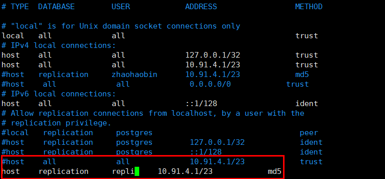

# 数据库双活


一、架构

架构如图所示，这里没有展示lvs负载均衡层。app请求分为写请求和读请求，写请求向10.91.4.251请求，最终分发到10.91.4.247，读请求向10.91.4.252，通过负载均衡，分发到10.91.4.247或10.91.4.248。


二、pg的主从配置
1、防火墙配置
由于防火墙的存在，主备库可能不能互通，主备库都需要增加如下规则：
`iptables -I INPUT 5 -p tcp --dport 5432 -j ACCEPT`

2、增加复制用户
在主服务器，进入pg数据库执行：
```
create role repli login replication encrypted password 'skyeye';
```
修改pg_hba.conf文件，在数据目录，当前的pg数据目录在/data10/pgdata，增加以下内容：

从库也需要在pg_hba.conf增加上图内容

3、pg_hba.conf和postgresql.conf配置
主备库都做相同的操作
当前的pg数据目录在/data10/pgdata，需根据当前的pg数据目录进行修改。
修改pg_hba.conf，增加信任ip，如下图


修改postgresql.conf，接受所有地址，如下图：


4、主从复制配置
修改postgresql.conf，主库配置，备库不同的在注释写明：
```
postgresql.conf
listen_addresses = '*'   # 监听所有IP
port = 5432
max_connections = 300  #这个设置要注意下，从库的max_connections必须要大于主库的，从库这里设置为1000
wal_level = hot_standby
max_wal_senders = 10 # 这个设置了可以最多有几个流复制连接，差不多有几个从，就设置几个
wal_keep_segments = 256 # 设置流复制保留的最多的xlog数目
wal_sender_timeout = 60s # 设置流复制主机发送数据的超时时间
full_page_writes = on  # 支持rewind同步主库数据
wal_log_hints = on  # 支持rewind
```

在从服务器上，如果存在数据库的数据目录，则先删除：`rm -rf /data10/pgdata`
然后从主库复制数据，并修改文件用户和组所属：：
```shell
pg_basebackup -F p --progress -D /data10/pgdata -h 10.91.4.247 -p 5432 -U repli --password
chown -R postgres:postgres /data10/pgdata
```
然后输入之前设置的密码skyeye。

接下来设置恢复文件：
主库在数据目录，当前为/data10/pgdata，创建recovery.done文件，内容如下
```shell
standby_mode = on
primary_conninfo = 'host=10.91.4.248 port=5432 user=repli password=skyeye'
recovery_target_timeline = 'latest'
```
并修改该文件所属用于和组：
`chown postgres:postgres /data10/pgdata/recovery.done`

备库相同的处理，不过命名为recovery.conf，且host修改为主库地址：
```shell
standby_mode = on
primary_conninfo = 'host=10.91.4.247 port=5432 user=repli password=skyeye'
recovery_target_timeline = 'latest'
```
并修改该文件所属用于和组：
`chown postgres:postgres /data10/pgdata/recovery.done`

5、测试配置是否成功
在主库中执行：

如上图，f表明是主库。若在备库执行，返回t则表明是备库。
同时也可以执行：

如图，可以看到备库的ip地址就证明配置成功。注：图和这里的主备库关系不同。

三、Keepavlied安装与配置
官网下载二进制文件：https://www.keepalived.org/software/keepalived-2.0.20.tar.gz
1、编译安装：
假设tar包放在/tools下
```shell
tar -zxvf keepalived-2.0.20.tar.gz
cd keepalived-2.0.20
./configure --prefix=/usr/local/keepalived
make&&make install
```

2、环境配置
由于keepalived的配置文件默认指定在/etc/keepalived，因此需要进行环境配置。
```shell
mkdir /etc/keepalived
cp /usr/local/keepalived/etc/keepalived/keepalived.conf /etc/keepalived/
cp /usr/local/keepalived/sbin/keepalived /usr/sbin/
cp /usr/local/keepalived/etc/sysconfig/keepalived /etc/keepalived
cp /tools/keepalived-2.0.20/keepalived/etc/init.d/keepalived /etc/init.d/
chmod 755 /etc/init.d/keepalived
```

3、主库的keepalived配置（10.91.4.247）
```shell
vim /etc/keepalived/keepalived.conf

keepalived.conf文件内容如下
! Configuration File for keepalived

global_defs {
   # 这里可配置邮件通知
   # notification_email {
   #   acassen@firewall.loc
   #   failover@firewall.loc
   #   sysadmin@firewall.loc
   # }
   # notification_email_from Alexandre.Cassen@firewall.loc
   # smtp_server 192.168.200.1
   # smtp_connect_timeout 30
   router_id pg1
}


vrrp_instance VI_1 {
    state BACKUP  # 主备都是BACKUP
    interface mgt
    virtual_router_id 50  # 主备库这里的id要一致
    priority 100
    advert_int 1
    nopreempt
    notify_master "/etc/keepalived/switch_master.sh"
    #notify_backup "/etc/keepalived/switch_backup.sh"
    authentication {
        auth_type PASS
        auth_pass skyeye
    }
    virtual_ipaddress {
	10.91.4.251 dev mgt label mgt:1
	10.91.4.252 dev mgt label mgt:2
    }
}


# 写VIP
virtual_server 10.91.4.251 5432
    delay_loop 3
    lb_algo rr
    lb_kind DR
    # persistence_timeout 5
    protocol TCP

	real_server 10.91.4.247 5432 {
        weight 1
        notify_down /etc/keepalived/pg_down.sh
        TCP_CHECK {
            connect_timeout 3
            nb_get_retry 3
            delay_before_retry 3
            connect_port 5432
        }
    }
}

# 读VIP
virtual_server fwmark 1 {
    delay_loop 3
    lb_algo rr
    lb_kind DR
    #persistence_timeout 5
    protocol TCP

    real_server 10.91.4.247 5432 {
	weight 1
	notify_down /etc/keepalived/pg_down.sh
	TCP_CHECK {
	    connect_timeout 3
	    nb_get_retry 3
            delay_before_retry 3
	    connect_port 5432
	    }
    }
    real_server 10.91.4.248 5432 {
	weight 1
	TCP_CHECK {
	    connect_timeout 3
	    nb_get_retry 3
	    delay_before_retry 3
	    connect_port 5432
	    }
    }
}

```

4、备库的keepalived配置
```shell
vim /etc/keepalived/keepalived.conf

keepalived.conf文件内容如下
! Configuration File for keepalived

global_defs {
   # 这里可配置邮件通知
   # notification_email {
   #   acassen@firewall.loc
   #   failover@firewall.loc
   #   sysadmin@firewall.loc
   # }
   # notification_email_from Alexandre.Cassen@firewall.loc
   # smtp_server 192.168.200.1
   # smtp_connect_timeout 30
   router_id pg2
}

vrrp_instance VI_1 {
    state BACKUP  # 主备库都为BACKUP
    interface mgt
    virtual_router_id 50  # 主备库id要一致
    priority 90
    advert_int 1
    nopreempt
    notify_master "/etc/keepalived/switch_master.sh"
    #notify_backup "/etc/keepalived/switch_backup.sh"
    authentication {
        auth_type PASS
        auth_pass skyeye
    }
    virtual_ipaddress {
	10.91.4.251 dev mgt label mgt:1
	10.91.4.252 dev mgt label mgt:2
    }
}

# 写VIP
virtual_server 10.91.4.251 5432
    delay_loop 3
    lb_algo rr
    lb_kind DR
    # persistence_timeout 5
    protocol TCP

	real_server 10.91.4.248 5432 {
        weight 1
	notify_down /etc/keepalived/pg_down.sh
        TCP_CHECK {
            connect_timeout 3
            nb_get_retry 3
            delay_before_retry 3
            connect_port 5432
        }
    }
}


# 读VIP
virtual_server fwmark 2 {
    delay_loop 3
    lb_algo rr
    lb_kind DR
    # persistence_timeout 5
    protocol TCP

    real_server 10.91.4.247 5432 {
        weight 1
        TCP_CHECK {
            connect_timeout 3
            nb_get_retry 3
            delay_before_retry 3
            connect_port 5432
        }
    }
    real_server 10.91.4.248 5432 {
        weight 1
        notify_down /etc/keepalived/pg_down.sh
        TCP_CHECK {
            connect_timeout 3
            nb_get_retry 3
            delay_before_retry 3
            connect_port 5432
        }
    }
}

```

5、防火墙配置
由于防火墙的存在，主备库可能不能互通，主备库都需要增加如下规则：
`iptables -I INPUT 4 -p vrrp -j ACCEPT`

6、notify_master脚本
/etc/keepalived/switch_master.sh
```shell
#!/usr/bin/bash

echo `date` >> "/etc/keepalived/messages.log"
echo "10.91.4.247 主库切换开始"  >> "/etc/keepalived/messages.log"
# 提升为主库
su - postgres -c "/usr/pgsql-11/bin/pg_ctl promote -D /data10/pgdata"

echo "10.91.4.247 主库切换完成" >> "/etc/keepalived/messages.log"
```
脚本的中的ip根据主备库修改，如这里是主备配置，若备库，则修改为10.91.4.248

7、notify_backup脚本
/etc/keepalived/switch_backup.sh
```shell
#!/usr/bin/bash

echo `date` >> "/etc/keepalived/messages.log"
echo "10.91.4.247 从库切换开始" >> "/etc/keepalived/messages.log"
systemctl stop postgresql-11
# 保证从库和主库数据一致
su - postgres -c "/usr/pgsql-11/bin/pg_rewind --target-pgdata /data10/pgdata/ --source-server='host=10.91.4.248 port=5432 user=postgres' -P"
`\cp -p /etc/keepalived/recovery.conf /data10/pgdata/recovery.conf`
rm -f /data10/pgdata/recovery.done
systemctl restart postgresql-11
echo "10.91.4.247 从库切换完成" >> "/etc/keepalived/messages.log"
```
ip根据主备库修改，如这里是主库配置，若备库，则修改为10.91.4.247

8、pg_down脚本
/etc/keepalived/pg_down.sh
```shell
#!/usr/bin/bash

systemctl stop keepalived
```
该脚本主备库一致

9、负载均衡问题
由于数据库读需要进行负载均衡，因此这里需要配置lvs。
（1）安装ipvsadm
从http://mirror.centos.org/centos/7/os/x86_64/Packages/ipvsadm-1.27-7.el7.x86_64.rpm下载
放在/tools/下，执行`rpm -ivh ipvsadm-1.27-7.el7.x86_64.rpm`安装
（2）循环转发问题
由于lvs和real_server在同一台服务器，因此会导致循环转发问题，需要通过iptables作标记再转发。
在主库执行（10.91.4.247）：
`iptables -t mangle -I PREROUTING -d 10.91.4.252 -p tcp -m tcp --dport 5432 -m mac ! --mac-source 00:0c:29:4d:b3:39 -j MARK --set-mark 0x1`
在从库执行（10.91.4.248）:
`iptables -t mangle -I PREROUTING -d 10.91.4.252 -p tcp -m tcp --dport 5432 -m mac ! --mac-source 00:0c:29:f5:0b:80 -j MARK --set-mark 0x2`

10.91.4.252是读VIP，dport是pg端口，00:0c:29:4d:b3:39是备库（10.91.4.248）的mac地址，00:0c:29:f5:0b:80是主库的mac地址。0x1和0x2分别对应主备库的keepalivde的fwmark配置。

10、编写real_server网络配置
在主库（10.91.4.247）和备库（10.91.4.248）上建立/etc/init.d/realserver文件，内容如下：
```
#!/usr/bin/sh
RVIP=10.91.4.251
WVIP=10.91.4.252
. /etc/rc.d/init.d/functions

case "$1" in
# 禁用本地的ARP请求、绑定本地回环地址
start)
    /sbin/ifconfig lo down
    /sbin/ifconfig lo up
    echo "1" >/proc/sys/net/ipv4/conf/lo/arp_ignore
    echo "2" >/proc/sys/net/ipv4/conf/lo/arp_announce
    echo "1" >/proc/sys/net/ipv4/conf/all/arp_ignore
    echo "2" >/proc/sys/net/ipv4/conf/all/arp_announce
    /sbin/sysctl -p >/dev/null 2>&1

    # 在回环地址上绑定VIP，设定掩码，与Direct Server上自身的IP保持通信
    /sbin/ifconfig lo:0 $RVIP netmask 255.255.255.255 up
    /sbin/ifconfig lo:1 $WVIP netmask 255.255.255.255 up

    /sbin/route add -host $RVIP dev lo:0
    /sbin/route add -host $WVIP dev lo:1

    echo "LVS-DR real server starts successfully.\n"
    ;;
stop)
    /sbin/ifconfig lo:0 down
    /sbin/ifconfig lo:1 down
    /sbin/route del $RVIP >/dev/null 2>&1
    /sbin/route del $WVIP >/dev/null 2>&1

    echo "1" >/proc/sys/net/ipv4/conf/lo/arp_ignore
    echo "2" >/proc/sys/net/ipv4/conf/lo/arp_announce
    echo "1" >/proc/sys/net/ipv4/conf/all/arp_ignore
    echo "2" >/proc/sys/net/ipv4/conf/all/arp_announce
echo "LVS-DR real server stopped.\n"
    ;;
status)
    isLoOn=`/sbin/ifconfig lo:0 | grep "$RVIP"`
    isRoOn=`/bin/netstat -rn | grep "$RVIP"`
    if [ "$isLoON" == "" -a "$isRoOn" == "" ]; then
        echo "LVS-DR real server has run yet."
    else
        echo "LVS-DR real server is running."
    fi
    exit 3
    ;;
*)
    echo "Usage: $0 {start|stop|status}"
    exit 1
esac
exit 0

```

执行以下命令使其开机启动，并启动realserver：
```
chmod +x /etc/init.d/realserver
echo "/etc/init.d/realserver" >> /etc/rc.d/rc.local
service start realserver
```

再启动keepalived：
`systemctl start keepalived`
利用ipvsadm查看转发：

可以看到，251转发到247，而252通过FWM负载均衡到247和248。

