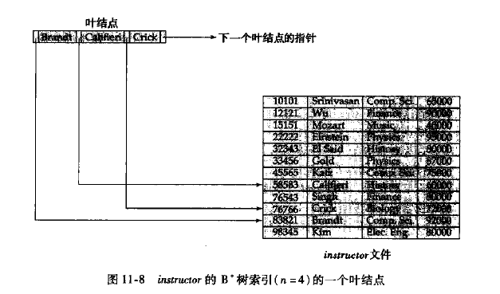

# 索引和散列

## 基本概念
数据库系统中文件索引非常类似书的目录。

两种基本的索引类型：

* 顺序索引：基于值的顺序排序。
* 散列索引：基于将值平均分布到若干散列桶中。一个值所属的散列桶是由一个函数决定的，该函数称为**散列函数**。

对于这两种索引类型的技术，需要考虑以下因素：

* 访问类型：能有效支持的访问类型。访问类型可以包括找到具有特定属性值的记录，以及找到属性值落到某个范围内的记录。
* 访问时间：在查询中使用该技术找到一个特定数据项或数据项集所需的时间。
* 插入时间：插入一个新数据项所需的时间。该值包括找到插入这个新数据项的正确位置所需的时间，以及更新索引结构所需的时间。
* 删除时间：删除一个数据项所需的时间。该值包括找到待删除项所需的时间，以及更新索引结构所需的时间。
* 空间开销：索引结构所占用的额外存储空间。

通常需要在一个文件上建立多个索引。例如，可能按作者、主题或者书名来查找一本书。

用于在文件中查找记录的属性或属性集称为**搜索码**。如果一个文件上有多个索引，那么它就有多个搜索码。

## 顺序索引
为了快速**随机访问**文件中的记录，可以使用索引结构。每个索引结构与一个特定的搜索码相关联。

如果包含记录的文件按照某个搜索码指定的顺序排序，那么该索引码对应的索引称为**聚集索引**。也称为**主索引**，一般建立在主码（主键）上。搜索码指定的顺序与文件中记录的物理顺序不同的索引称为**非聚集索引**或**辅助索引**。

### 稠密索引和稀疏索引
索引项或索引记录由一个搜索码值和指向具有该搜索码值的一条或多条记录的指针构成。指向记录的指针包括磁盘块的标识和标识磁盘块内记录的块内偏移量。

顺序索引有两类：

* 稠密索引：在稠密索引中，文件中的每个搜索码值都有一个索引项。在稠密聚集索引中，索引项包含搜索码值以及指向具有该所有吗值得第一条数据记录的指针。具有相同搜索码值得其余记录顺序地存储在第一条记录之后，由于该索引是聚集索引，因此记录根据相同的搜索码值排序。在稠密非聚集索引中，索引必须存储指向所有具有相同搜索码值得记录的指针列表。
* 稀疏索引：在稀疏索引中，只为搜索码的某些值建立索引项。只有当关系按搜索码排序顺序存储时才能使用稀疏索引。即只有索引是聚集索引时才能使用稀疏索引。和稠密索引一样，每个索引项也包括一个搜索码值和只想具有该搜索码值得第一条数据记录的指针。为了定位一条记录，我们找到其最大搜索码值小于或等于锁查找记录的搜索码值得索引项。然后从该索引项指向的记录开始，沿着文件中的指针查找，直到找到所需记录为止。

稠密索引查找性能好，而稀疏索引占空间较小，并且插入和删除时所需的维护开销也较小。

### 多级索引
如果关系中元祖过多，那么建立一级稠密索引就需要大量的磁盘空间。如果索引较大，那么不能放到主存中，搜索一个索引项需要多次读取磁盘块。

即便使用二分搜索，那么也需要logn的时间复杂度。

为了解决这个文件，可以像对待其他任何顺序文件那样对待索引文件，并且在原始的内层索引上构造一个稀疏的外层索引。索引项总是有序的，因此外层索引可以是稀疏的。为了定位一条记录，首先在外层索引上使用二分搜索找到其最大搜索码值小于或等于所需搜索码值得记录。指针指向一个内层索引块。扫描这一块直到找到其最大搜索码值小于或等于所需搜索码值的记录。这条记录的指针只想包含所查找记录的文件块。

## B+树索引文件
索引顺序文件组织最大的缺点在于，随着文件的增大，索引查找性能和数据顺序扫描都会下降。虽然能通过重新租金来弥补，但是不希望频繁地进行重组。

B+树索引结构是在数据插入和删除的情况下仍能保持其执行效率的集中使用最广泛的索引结构之一。B+树索引采用**平衡树**结构，其中树根到树叶的每条路径的长度相同。树种每个非叶结点有[n/2]~n个子女（[n/2]向上取整），其中n对特定的树是固定的。

### B+树结构
B+树索引是一种多级索引，但是其结构不同于多级索引顺序文件。典型的B+树结点结构如下图所示。它最多包含n-1个搜索码值K1、K2，……，Kn-1，以及n个指针P1、P2、……，Pn。每个结点中的搜索码值排序存放。因此，如果i<j，你们Ki<Kj（假设没有重复的码值）。

首先考察叶结点的结构。对i=1,2，……，n-1，指针Pi指向具有搜索码值Ki的一条文件记录。指针Pn有特殊作用。

下图是instructor文件的B+树的一个叶结点，其中我们设n等于4，搜索码是name。

每个叶结点最多可有n-1个值。允许叶结点包含的值得个数最少为[(n-1)/2]（向上取整）。在B+树例子中n=4，每个叶子必须包含最少两个并且最多三个值。

各叶结点中值的范围互不重合，除非有重复的搜索码值，在这种情况下，一个值可能出现在多个叶结点中。即，如果Li和Lj是两个叶结点且i<j，那么Li中的所有搜索码值都小于或等于Lj中所有搜索码值。要使B+树索引成为稠密索引（通常情况），各搜索码值都必须出现在某个叶结点。

因为各叶结点之间按照所含的的搜索码值大小有一个线性的顺序，所以可以用Pn将叶结点按搜索码顺序串在一起。郑重排序可以对文件进行高效的顺序处理。

B+树的非叶结点形成叶结点上的一个多级（稀疏）索引。非叶结点的结构和叶结点的相同，只不过非叶结点中所有的指针都是指向树中结点的指针。一个非叶结点可以容纳最多n个指针，同事必须至少容纳[n/2]（向上取整）个指针。结点的指针数称为该结点的扇出。非叶结点也称为**内部结点**。

## 静态散列
顺序文件组织的一个缺点是我们必须访问索引结构来定位数据，或者必须使用二分法搜索。这将导致过多的I/O操作。基于散列技术的文件组织使我们能够避免访问索引结构。散列也提供了一种构造索引的方法。

在对散列的描述中，术语**桶**表示能存储一条或多条记录的一个存储单位。通常一个桶就是一个磁盘块，但也可能小于或大于一个磁盘块。

令K表示所有搜索码值得集合，令B表示所有桶地址的集合，散列函数h是一个从K到B的函数。

散列可以用于两个不同的目的。在散列文件组织中，通过计算所需记录搜索码值上的一个函数直接获得包含该记录的磁盘块地址。在散列索引组织中，把搜索码以及它们相关联的指针组织成一个散列文件结构。

### 散列函数
希望选择一个把搜索码值分配到桶中并且具有下列分布特性的散列函数。

* 分布是均匀的。即散列函数从所有可能的搜索码值集合中为每个桶分配同样数量的搜索码值。
* 分布式随机的。即在一般情况下，不管搜索码实际怎样分布，每个桶应分配到搜索码值数目几乎相同。

### 顺序索引和散列索引
如果不会频繁使用范围查询，散列索引性能更好，否则使用顺序索引。一般都使用顺序索引。