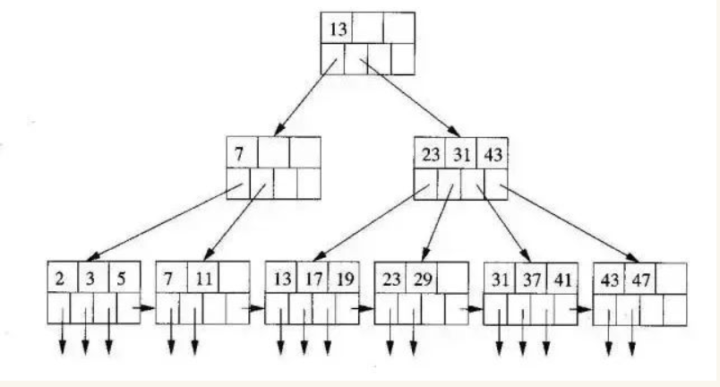
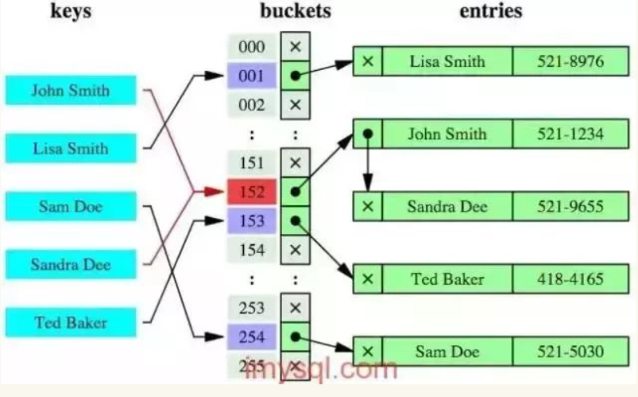
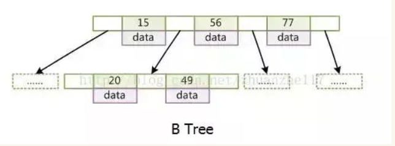
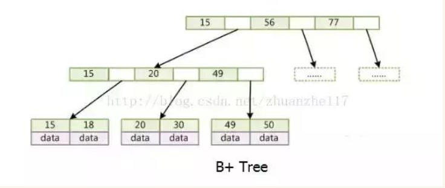

# mysql

## 为什么用自增列作为主键
1. 数据记录本身被存于主索引（一棵B+树）的叶子节点上，这要求同一个叶子节点内（大小为一个内存页或磁盘页）的各条数据记录按主键顺序存储。因此每当有一条新的记录插入时，mysql会根据其主键将其插入适当的节点和位置，如果页面达到装载因子（InnoDB默认为15/16），则开辟一个新的页（节点）。
2. 如果使用自增主键，那么每次插入新的记录，记录就会顺序添加到当前索引节点的后续位置，当一页写满，就会自动开辟一个新的页（节点）。
3. 如果使用非自增主键，由于每次插入主键的值近似于随机，因此每次新纪录都要被插入到现有索引页中间的某个位置。此时MySQL不得不为了将新纪录插到合适位置而移动数据，甚至目标页面可以能已经被回写到磁盘上而从缓存中清掉，此时又要从磁盘上都回来，这增加了很多开销。同时频繁的移动、分页操作造成了大量的碎片，得到了不够紧凑的索引结构，后续不得不通过optimize table来重建表并优化填充页面。

## 为什么使用数据索引能提高效率
1. 数据索引的存储是有序的
2. 在有序的情况下，通过索引查询一个数据无序遍历索引记录
3. 极端情况下，数据索引的查询效率为二分查找效率，时间复杂度O(logn)

## B+树索引和哈希索引的区别
B+树是一个平衡多叉树，从根节点到每个叶子节点的高度差不超过1，而且同层级的节点间有指针相互连接，是有序的，如下图：

哈希索引就是采用移动的哈希算法，检索时不需要类似B+树那样从根节点到叶子节点逐级查找，只需一次哈希算法即可，是无序的，如下图：

### 哈希索引的优势
**等值查询**。哈希索引具有绝对优势（前提是没有大量重复的键值，否则效率低，因为哈希冲突）

### 哈希索引不适合的场景
1. 不支持范围查询
2. 不支持索引完成排序
3. 不支持联合索引的最左前缀匹配规则

## B树和B+树的区别
1. B树，每个节点都存储key和data，所有节点组成这棵树，并且叶子节点指针为null，叶子节点不包含任何关键字信息。

2. B+树，所有叶子节点中包含了全部关键字信息，及指向这些关键字记录的指针，且叶子节点本身依关键字的大小自小而大的顺序连接。所有的非终端节点可以看成索引部分，节点中仅含有其子树根节点中最大（或最小）关键字。（而B树的非终结点也包含需要查找的有效信息）

[url](https://www.cnblogs.com/williamjie/p/11081592.html)