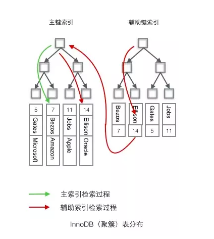
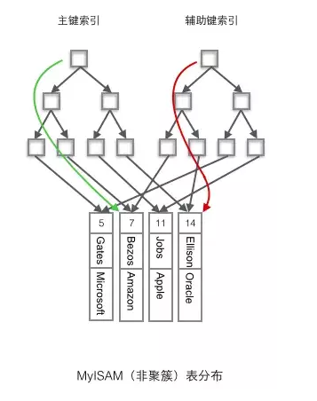
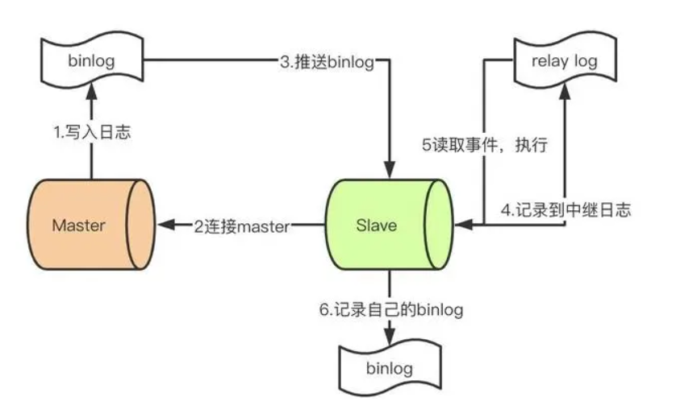

# mysql

## 为什么用自增列作为主键
1. 数据记录本身被存于主索引（一棵B+树）的叶子节点上，这要求同一个叶子节点内（大小为一个内存页或磁盘页）的各条数据记录按主键顺序存储。因此每当有一条新的记录插入时，mysql会根据其主键将其插入适当的节点和位置，如果页面达到装载因子（InnoDB默认为15/16），则开辟一个新的页（节点）。
2. 如果使用自增主键，那么每次插入新的记录，记录就会顺序添加到当前索引节点的后续位置，当一页写满，就会自动开辟一个新的页（节点）。
3. 如果使用非自增主键，由于每次插入主键的值近似于随机，因此每次新纪录都要被插入到现有索引页中间的某个位置。此时MySQL不得不为了将新纪录插到合适位置而移动数据，甚至目标页面可以能已经被回写到磁盘上而从缓存中清掉，此时又要从磁盘上都回来，这增加了很多开销。同时频繁的移动、分页操作造成了大量的碎片，得到了不够紧凑的索引结构，后续不得不通过optimize table来重建表并优化填充页面。

## 为什么使用数据索引能提高效率
1. 数据索引的存储是有序的
2. 在有序的情况下，通过索引查询一个数据无序遍历索引记录
3. 极端情况下，数据索引的查询效率为二分查找效率，时间复杂度O(logn)

## B+树索引和哈希索引的区别
B+树是一个平衡多叉树，从根节点到每个叶子节点的高度差不超过1，而且同层级的节点间有指针相互连接，是有序的，如下图：


哈希索引就是采用移动的哈希算法，检索时不需要类似B+树那样从根节点到叶子节点逐级查找，只需一次哈希算法即可，是无序的，如下图：


### 哈希索引的优势
**等值查询**。哈希索引具有绝对优势（前提是没有大量重复的键值，否则效率低，因为哈希冲突）

### 哈希索引不适合的场景
1. 不支持范围查询
2. 不支持索引完成排序
3. 不支持联合索引的最左前缀匹配规则


## B树和B+树的区别
1. B树，每个节点都存储key和data，所有节点组成这棵树，并且叶子节点指针为null，叶子节点不包含任何关键字信息。

m阶B树定义：
* 每个节点最多只有m个子节点，当超过m时需要进行分裂。
* 每个非叶子节点（除了根）具有至少ceil(m/2)子节点。
* 如果根不是叶节点，则根至少有两个子节点。
* 具有k个子节点的非叶节点包含k -1个关键字。
* 所有叶子都出现在同一水平，没有任何信息（高度一致）。


2. B+树，所有叶子节点中包含了全部关键字信息，及指向这些关键字记录的指针，且叶子节点本身依关键字的大小自小而大的顺序连接。所有的非终端节点可以看成索引部分，节点中仅含有其子树根节点中最大（或最小）关键字。（而B树的非终结点也包含需要查找的有效信息）

m阶B+树定义和B树定义几乎相同，不同点在于：
* 具有k个子节点的非叶子节点包含k个关键字
* 叶子节点包含所有父节点的关键字
* 非叶子节点不存储关键字指向磁盘数据的指针，如图中的data字段
* 叶子节点有一个尾指针指向下一个叶子节点


### 为什么说B+树比B树更适合数据库索引？
1. B+树的磁盘读写代价更低
B+树的内部结点并没有指向关键字具体信息的指针。因此其内部结点相对B树更小。如果把所有同一内部结点的关键字存放在同一盘块中，那么盘块所能容纳的关键字数量也越多。一次性读入内存中的需要查找的关键字也就越多。相对来说IO读写次数也就降低了；

2. B+树查询效率更加稳定
由于非终结点并不是最终指向文件内容的结点，而只是叶子结点中关键字的索引。所以任何关键字的查找必须走一条从根结点到叶子结点的路。所有关键字查询的路径长度相同，导致每一个数据的查询效率相当；

3. B+树便于范围查询（最重要的原因，范围查找是数据库的常态）
B树在提高了IO性能的同时并没有解决元素遍历的我效率低下的问题，正是为了解决这个问题，B+树应用而生。B+树只需要去遍历叶子节点就可以实现整棵树的遍历。而且在数据库中基于范围的查询是非常频繁的，而B树不支持这样的操作或者说效率太低；不懂可以看看这篇解读-》范围查找

补充：B树的范围查找用的是中序遍历，而B+树用的是在链表上遍历；


## MySQL联合索引
1. 联合索引是两个或更多列上的索引。
联合索引只适合最左前缀匹配，如建立联合索引（a，b，c），则只支持a、ab、abc走索引，其他如bc等不走索引。

2. 利用索引中的附加列，可以缩小搜索的范围。


## 什么情况下不建或少建索引
1. 表记录太少。
2. 经常插入、更新、删除。
3. 数据重复且分布平均的表字段，如字段flag，值True占50%，值False占50%。
4. 经常和主字段一块查询但主字段索引值比较多的表字段。


## 表分区
表分区，是根据一定规则，将数据库中的一张表分解成多个更小的，容易管理的部分。从逻辑上来看，只有一张表，但是底层却是由多个物理分区组成。

### 表分区和分表的区别
分表：指的是通过一定规则，将一张表分解成多张不同的表。比如用户订单记录根据时间分成多个表。

区别：分区从逻辑上只有一张表，而分表则是分成多个表。

### 表分区的优点
1. 存储更多数据。分区表的数据可以分布在不同的物理设备上，从而高效地利用多个硬件设备。
2. 优化查询。在where语句中包含分区条件，可以只扫描一个或多个分区来提高查询效率；涉及sum和count语句时，也可以在多个分区上并行处理，最后汇总结果。
3. 分区表更容易维护。例如删除大量数据可以删除整个分区表。
4. 避免某些特殊的瓶颈。例如InnoDB的单个索引的互斥访问等。

### 分区表的限制因素
1. 一个表最多有1024个分区。
2. 如果分区字段中有主键或者唯一约束的列，那么所有主键列和唯一索引列都必须包含进来。
3. 分区表无法使用外键约束。
4. 分区适用于一个表的所有数据和索引，不能对它们其一进行分区。

### 分区类型
1. RANGE分区：这种模式允许将数据划分不同范围。如将一个表通过年份划分若干分区。
2. LIST分区：这种模式允许系统通过预定义的列表的值来对数据进行分割。按照List中的值分区，与RANGE的区别是RANGE分区的区间范围是连续的。
3. HASH分区：这种模式允许通过对表的一个或多个列的hash key计算进行分区。

## 四种隔离级别
1. 读未提交（RU）：会发生脏读、不可重复读和幻读。
2. 读已提交（RC）：解决脏读；会发生不可重复读和幻读。
3. 可重复读（RR）：解决脏读、不可重复读；会发生幻读。MySQL默认隔离级别。
4. 串行化（Serializable）：解决脏读、不可重复读和幻读。

* 脏读：读了别的事务未提交的数据。
* 不可重复读：主要针对是更新数据，如事务t1第一次根据条件读了某些数据，中间事务t2更新了数据，然后事务t2再次读取发生和第一次读取的数据不一样了。
* 幻读：主要针对的是插入和删除数据，如事务t1第一次根据条件读了某些数据，中间事务t2插入了数据，然后事务t2再次读取发生和第一次读取的数据相比变多了。


## MVCC
MVCC的优点：读不阻塞写，写不阻塞读。提高并发性能。适合多读少写。MySQL主要用MVCC实现读已提交（RC）和可重复读（RR）的隔离级别。

在MVCC中，读操作可以分成两类：
* 快照读：读取的是记录的可见版本（小于当前事务id的版本），不用加锁。
* 当前读：读取的是记录最新版本，并且，当前读返回的记录都会加上锁，保证其他其他事务不会再并发修改这条记录。


## 行级锁
行级锁的优点：
1. 当在许多线程中访问不同的行时只存在少量锁定冲突。粒度更小，并发性能更好。
2. 回滚时只有少量的更改。
3. 可以长时间锁定单一的行。

行级锁的缺点：
1. 比页级锁或表锁占用更多的内存。
2. 当在表的大部分中使用时，比页级锁或表锁锁定速度慢，因为必须获取更多的锁。
3. 如果在大部分数据上经常进行GROUP BY操作或者必须经常扫描整个表，比其他锁明显慢很多。


## 优化
1. 开启查询缓存，优化查询。
2. 利用explain来分析查询。
3. 当只要一行数据时使用limit 1。
4. 为搜索字段建立索引。
5. 使用ENUM而不是VARCHAR。
6. 垂直分表。
7. 选择正确的存储引擎。


## key和index的区别
1. key是数据库的物理结构，它包含两层意义和作用，一是约束，如唯一约束，外部引用完整性约束等，二是索引，包括primary key，unique key，foreign key等。
2. index是数据库的物理结构，它只是辅助查询的，它创建时会在另外的表空间以一个类似目录的结构存储，可以分为：前缀索引、全文索引等。

总结：key包含了index，除了有索引作用，还有约束作用。


## MyISAM和InnoDB区别
1. InnoDB支持事务，MyISAM不支持。
2. InnoDB支持外键，MyISAM不支持。
3. InnoDB是聚集索引，数据文件和索引绑定在一起，必须要有主键，通过主键索引效率很高。但是辅助索引需要两次查询，先查询到主键，然后再通过主键查询到数据，因此主键不应该太大。而MyISAM是非聚集索引，数据文件是分离的，索引保存的是数据文件的指针。主键索引和辅助索引是独立的。
4. InnoDB不保存表的具体行数，执行`select count(*) from table;`需要全表扫描，而MyISAM只需要读出该变量即可。
5. InnoDB不支持全文索引，而MyISAM支持全文索引，查询效率上MyISAM要高。

如何选择：
1. 需要事务只能使用InnoDB，其他可以考虑MyISAM。
2. 如果表中绝大多数数据都只是读查询，可以考虑MyISAM；如果读写频繁，使用InnoDB。
3. 系统崩溃后，MyISAM恢复起来更困难。


## MySQL的复制原理以及流程
1. 主：binlog线程记录下所有改变了数据库数据的语句，放进master的binlog中；
2. 从：io线程在使用start slave之后，负责从master拉取binlog内容，放进自己的relay log（中继日志）中；
3. 从：sql执行线程执行relay log中的语句。


## InnoDB的日志的实现方式
1. 错误日志：记录出错信息，也记录一些警告信息或者正确信息。
2. 查询日志：记录所有对数据库请求的信息。
3. 慢查询日志：设置一个阈值，将运行时间超过该阈值的所有SQL语句都记录到慢查询日志文件中。
4. 二进制日志：记录对数据库执行更改的所有操作，开启二进制日志的是master。
5. 中继日志：记录master的二进制日志。
6. 事务日志：记录事务的日志。


## 聚簇索引和非聚簇索引
**聚簇索引**：将数据存储与索引放到了一块，索引结构的叶子节点保存了行数据

**非聚簇索引**：将数据与索引分开存储，索引结构的叶子节点指向了数据对应的位置

在innodb中，在聚簇索引之上创建的索引称之为辅助索引，非聚簇索引都是辅助索引，像复合索引、前缀索引、唯一索引。辅助索引叶子节点存储的不再是行的物理位置，而是**主键值**，辅助索引（也称二级索引）访问数据总是需要二次查找。



两者检索的区别：
1. InnoDB使用的是聚簇索引，将主键组织到一棵B+树中，而行数据就储存在叶子节点上，若使用"where id = 14"这样的条件查找主键，则按照B+树的检索算法即可查找到对应的叶节点，之后获得行数据。
2. 若对Name列进行条件搜索，则需要两个步骤：第一步在辅助索引B+树中检索Name，到达其叶子节点获取对应的主键。第二步使用主键在主索引B+树种再执行一次B+树检索操作，最终到达叶子节点即可获取整行数据。（重点在于通过其他键需要建立辅助索引）

聚簇索引的特性：
1. 聚簇索引具有唯一性，由于聚簇索引是将数据跟索引结构放到一块，因此一个表仅有一个聚簇索引。
2. 表中行的物理顺序和索引中行的物理顺序是相同的，在创建任何非聚簇索引之前创建聚簇索引，这是因为聚簇索引改变了表中行的物理顺序，数据行 按照一定的顺序排列，并且自动维护这个顺序；
3. 聚簇索引默认是主键，如果表中没有定义主键，InnoDB 会选择一个唯一且非空的索引代替。如果没有这样的索引，InnoDB 会隐式定义一个主键（类似oracle中的RowId）来作为聚簇索引。如果已经设置了主键为聚簇索引又希望再单独设置聚簇索引，必须先删除主键，然后添加我们想要的聚簇索引，最后恢复设置主键即可。

MyISAM使用的是非聚簇索引，非聚簇索引的两棵B+树看上去没什么不同，节点的结构完全一致只是存储的内容不同而已，主键索引B+树的节点存储了主键，辅助键索引B+树存储了辅助键，**索引指向数据存储地址，而不像InnoDB存储的是主键值**。表数据存储在独立的地方，这两颗B+树的叶子节点都使用一个地址指向真正的表数据，对于表数据来说，这两个键没有任何差别。由于索引树是独立的，通过辅助键检索无需访问主键的索引树。如下图




聚簇索引的优点：

每次使用辅助索引检索都要经过两次B+树查找，看上去聚簇索引的效率明显要低于非聚簇索引，这不是多此一举吗？聚簇索引的优势在哪？

1.由于行数据和聚簇索引的叶子节点存储在一起，同一页中会有多条行数据，访问同一数据页不同行记录时，已经把页加载到了Buffer中（缓存器），再次访问时，会在内存中完成访问，不必访问磁盘。这样主键和行数据是一起被载入内存的，找到叶子节点就可以立刻将行数据返回了，如果按照主键Id来组织数据，获得数据更快。

2.辅助索引的叶子节点，存储主键值，而不是数据的存放地址。好处是当行数据放生变化时，索引树的节点也需要分裂变化；或者是我们需要查找的数据，在上一次IO读写的缓存中没有，需要发生一次新的IO操作时，可以避免对辅助索引的维护工作，只需要维护聚簇索引树就好了。另一个好处是，因为辅助索引存放的是主键值，减少了辅助索引占用的存储空间大小。

注：我们知道一次io读写，可以获取到16K大小的资源，我们称之为读取到的数据区域为Page。而我们的B树，B+树的索引结构，叶子节点上存放好多个关键字（索引值）和对应的数据，都会在一次IO操作中被读取到缓存中，所以在访问同一个页中的不同记录时，会在内存里操作，而不用再次进行IO操作了。除非发生了页的分裂，即要查询的行数据不在上次IO操作的缓存里，才会触发新的IO操作。

3.因为MyISAM的主索引并非聚簇索引，那么他的数据的物理地址必然是凌乱的，拿到这些物理地址，按照合适的算法进行I/O读取，于是开始不停的寻道不停的旋转。聚簇索引则只需一次I/O。（强烈的对比）

4.不过，如果涉及到大数据量的排序、全表扫描、count之类的操作的话，还是MyISAM占优势些，因为索引所占空间小，这些操作是需要在内存中完成的。


聚簇索引需要注意的地方

当使用主键为聚簇索引时，主键最好不要使用uuid，因为uuid的值太过离散，不适合排序且可能出线新增加记录的uuid，会插入在索引树中间的位置，导致索引树调整复杂度变大，消耗更多的时间和资源。

建议使用int类型的自增，方便排序并且默认会在索引树的末尾增加主键值，对索引树的结构影响最小。而且，主键值占用的存储空间越大，辅助索引中保存的主键值也会跟着变大，占用存储空间，也会影响到IO操作读取到的数据量。

为什么主键通常建议使用自增id

聚簇索引的数据的物理存放顺序与索引顺序是一致的，即：只要索引是相邻的，那么对应的数据一定也是相邻地存放在磁盘上的。如果主键不是自增id，那么可以想 象，它会干些什么，不断地调整数据的物理地址、分页，当然也有其他一些措施来减少这些操作，但却无法彻底避免。但，如果是自增的，那就简单了，它只需要一 页一页地写，索引结构相对紧凑，磁盘碎片少，效率也高。


## 覆盖索引
覆盖索引指一个查询语句的执行只用从索引中就能够获取，不必从数据表中读取。

当一条查询语句符合覆盖索引条件时，MySQL只需要通过索引就可以返回查询所需要的数据，这样避免了查到索引获取主键值回表再次查询，减少I/O提高效率。

如，表covering_index_sample中有一个普通索引 idx_key1_key2(key1,key2)。

当我们通过SQL语句：`select key2 from covering_index_sample where key1 = 'keytest';`的时候，就可以通过覆盖索引查询，无需回表。


## 索引下推、查询优化
MySQL5.6对索引做了优化：索引下推（Index Condition Pushdown）

people表中（zipcode，lastname，firstname）构成一个索引

`SELECT * FROM people WHERE zipcode='95054' AND lastname LIKE '%etrunia%' AND address LIKE '%Main Street%';`

如果没有使用索引下推技术，则MySQL会只考虑zipcode，然后回表获取数据，然后MySQL服务端基于lastname LIKE '%etrunia%'和address LIKE '%Main Street%'来判断数据是否符合条件。如果符合zipcode为95054的有三条数据，则需要回表三次，然后根据lastname和address进行过滤。

如果使用了索引下推技术，会考虑zipcode和lastname索引是否同时满足，则MYSQL首先会返回符合zipcode='95054'的索引，然后根据lastname LIKE '%etrunia%'和address LIKE '%Main Street%'来判断索引是否符合条件。如果符合条件，则根据该索引来定位对应的数据，如果不符合，则直接reject掉。有了索引下推优化，可以在有like条件查询的情况下，减少回表次数。如果符合zipcode为95054，且同时满足lastname为%etrunia%的只有一条数据，那么只需要回表一次。


## 可重复读（RR）隔离级别下MVCC如何工作？
* SELECT：InnoDB会根据以下条件检查每一行记录：第一，InnoDB只查找版本早于当前事务版本的数据行，这样可以确保事务读取的行要么在开始事务之前已经存在要么是事务自身插入或者修改过。第二，行的删除版本号要么未定义，要么大于当前事务版本号，这样可以确保事务读取到的行在事务开始之前未被删除。
* INSERT：InnoDB为新插入的每一行保存当前系统版本号作为行版本号。
* DELETE：InnoDB为删除的每一行保存当前系统版本号作为行删除标识。
* UPDATE：InnoDB为插入的一行新记录保存当前系统版本作为行版本号，同时保存当前系统版本号到原来的行作为删除标识保存这两个版本号，使大多数操作都不用加锁。不足之处使每行记录都需要额外存储空间。

## MySQL事务实现原理是什么？
* 事务的实现基于数据库的存储引擎，不同的存储引擎对事务的支持程度不一样。MySQL中支持事务的存储引擎有InnoDB和NDB。
* InnoDB是通过MVCC解决不可重复读，加上间隙锁解决幻读问题。
* InnoDB的RR隔离级别实际上实现了串行化级别的效果，而且保留了比较好的并发性能。事务的隔离性是通过锁和MVCC实现，而事务的原子性通过undo log日志实现、一致性一般由代码层实现，持久性则是通过内存和redo log实现。


## 锁的类型有哪些
主要有共享锁（读锁）和排他锁（写锁）。

读锁是共享的，可以通过`lock in share mode`实现，这时候只能读不能写。

写锁是排他的，它会阻塞其他的写锁和读锁。从颗粒度来区分，可以分为行锁和表锁。

表锁会锁定整张表并且阻塞其他用户对该表的所有读写操作，比如alter修改表结构的时候会锁表。

行锁又可以分为乐观锁和悲观锁，悲观锁可以通过`for update`实现，乐观锁则通过MVCC实现。


## 间隙锁
间隙锁是可重复读级别下才有的锁，结合MVCC和间隙锁可以解决幻读的问题。

假设user表有以下几条数据：

| id  | age |
| --- | --- |
| 1   | 10  |
| 2   | 20  |
| 3   | 30  |

当我们执行：

```SQL
begin;
select * from user where age=20 for update; # 加了悲观锁
begin;
insert into user(age) values(10); # 成功
insert into user(age) values(11); # 失败
insert into user(age) values(20); # 失败
insert into user(age) values(21); # 失败
insert into user(age) values(30); # 失败
```

只有10可以插入成功，因为表的间隙mysql自动生成区间（左开右闭）：
(negeative infinity, 10], (10,20], (20,30], (30, postive infinity)

由于20存在记录，所以(10, 20], (20, 30]区间都被锁定了无法插入、删除。


## 分表后的ID怎么保证唯一性
1. 设置步长，比如1-1024张表分别设定1-1024基础步长。
2. 分布式id，如雪花算法
3. 分表后不适用主键作为查询一句，而是每张表单独新增一个字段作为唯一主键使用，比如订单表订单号是唯一的。


## 分表后非sharding_key的查询怎么处理
1. 可以作一个mapping，比如这时候商家要查询订单列表怎么办？不带user_id查询总不能全表扫描吧，做一个映射表，保存商家和用户的关系，查询的时候先通过商家查询用户列表，再通过user_id查询。
2. 打宽表，一般而言，商户端对数据实时性要求不高，比如查询订单列表，可以把订单列表同步到离线（实时）数仓，再基于数仓取做一张宽表，然后再基于其他如es提供查询服务。
3. 数据量不是很大的话，比如后台的一些查询之类的，也可以通过多线程扫表，然后再聚合的结果方式。也可以异步。


## Mysql主从同步怎么做
1. master提供完事务后，写入binlog。
2. slave连接master，获取binlog。
3. master创建dump线程，推送binlog到slave。
4. slave启动一个I/O线程读取同步过来的master的binlog，记录到relay log中继日志中。
5. slave再启动一个sql线程读取relay log事件并在slave执行，完成同步。
6. slave记录自己的binlog。



由于MySQl默认的复制方式是异步的，主库把日志发送给从库后不关心从库是否已经处理，这里会产生一个问题就是假设主库挂了，从库处理失败，这时候从库提升为主库，日志就丢失了。由此产生两个概念。

全同步复制：主库写入binlog后强制同步日志到从库，所有的从库都执行完成后才返回客户端，但是性能很差。

半同步复制：从库写入日志成功后返回ack确认给主库，主库收到至少一个从库的取人就认为写操作完成。

## 主从的延迟怎么解决

## 为什么MySQl默认隔离级别是可重复读
[url](https://blog.csdn.net/m0_37774696/article/details/88951846)


## 关于锁方面
