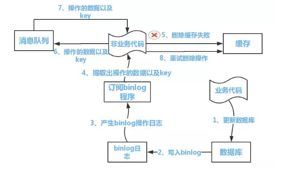

# others

## 高并发下，先操作缓存还是先操作数据库
cache aside pattern（边缘缓存模式）：

1. 失效：查询不到缓存，从数据库获取数据再设置缓存。
2. 命中：直接返回缓存中的数据。
3. 更新：先更新数据库，再删除缓存。

在以下两种情况也可能出现数据不一致：

1. 缓存刚好失效；
2. 请求A查询数据库，得一个旧值；
3. 请求B将新值写入数据库；
4. 请求B删除缓存；
5. 请求A将查到的旧值写入缓存；

但这种情况出现概率极低。

另外一种数据不一致的情况：
删除缓存失败。

解决办法：

1. 更新数据库数据
2. 数据库会将操作信息写入binlog日志当中
3. 订阅程序提取出所需要的数据以及key
4. 另起一段非业务代码，获取该信息
5. 尝试删除缓存操作，发现删除失败
6. 将这些信息发送到消息队列
7. 重新从消息队列中获取该数据，重试执行。