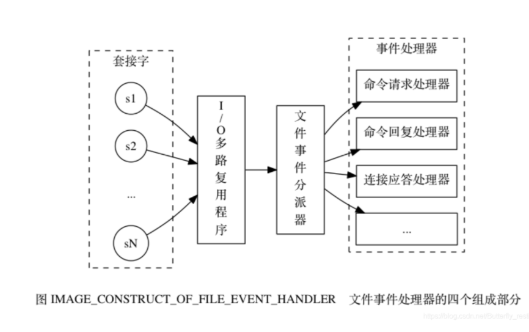

# redis

## gossip原理
可以理解为**随机**感染传播。

[图解Gossip：可能是最有趣的一致性协议](https://www.jianshu.com/p/54eab117e6ae)

[P2P 网络核心技术（Gossip 协议）](https://www.solves.com.cn/it/wl/zs/2019-08-29/3968.html)

[浅谈集群版Redis和Gossip协议](https://zhuanlan.zhihu.com/p/92937061)

[《redis设计与实现》-17 集群 gossip协议](https://blog.csdn.net/bohu83/article/details/86507369)

## 布隆过滤器
能解决缓存穿透问题，布隆过滤器说不在缓存里肯定不在，说在缓存里可能有误判。

[python-布隆过滤器](https://www.cnblogs.com/yscl/p/12003359.html)

需要删除元素则可以使用布谷鸟过滤器或者计数过滤器

## redis持久化机制
Redis是一个支持持久化的内存数据库，通过持久化机制把内存中的数据同步到硬盘文件来保证数据持久化。当Redis重启后通过把硬盘文件重新加载到内存，就能达到恢复数据的目的。
实现：fork+cow。单独创建fork()一个子进程，将当前父进程的数据库数据复制到子进程的内存中，然后由子进程写入到临时文件中，持久化的过程结束了，再用这个临时文件替换上次的快照文件，然后子进程退出，内存释放。

RDB是Redis默认的持久化方式。按照一定的时间周期策略把内存的数据以快照的形式保存到硬盘的二进制文件。即Snapshot快照存储，对应产生的数据文件为dump.rdb，通过配置文件中的save参数来定义快照的周期。（ 快照可以是其所表示的数据的一个副本，也可以是数据的一个复制品。）

AOF：Redis会将每一个收到的写命令都通过Write函数追加到文件最后，类似于MySQL的binlog。当Redis重启是会通过重新执行文件中保存的写命令来在内存中重建整个数据库的内容。
当两种方式同时开启时，数据恢复Redis会优先选择AOF恢复。

对比：
1. aof文件比rdb更新频率高，优先使用aof还原数据。
2. aof比rdb更安全
3. rdb性能更好
4. 如果两个都配了，优先加载aof。

## 缓存雪崩、缓存穿透等问题
### 缓存雪崩
缓存雪崩是由于重启服务器或者大量过期时间相同的key同时过期，使得大量缓存失效。

解决办法：访问数据库时加锁或者利用队列避免压溃数据库，高可用避免宕机缓存失效，过期时间增加随机数，错开过期时间。

### 缓存穿透
指用户查询了一个数据库里没有的数据，自然在缓存中也没有。每次都需要访问数据库，增大压力。

解决办法：布隆过滤器，或者把这个空结果放到缓存，但过期时间很短。

### 缓存击穿
和缓存雪崩一样，只不过这里指的是一个key，雪崩指的是大量key。一个key非常热点，在不停的扛着大并发，大并发集中对这一个点进行访问，当这个key在失效的瞬间，持续的大并发就穿破缓存，直接请求数据。

解决办法：加锁。

### 缓存预热
在系统上线后，将相关的缓存数据加载到缓存系统。避免在用户请求的时候，先查询数据库，然后再将数据缓存。

解决思路：
1. 直接写个缓存刷新页面，上线时手工操作。
2. 数据量不大时，可以在项目启动的时候自动加载。
3. 定时刷新缓存。

### 缓存更新
除了缓存服务器自带的缓存失效策略之外（redis默认有6种策略），还可以根据具体业务需求进行自定义的缓存淘汰，常见的策略有：
1. 定时清理过期缓存。
2. 当有用户请求时，再判断这个请求是否过期，过期则更新。

### 缓存降级
当访问量剧增、服务出现问题（如响应时间慢或不响应）或非核心服务影响到核心流程的性能时，仍然需要保证服务还是可用的，即使是有损服务。系统可以根据一些关键数据进行自动降级，也可以配置开关实现人工降级。

降级的最终目的是保证核心服务可用，即使是有损的。而且有些服务是无法降级的（比如加入购物车、结算）。

参考日志级别设置预案：
1. 一般：比如有些服务偶尔因为网络抖动或者服务正在上线而超时，可用自动降级。
2. 警告：有些服务在一段时间内成功率有波动（如在95%~100%之间），可用自动降级或人工降级，并发送告警。
3. 错误：比如可用率低于90%，或者数据库连接池被打爆了，或者访问量突然猛增到系统能承受的最大阈值，此时可以根据情况自动降级或者人工降级。
4. 严重错误：比如因为特殊原因数据错误了，此时需要紧急人工降级。

服务降级的目的，是为了防止redis服务故障，导致数据库跟着一起发生雪崩问题。因此，对于不重要的缓存数据，可以采取服务降级策略，例如一个比较常见的做法就是redis出现问题，不去数据库查，而是直接返回默认值给用户。

## 热点数据和冷数据是什么
热点数据，缓存才有价值

对于冷数据而言，大部分数据可能还没有再次访问到就已经被挤出内存了，不仅占用内存，而且价值不大。频繁修改的数据，看情况考虑使用缓存。

对于上面两个例子，寿星列表，导航信息都存在一个特点，就是信息修改频率不高，读取通常非常高的场景。

## memcache和redis的却别
1. 存储方式：memcache只存储在内存，但redis同时也支持持久化。
2. 数据支持类型：memcache所有值均是简单的字符串。而redis支持丰富的数据类型，string、list、hash、set、sorted set。
3. value值大小不同，memcache只有1m，redis最大512M。
4. redis支持数据备份

## 单线程redis为什么这么快
1. 纯内存操作
2. 单线程操作，避免频繁的上下文切换
3. 采用了非阻塞I/O多路复用

## redis的数据类型，以及每种数据类型的使用场景
1. string：计数、缓存等。
2. hash：存储结构化信息，如session。
3. list：简单的消息队列。
4. set：去重，集合操作等。
5. sorted set：排行榜，延时队列等。

## redis数据类型底层实现
### sds
sds（simple dynamic string）结构体由三个成员组成：free、len、buf，分别表示buf可用空间、总长度和buf。

比起C字符串，优点是
1. 常数复杂度获取字符串长度
2. 杜绝缓冲区溢出
3. 减少修改字符串长度所需的内存分配次数
4. 二进制安全
5. 兼容部分C字符串函数

### 链表
1. 链表被广泛用于redis的各种功能，比如列表、发布与订阅、慢查询、监视器等。
2. redis的链表实现是双端链表。
3. 每个链表使用一个list结构表示，这个结构带有表头指针、表尾节点指针以及链表长度等信息。
4. redis的链表实现是无环链表。
5. 通过为链表设置不同类型特定的函数，redis的链表可以用于保存各种不同类型的值。

### 字典
1. 字典被广泛用于实现redis的各种功能，其中包括数据库和哈希键和集合。
2. redis中的字典使用哈希表作为底层实现，每个字典带有两个哈希表，一个平时用，另一个在进行rehash时使用。
3. 当字典被用作数据库的底层实现，或者哈希键的底层实现时，redis使用murmurhash2算法计算键的哈希值。
4. 哈希表使用链址法解决键冲突，被分配到同一个索引上的多个键值对会连接成一个单向链表。
5. 在对哈希表进行扩展或者收缩时，程序需要将现有哈希表包含的所有键值对rehash到新哈希表里，并且这个rehash过程并不是一次性完成的，而是渐进地完成。

### 跳跃表
跳跃表（skiplist）是一种有序数据结构，它通过在每个节点中维持多个指向其他节点的指针，从而达到快速访问节点的目的。

支持平均O(logn)，最坏O(n)的查找时间复杂度，还可以通过顺序性操作来批量处理节点。

在大部分情况下，跳跃表的效率可以和平衡树相媲美，并且跳跃表的实现比平衡树更简单。

1. 跳跃表是有序集合的底层实现之一。
2. 每个跳跃表节点的层高都是1-32之间的随机数。
3. 在同一个跳跃表中，多个节点可以包含相同的分值，但每个节点的成员对象必须是唯一的。
4. 跳跃表中的节点按照分值大小进行排序，当分值相同时，节点按照成员对象的大小进行排序。

### 整数集合
整数集合是集合键的底层实现之一，当一个集合只包含整数值元素，并且这个集合的元素不多时，就会使用整数集合实现集合键。

1. 整数集合是集合键的底层实现之一
2. 整数集合的底层为数组，这个数组以有序、无重复的方式保存集合元素，在有需要时，程序会根据添加元素的类型，改变这个数组的类型。
3. 升级操作为了整数集合带来了灵活性，并且尽可能节约了内存。
4. 整数集合只支持升级操作，不支持降级操作。

### 压缩列表
1. 压缩列表是一种为了节约内存而开发的顺序性数据结构，因为记录每一个元素的编码类型，可以解决内存。
2. 压缩列表被用于列表键和哈希键的底层实现之一。
3. 压缩列表可以包含多个节点，每个节点可以保存一个字节数组或者整数值。
4. 添加新节点到压缩列表，或者从压缩列表中删除节点，可能会引发连锁更新操作，但这种操作出现的机率不高。

## redis的过期策略以及内存淘汰机制
redis采用的是**定期删除+惰性删除**。

### 为什么不用定时删除
定时删除，用一个定时器负责监视key，过期则自动删除。虽然内存及时释放，但是十分消耗CPU资源。在大并发请求下，CPU要将时间应用在处理请求，而不是删除key，因此没有采用这一策略。

### 定期删除+惰性删除是如何工作？
定期删除，redis每个100ms检查，是否有过期的，有过期key则删除。redis不是每100ms将所有key检查一次，而是随机抽取进行检查。

惰性删除，当获取某个key的时候，redis会检查以下，这个key是否过期了，如果过期了就删除。

定期删除和惰性删除还是会导致某些key没被删除，当定期删除没有删除某个key，同时没有请求过这个key（即不触发惰性删除），那么这个key就不会被删除。这时候需要内存淘汰机制。

### 内存淘汰策略
1. volatile-lru：从已设置过期时间的数据集中挑选最近使用最少的（根据使用时间确定）。
2. volatile-lfu：从已设置过期时间的数据集中挑选最近使用次数最少的（根据使用频率确定）
3. volatile-ttl：从已设置过期时间的数据集中挑选将要过期的数据。
4. volatile-random：从已设置过期时间的数据集中随机挑选。
5. allkeys-lru：从所有数据集中挑选最近使用最少的（根据使用时间确定）。
6. allkeys-random：从所有数据集中随机挑选。
7. no-envication：禁止驱逐数据，如果超过内存，写入就报错。

## redis为什么是单线程的
因为redis是基于内存的操作，CPU不是redis的瓶颈，redis的瓶颈最有可能的是机器内存的大小或者网络带宽。redis利用队列将并发访问变为串行访问。
绝大部分请求是纯内存操作，速度快；采用单线程避免不必要的上下文切换。

## redis集群方案应该怎么做？都有哪些方案？
1. twemproxy：中间件代理，采用一致性hash分片，但对redis节点数量改变的时候的计算值改变，数据无法自动移动到新的节点。
2. codis：和twemproxy一样，不过修复了缺点。
3. redis cluster：官方自带的集群方案，不采用一致性hash，改为hash槽。

## 有没有尝试进行多机redis的部署？如何保证数据一致？
主从复制、读写分离。

## 对于大量的请求怎么处理？
采用IO多路复用。

## redis常见性能问题和解决方案？
1. master最好不要做任何持久化工作，如RDB内存快照和AOF日志文件。
2. 如果数据比较重要，某个slave开启AOF备份数据，策略设置每秒同步一次。
3. 为了主从复制的速度和连接的稳定性，master和slave最好在同一个局域网内。
4. 尽量避免在压力很大的主库上增加从库。

## redis的线程模型
文件事件处理器包括分别是套接字、 I/O 多路复用程序、 文件事件分派器（dispatcher）、 以及事件处理器。使用 I/O 多路复用程序来同时监听多个套接字， 并根据套接字目前执行的任务来为套接字关联不同的事件处理器。当被监听的套接字准备好执行连接应答（accept）、读取（read）、写入（write）、关闭（close）等操作时， 与操作相对应的文件事件就会产生， 这时文件事件处理器就会调用套接字之前关联好的事件处理器来处理这些事件。
I/O 多路复用程序负责监听多个套接字， 并向文件事件分派器传送那些产生了事件的套接字。
工作原理：
1)I/O 多路复用程序负责监听多个套接字， 并向文件事件分派器传送那些产生了事件的套接字。
尽管多个文件事件可能会并发地出现， 但 I/O 多路复用程序总是会将所有产生事件的套接字都入队到一个队列里面， 然后通过这个队列， 以有序（sequentially）、同步（synchronously）、每次一个套接字的方式向文件事件分派器传送套接字： 当上一个套接字产生的事件被处理完毕之后（该套接字为事件所关联的事件处理器执行完毕）， I/O 多路复用程序才会继续向文件事件分派器传送下一个套接字。如果一个套接字又可读又可写的话， 那么服务器将先读套接字， 后写套接字.

## Redis事务
Redis事务功能是通过MULTI、EXEC、DISCARD和WATCH 四个原语实现的
Redis会将一个事务中的所有命令序列化，然后按顺序执行。
1.redis 不支持回滚“Redis 在事务失败时不进行回滚，而是继续执行余下的命令”， 所以 Redis 的内部可以保持简单且快速。
2.如果在一个事务中的命令出现错误，那么所有的命令都不会执行；
3.如果在一个事务中出现运行错误，那么正确的命令会被执行。
注：redis的discard只是结束本次事务,正确命令造成的影响仍然存在.

1）MULTI命令用于开启一个事务，它总是返回OK。 MULTI执行之后，客户端可以继续向服务器发送任意多条命令，这些命令不会立即被执行，而是被放到一个队列中，当EXEC命令被调用时，所有队列中的命令才会被执行。
2）EXEC：执行所有事务块内的命令。返回事务块内所有命令的返回值，按命令执行的先后顺序排列。 当操作被打断时，返回空值 nil 。
3）通过调用DISCARD，客户端可以清空事务队列，并放弃执行事务， 并且客户端会从事务状态中退出。
4）WATCH 命令可以为 Redis 事务提供 check-and-set （CAS）行为。 可以监控一个或多个键，一旦其中有一个键被修改（或删除），之后的事务就不会执行，监控一直持续到EXEC命令。

## 什么是RESP？有什么特点？
RESP 是redis客户端和服务端之前使用的一种通讯协议；

RESP 的特点：实现简单、快速解析、可读性好

For Simple Strings the first byte of the reply is "+" 回复

For Errors the first byte of the reply is "-" 错误

For Integers the first byte of the reply is ":" 整数

For Bulk Strings the first byte of the reply is "$" 字符串

For Arrays the first byte of the reply is "*" 数组

## redis有哪些架构模式，讲讲各自的特点
### 单机版

优点：简单
缺点：内存容量有限；处理能力有限；无法高可用。

### 主从复制

Redis 的复制（replication）功能允许用户根据一个 Redis 服务器来创建任意多个该服务器的复制品，其中被复制的服务器为主服务器（master），而通过复制创建出来的服务器复制品则为从服务器（slave）。 只要主从服务器之间的网络连接正常，主从服务器两者会具有相同的数据，主服务器就会一直将发生在自己身上的数据更新同步 给从服务器，从而一直保证主从服务器的数据相同。

优点：
1. master/slave角色
2. master/slave数据相同
3. 降低master读压力，读写分离。

缺点：
1. 无法保证高可用
2. 没有解决master写的压力

### 哨兵

Redis sentinel 是一个分布式系统中监控 redis 主从服务器，并在主服务器下线时自动进行故障转移。其中三个特性：

监控（Monitoring）：    Sentinel  会不断地检查你的主服务器和从服务器是否运作正常。

提醒（Notification）： 当被监控的某个 Redis 服务器出现问题时， Sentinel 可以通过 API 向管理员或者其他应用程序发送通知。

自动故障迁移（Automatic failover）： 当一个主服务器不能正常工作时， Sentinel 会开始一次自动故障迁移操作。

优点：

1. 高可用
2. 监控各个节点
3. 自动故障迁移

缺点：

1. 主从模式，切换需要时间丢数据
2. 没有解决master写的压力

### 集群（proxy）

是一个快速的单线程代理程序，支持 Memcached ASCII 协议和 redis 协议。

优点：

1. 多种 hash 算法：MD5、CRC16、CRC32、CRC32a、hsieh、murmur、Jenkins
2. 支持失败节点自动删除
3. 后端 Sharding 分片逻辑对业务透明，业务方的读写方式和操作单个 Redis 一致

缺点：

1. 增加了新的 proxy，需要维护其高可用。
2. failover 逻辑需要自己实现，其本身不能支持故障的自动转移可扩展性差，进行扩缩容都需要手动干预

### 集群（直连型）

从redis 3.0之后版本支持redis-cluster集群，Redis-Cluster采用无中心结构，每个节点保存数据和整个集群状态,每个节点都和其他所有节点连接。

优点：

1. 无中心架构（不存在哪个节点影响性能瓶颈），少了 proxy 层。
2. 数据按照 slot 存储分布在多个节点，节点间数据共享，可动态调整数据分布。
3. 可扩展性，可线性扩展到 1000 个节点，节点可动态添加或删除。
4. 高可用性，部分节点不可用时，集群仍可用。通过增加 Slave 做备份数据副本
5. 实现故障自动 failover，节点之间通过 gossip 协议交换状态信息，用投票机制完成 Slave到 Master 的角色提升。

缺点：

1. 资源隔离性较差，容易出现相互影响的情况。
2. 数据通过异步复制,不保证数据的强一致性

## redis对象
1. redis数据库中每个键值对的键和值都是一个对象。
2. redis共有字符串、列表、哈希、集合、有序集合五种类型的对象，每种类型的对象至少都有两种或以上的编码方式，不同的编码可以在不同的使用场景上优化对象的使用效率。
3. 服务器在执行某些命令之前，会先检查给定键的类型能否执行指定的命令，而检查一个键的类型就是检查键的值对象的类型。
4. redis的对象系统带有引用计数实现的内存回收机制，当一个对象不再被使用时，就会释放。由于redis对象之间没有深层次的嵌套，因此不存在循环引用的问题。
5. redis会共享0到9999的字符串对象。
6. 对象会记录自己的最后一次被访问的时间，这个时间可以用于计算对象的空转时间。

## RDB持久化
1. RDB文件用于保存和还原redis服务器所有数据库中的所有键值对数据，是全量保存的。
2. SAVE命令由服务器直接执行保存操作，所以该命令会阻塞服务器。
3. BGSAVE命令由子进程执行保存操作，所以该命令不会阻塞服务器。
4. 服务器状态会保存所有用save选项设置的保存条件，当任意一个保存条件被满足时，服务器会自动执行BGSAVE命令。
5. RDB文件是一个经过压缩的二进制文件，由多个部分组成。
6. 对于不同类型的键值对，RDB文件会使用不同的方式保存它们。

## AOF持久化
1. AOF文件通过保存所有修改数据库的写命令请求来记录服务器的数据库状态。
2. AOF文件中的所有命令都以redis命令请求协议的格式保存。
3. 命令请求会先保存到AOF缓冲区里，之后再定期写入并同步到AOF文件。
4. appendfsync选项的不同值对AOF持久化功能的安全性以及redis服务器的性能有很大的影响。（always、everysec、no）。
5. 服务器只要载入并重新执行保存在AOF文件中的命令，就可以还原数据库本来的状态。
6. AOF重写可以产生一个新的AOF文件，这个新的AOF文件和原有的AOF文件所保存的数据库状态一样，但体积更小。
7. AOF重写是通过读取数据库中的键值对来实现的，程序无序对现有AOF文件进行任何读入、分析或者写入。
8. 在执行BGREWRITEAOF命令时，redis服务器会维护一个AOF重写缓冲区，该缓冲区会在子进程创建AOF文件期间，记录服务器执行的所有写命令。当子进程完成创建新AOF文件的工作之后，服务器会将重写缓冲区中所有内容追加到新AOF文件的末尾，使得新旧两个AOF文件所保存的数据库状态一致。最后，服务器用新的AOF文件替代旧的AOF文件，以此来完成AOF文件重写操作。

## 事件
1. redis服务器是一个事件驱动程序，服务器处理的事件分为时间事件和文件事件。
2. 文件事件处理器是基于reactor模式实现的网络通信程序。
3. 文件事件是对套接字操作的抽象：每次套接字变为可应答（accept），可写（writable）或者可读（readable）时，相应的文件事件就会产生。
4. 文件事件分为AE_READABLE（读事件）和AE_WRITEABLE（写事件）。
5. 时间事件分为定时事件和周期性事件。
6. 服务器在一般情况下只执行serverCron函数一个时间事件，并且这个事件是周期性事件。
7. 文件事件和时间事件之间是合作关系，服务器会轮流处理这两种事件，并且处理事件的过程中也不会进行抢占。
8. 时间事件的实际处理事件通常会比设定的到达时间晚一些。

## 客户端
1. 服务器状态结构使用clients链表连接起多个客户端状态，新添加的客户端状态会被放到链表的末尾。
2. 客户端状态的flags属性使用不同标志表示客户端角色，以及客户端当前所处的状态。
3. 输入缓冲区记录客户端发送的命令请求，不超过1GB。
4. 命令的参数和参数个数会被记录在客户端状态的argv和argc属性里，而cmd属性则记录了客户端要执行命令的实现函数。
5. 客户端有固定大小缓冲区和可变大小缓冲区，其中固定大小缓冲区最大为16KB，而可变大小缓冲区不超过服务器配置设定。
6. 输出缓冲区限制有两种：如果输出缓冲区的大小超过了服务器设置的硬性限制，那么客户端会被立即关闭。
7. 处理lua脚本的伪客户端在服务器初始化时创建，这个客户端会一直存在，直到服务器关闭。
8. 载入AOF文件时使用的伪客户端在载入工作开始时动态创建，载入工作完毕之后关闭。

## 服务器
1. 一个命令请求从发送到完成主要包括以下步骤：
1）客户端将命令请求发送个服务器
2）服务器读取命令请求
3）命令执行器根据参数查找命令的实现函数，然后执行实现函数并得到命令恢复。
4）服务器将命令回复返回给客户端。
2. serverCron函数默认每个100ms执行一次，它的工作主要包括更新服务器状态信息，处理服务器接收的SIGTERM信号，管理客户端资源和数据库状态，检查并执行持久化操作。
3. 服务器从启动到能够处理客户端命令请求需要执行以下步骤：
1）初始化服务器状态
2）载入服务器配置
3）初始化服务器数据结构
4）还原数据库状态
5）执行事件循环

## 复制
1. redis2.8以前的复制功能不能高效地处理断线后重复制情况，但redis2.8之后添加了部分重同步功能。
2. 部分重同步通过复制偏移量、复制积压缓冲区、服务器运行ID三部分实现。
3. 在复制操作杠开始的时候，从服务器会成为主服务器的客户端，并通过向主服务器发送命令请求来执行复制的步骤，而在复制操作的后期，主从服务器会互相成为对方的客户端。
4. 主服务器通过向从服务器传播命令来更新从服务器状态，保持主从服务器一致，而从服务器则通过向主服务器发送命令来执行心跳检测，以及命令丢失检测。

