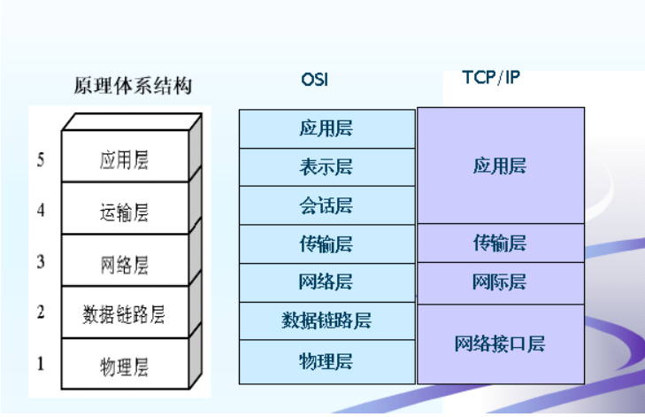
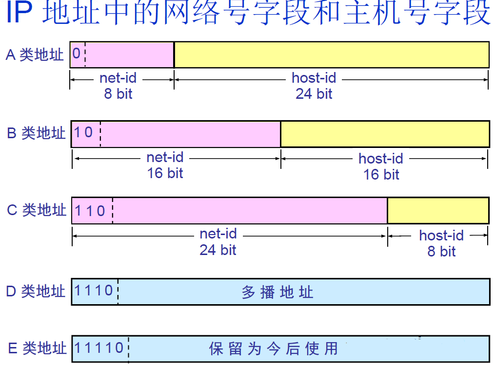
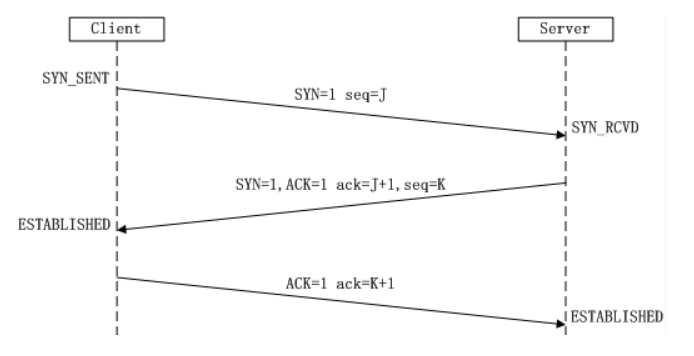
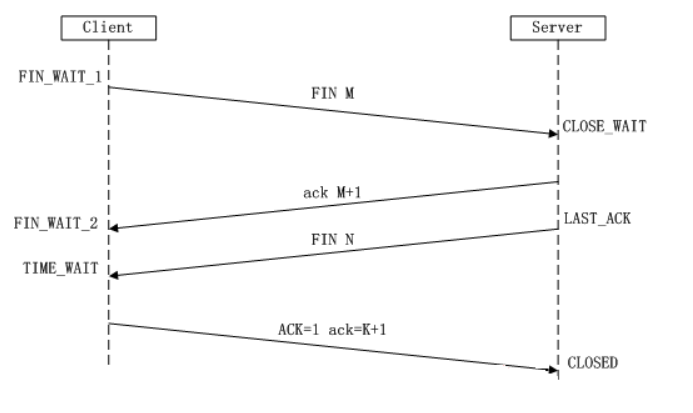
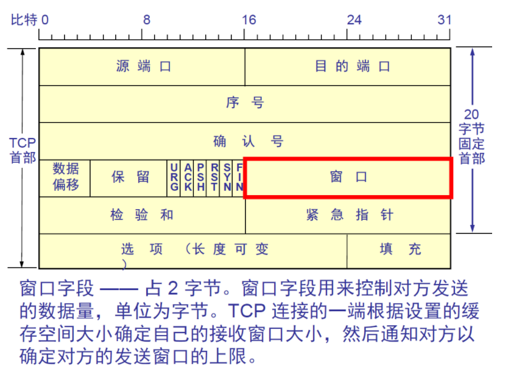
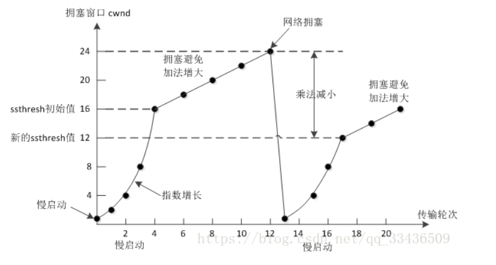
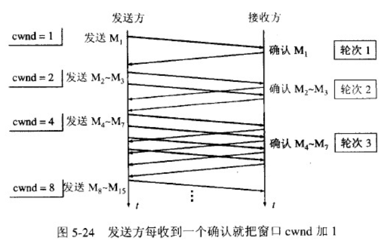
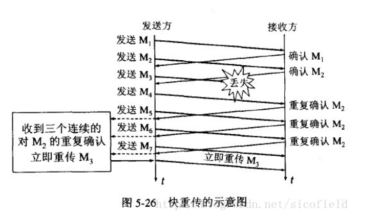

# 计算机网络

## 计算机网络体系结构


常见协议
应用层：
* FTP(21端口)：文件传输协议
* SSH(22端口)：远程登陆
* TELNET(23端口)：远程登录
* SMTP(25端口)：发送邮件
* POP3(110端口)：接收邮件
* HTTP(80端口)：超文本传输协议
* DNS(53端口)：运行在UDP上，域名解析服务
传输层：TCP/UDP
网络层：IP、ARP、NAT、RIP...

### 路由器、交换机位于哪一层？
路由器网络层，根据IP地址进行寻址；
交换机数据链路层，根据MAC地址进行寻址

## 网络层
### IP地址的分类


路由器仅根据网络号net-id来转发分组，当分组到达目的网络的路由器之后，再按照主机号host-id将分组交付给主机；同一网络上的所有主机的网络号相同。


### 什么叫划分子网
从主机号host-id借用若干个比特作为子网号subnet-id；子网掩码：网络号和子网号都为1，主机号为0；数据包仍然按照网络号找到目的网络，发送到路由器，路由器再按照网络号和子网号找到目的子网：将子网掩码与目标地址逐比特与操作，若结果为某个子网的网络地址，则送到该子网。

### 什么是ARP协议 (Address Resolution Protocol)？
ARP协议完成了IP地址与物理地址的映射。每一个主机都设有一个 ARP 高速缓存，里面有所在的局域网上的各主机和路由器的 IP 地址到硬件地址的映射表。当源主机要发送数据包到目的主机时，会先检查自己的ARP高速缓存中有没有目的主机的MAC地址，如果有，就直接将数据包发到这个MAC地址，如果没有，就向所在的局域网发起一个ARP请求的广播包（在发送自己的 ARP 请求时，同时会带上自己的 IP 地址到硬件地址的映射），收到请求的主机检查自己的IP地址和目的主机的IP地址是否一致，如果一致，则先保存源主机的映射到自己的ARP缓存，然后给源主机发送一个ARP响应数据包。源主机收到响应数据包之后，先添加目的主机的IP地址与MAC地址的映射，再进行数据传送。如果源主机一直没有收到响应，表示ARP查询失败。

如果所要找的主机和源主机不在同一个局域网上，那么就要通过 ARP 找到一个位于本局域网上的某个路由器的硬件地址，然后把分组发送给这个路由器，让这个路由器把分组转发给下一个网络。剩下的工作就由下一个网络来做。

### 什么是NAT (Network Address Translation, 网络地址转换)？
用于解决内网中的主机要和因特网上的主机通信。由NAT路由器将主机的本地IP地址转换为全球IP地址，分为静态转换（转换得到的全球IP地址固定不变）和动态NAT转换。


## 传输层
### 三次握手


1. 第一次握手：Client将SYN置1，随机产生一个初始序列号seq发送给Server，进入SYN_SENT状态；
2. 第二次握手：Server收到Client的SYN=1之后，知道客户端请求建立连接，将自己的SYN置1，ACK置1，产生一个acknowledge number=sequence number+1，并随机产生一个自己的初始序列号，发送给客户端；进入SYN_RCVD状态；
3. 第三次握手：客户端检查acknowledge number是否为序列号+1，ACK是否为1，检查正确之后将自己的ACK置为1，产生一个acknowledge number=服务器发的序列号+1，发送给服务器；进入ESTABLISHED状态；服务器检查ACK为1和acknowledge number为序列号+1之后，也进入ESTABLISHED状态；完成三次握手，连接建立。

#### TCP建立连接可以两次握手吗？为什么?
不可以。有两个原因：

1. 首先，可能会出现已失效的连接请求报文段又传到了服务器端。client 发出的第一个连接请求报文段并没有丢失，而是在某个网络结点长时间的滞留了，以致延误到连接释放以后的某个时间才到达 server。本来这是一个早已失效的报文段。但 server 收到此失效的连接请求报文段后，就误认为是 client 再次发出的一个新的连接请求。于是就向 client 发出确认报文段，同意建立连接。假设不采用 “三次握手”，那么只要 server 发出确认，新的连接就建立了。由于现在 client 并没有发出建立连接的请求，因此不会理睬 server 的确认，也不会向 server 发送数据。但 server 却以为新的运输连接已经建立，并一直等待 client 发来数据。这样，server 的很多资源就白白浪费掉了。采用 “三次握手” 的办法可以防止上述现象发生。例如刚才那种情况，client 不会向 server 的确认发出确认。server 由于收不到确认，就知道 client 并没有要求建立连接。
2. 其次，两次握手无法保证Client正确接收第二次握手的报文（Server无法确认Client是否收到），也无法保证Client和Server之间成功互换初始序列号。

#### 可以采用四次握手吗？为什么？
可以。但是会降低传输的效率。

四次握手是指：第二次握手：Server只发送ACK和acknowledge number；而Server的SYN和初始序列号在第三次握手时发送；原来协议中的第三次握手变为第四次握手。出于优化目的，四次握手中的二、三可以合并。

#### 第三次握手中，如果客户端的ACK未送达服务器，会怎样？
Server端：
由于Server没有收到ACK确认，因此会重发之前的SYN+ACK（默认重发五次，之后自动关闭连接进入CLOSED状态），Client收到后会重新传ACK给Server。

Client端，两种情况：

1. 在Server进行超时重发的过程中，如果Client向服务器发送数据，数据头部的ACK是为1的，所以服务器收到数据之后会读取 ACK number，进入 establish 状态
2. 在Server进入CLOSED状态之后，如果Client向服务器发送数据，服务器会以RST包应答。

#### 如果已经建立了连接，但客户端出现了故障怎么办？
服务器每收到一次客户端的请求后都会重新复位一个计时器，时间通常是设置为2小时，若两小时还没有收到客户端的任何数据，服务器就会发送一个探测报文段，以后每隔75秒钟发送一次。若一连发送10个探测报文仍然没反应，服务器就认为客户端出了故障，接着就关闭连接。

#### 初始序列号是什么？
TCP连接的一方A，随机选择一个32位的序列号（Sequence Number）作为发送数据的初始序列号（Initial Sequence Number，ISN），比如为1000，以该序列号为原点，对要传送的数据进行编号：1001、1002...三次握手时，把这个初始序列号传送给另一方B，以便在传输数据时，B可以确认什么样的数据编号是合法的；同时在进行数据传输时，A还可以确认B收到的每一个字节，如果A收到了B的确认编号（acknowledge number）是2001，就说明编号为1001-2000的数据已经被B成功接受。

### 四次挥手


1. 第一次挥手：Client将FIN置为1，发送一个序列号seq给Server；进入FIN_WAIT_1状态；
2. 第二次挥手：Server收到FIN之后，发送一个ACK=1，acknowledge number=收到的序列号+1；进入CLOSE_WAIT状态。此时客户端已经没有要发送的数据了，但仍可以接受服务器发来的数据。
3. 第三次挥手：Server将FIN置1，发送一个序列号给Client；进入LAST_ACK状态；
4. 第四次挥手：Client收到服务器的FIN后，进入TIME_WAIT状态；接着将ACK置1，发送一个acknowledge number=序列号+1给服务器；服务器收到后，确认acknowledge number后，变为CLOSED状态，不再向客户端发送数据。客户端等待2*MSL（报文段最长寿命）时间后，也进入CLOSED状态。完成四次挥手。

#### 为什么不能把服务器发送的ACK和FIN合并起来，变成三次挥手（CLOSE_WAIT状态意义是什么）？
因为服务器收到客户端断开连接的请求时，可能还有一些数据没有发完，这时先回复ACK，表示接收到了断开连接的请求。等到数据发完之后再发FIN，断开服务器到客户端的数据传送。

#### 如果第二次挥手时服务器的ACK没有送达客户端，会怎样？
客户端没有收到ACK确认，会重新发送FIN请求。

#### 客户端TIME_WAIT状态的意义是什么？
第四次挥手时，客户端发送给服务器的ACK有可能丢失，TIME_WAIT状态就是用来重发可能丢失的ACK报文。如果Server没有收到ACK，就会重发FIN，如果Client在2*MSL的时间内收到了FIN，就会重新发送ACK并再次等待2MSL，防止Server没有收到ACK而不断重发FIN。

MSL(Maximum Segment Lifetime)，指一个片段在网络中最大的存活时间，2MSL就是一个发送和一个回复所需的最大时间。如果直到2MSL，Client都没有再次收到FIN，那么Client推断ACK已经被成功接收，则结束TCP连接。

### TCP如何实现流量控制？


使用滑动窗口协议实现流量控制。防止发送方发送速率太快，接收方缓存区不够导致溢出。接收方会维护一个接收窗口 receiver window（窗口大小单位是字节），接受窗口的大小是根据自己的资源情况动态调整的，在返回ACK时将接受窗口大小放在TCP报文中的窗口字段告知发送方。发送窗口的大小不能超过接受窗口的大小，只有当发送方发送并收到确认之后，才能将发送窗口右移。

发送窗口的上限为接受窗口和拥塞窗口中的较小值。接受窗口表明了接收方的接收能力，拥塞窗口表明了网络的传送能力。

#### 什么是零窗口（接收窗口为0时会怎样）？
如果接收方没有能力接收数据，就会将接收窗口设置为0，这时发送方必须暂停发送数据，但是会启动一个持续计时器(persistence timer)，到期后发送一个大小为1字节的探测数据包，以查看接收窗口状态。如果接收方能够接收数据，就会在返回的报文中更新接收窗口大小，恢复数据传送。

### TCP的拥塞控制是怎么实现的？


拥塞控制主要由四个算法组成：慢启动（Slow Start）、拥塞避免（Congestion voidance）、快重传 （Fast Retransmit）、快恢复（Fast Recovery）

1. 慢启动：刚开始发送数据时，先把拥塞窗口（congestion window）设置为一个最大报文段MSS的数值，每收到一个新的确认报文之后，就把拥塞窗口加1个MSS。这样每经过一个传输轮次（或者说是每经过一个往返时间RTT），拥塞窗口的大小就会加倍。



2. 拥塞避免：当拥塞窗口的大小达到慢开始门限(slow start threshold)时，开始执行拥塞避免算法，拥塞窗口大小不再指数增加，而是线性增加，即每经过一个传输轮次只增加1MSS.
无论在慢开始阶段还是在拥塞避免阶段，只要发送方判断网络出现拥塞（其根据就是没有收到确认），就要把慢开始门限ssthresh设置为出现拥塞时的发送方窗口值的一半（但不能小于2）。然后把拥塞窗口cwnd重新设置为1，执行慢开始算法。（这是不使用快重传的情况）

3. 快重传：快重传要求接收方在收到一个失序的报文段后就立即发出重复确认（为的是使发送方及早知道有报文段没有到达对方）而不要等到自己发送数据时捎带确认。快重传算法规定，发送方只要一连收到三个重复确认就应当立即重传对方尚未收到的报文段，而不必继续等待设置的重传计时器时间到期。



4. 快恢复：当发送方连续收到三个重复确认时，就把慢开始门限减半，然后执行拥塞避免算法。不执行慢开始算法的原因：因为如果网络出现拥塞的话就不会收到好几个重复的确认，所以发送方认为现在网络可能没有出现拥塞。
也有的快重传是把开始时的拥塞窗口cwnd值再增大一点，即等于 ssthresh + 3*MSS 。这样做的理由是：既然发送方收到三个重复的确认，就表明有三个分组已经离开了网络。这三个分组不再消耗网络的资源而是停留在接收方的缓存中。可见现在网络中减少了三个分组。因此可以适当把拥塞窗口扩大些。

### TCP与UDP区别
1.  TCP是面向连接的；UDP是无连接的，
UDP发送数据之前不需要建立连接
2. TCP是可靠的；UDP不可靠，UDP接收方收到报文后，不需要给出任何确认
3. TCP只支持点对点通信，UDP支持一对一、一对多、多对一、多对多；
4. TCP是面向字节流的；UDP是面向报文的。面向字节流是指发送数据时以字节为单位，一个数据包可以拆分成若干组进行发送，而UDP一个报文只能一次发完。
5. TCP有拥塞控制机制，UDP没有。网络出现的拥塞不会使源主机的发送速率降低，这对某些实时应用是很重要的，比如媒体通信，游戏；
6. TCP首部开销（20字节）比UDP首部开销（8字节）要大
7. UDP 的主机不需要维持复杂的连接状态表

#### 什么时候选择TCP，什么时候选UDP？
对某些实时性要求比较高的情况，选择UDP，比如游戏，媒体通信，实时视频流（直播），即使出现传输错误也可以容忍；其它大部分情况下，HTTP都是用TCP，因为要求传输的内容可靠，不出现丢失

#### HTTP可以使用UDP吗？
HTTP不可以使用UDP，HTTP需要基于可靠的传输协议，而UDP不可靠

#### 面向连接和无连接的区别
无连接的网络服务（数据报服务）-- 面向连接的网络服务（虚电路服务）

虚电路服务：首先建立连接，所有的数据包经过相同的路径，服务质量有较好的保证；

数据报服务：每个数据包含目的地址，数据路由相互独立（路径可能变化）；网络尽最大努力交付数据，但不保证不丢失、不保证先后顺序、不保证在时限内交付；网络发生拥塞时，可能会将一些分组丢弃；

### TCP如何保证传输的可靠性
1. 数据包校验
2. 对失序数据包重新排序（TCP报文具有序列号）
3. 丢弃重复数据
4. 应答机制：接收方收到数据之后，会发送一个确认（通常延迟几分之一秒）；
5. 超时重发：发送方发出数据之后，启动一个定时器，超时未收到接收方的确认，则重新发送这个数据；
6. 流量控制：确保接收端能够接收发送方的数据而不会缓冲区溢出

## 应用层
### http请求报文和响应报文
#### http请求报文结构
* 请求行：由请求方法、相对url（或绝对url路径）和http版本三个部分组成。
* 请求头：为请求报文添加了一些附加信息，如Host、User-Agent、Connection和Accept-Encoding等。
* 空行。
* 请求正文：可选部分，如GET就没有请求正文。

一个请求报文实体例子：

```
GET /562f25980001b1b106000338.jpg HTTP/1.1
Host    img.mukewang.com
User-Agent    Mozilla/5.0 (Windows NT 10.0; WOW64) AppleWebKit/537.36 (KHTML, like Gecko) Chrome/51.0.2704.106 Safari/537.36
Accept    image/webp,image/*,*/*;q=0.8
Referer    http://www.imooc.com/
Accept-Encoding    gzip, deflate, sdch
Accept-Language    zh-CN,zh;q=0.8
```

#### http响应报文
* 状态行：由http版本、状态码和响应信息三部分组成。
* 响应头：与请求头类似，为响应报文添加了一些附加信息。
* 空行。
* 响应正文


### 浏览器请求一个网址的详细过程
1. 浏览器分析链接并指向页面的URL。
2. 浏览器向DNS请求解析www.baidu.com的IP地址。
3. DNS解析出该IP地址。
4. 浏览器与该服务器建立TCP连接（http端口为80，https端口为443）。
5. 浏览器发出HTTP请求：HTTP请求通过TCP套接字，发送请求报文，该请求报文作为TCP三次握手第三个报文数据发送给服务器。
6. 服务器通过HTTP响应发送给浏览器。
7. TCP连接释放（若Connection为close，服务端主动关闭，客户端被动关闭；若Connection为keepalive，则连接保持一段时间，该时间内可以继续接收请求）。
8. 浏览器将服务器返回数据解析显示给用户。


### HTTP状态码
这里只介绍常用的
#### 1**
1**表示信息，服务器收到请求，需要请求者继续执行操作。

1. 100：继续。客户端应继续其请求。
2. 101：切换协议。

#### 2**
2**表示成功，操作被成功接收并处理。

1. 200：OK。请求成功，一般用于GET与POST请求。
2. 201：Created。已创建，成功请求并创建了新资源。
3. 204：No content。无内容。服务器成功处理，但未返回内容。在未更新网页的情况下，可确保浏览器继续显示文档。

#### 3**
3**表示重定向，需要进一步的操作以完成请求。

1. 301：Moved Permanently。永久重定向。请求资源已被永久移动到新的URL，返回信息会包括新的URL，浏览器会自动定向到新的URL。今后的新请求都使用新的URL替代。这个会影响搜索引擎处理。
2. 302：Moved Temporatily。临时重定向。不会影响搜索引擎处理。

#### 4**
4**表示客户端错误，请求包含语法错误或无法完成请求。

1. 400：Bad Request。客户端请求语法错误，服务器无法理解。
2. 401：Unauthorized。请求要求用户的身份验证。
3. 403：Forbidden。服务器拒绝请求。
4. 404：Not Found。服务器没有找到该资源。

#### 5**
5**表示服务器错误，服务器在处理请求的过程中发生错误。

1. 500：Internal Server Error。服务器内部错误，无法完成请求。
2. 502：Bad Gateway。作为网关或者代理工作的服务器尝试执行请求时，从远程服务器接收到了一个无效的响应。


### HTTP请求方法
1. GET：向指定的资源发出显示请求，使用GET方法应该只用于读取数据。
2. HEAD：只获取头部信息，关于该资源的信息。
3. PUT：向指定资源位置上传最新位置（与POST相比，PUT指定了存放位置，而POST由服务器指定），具有幂等性。
4. DELETE：请求服务器删除某一个资源。具有幂等性。
5. POST：向指定资源提交数据，请求服务器进行处理（例如提交表单或者上传文件），不具有幂等性。
6. TRACE：请求服务器回送收到的请求信息，主要用于测试和诊断。
7. OPTIONS：使服务器传回该资源所支持的所有HTTP请求方法。若请求成功，则会在HTTP头中包含一个名为“Allow”的头，值是支持的方法，如GET、POST。


### GET和PSOT的区别
1. 对资源的影响：GET一般用于获取或者查询资源信息，意味着对同一个URL的多个请求返回的结果一样（幂等），没有修改资源状态（安全）；而POST一般用于创建资源信息，POST既不是安全的也不是幂等的。
2. 传递的信息量：GET把发送的数据放到URL后，使用？连接，各个变量用&连接。浏览器和服务器对URL长度有限制；POST则把需要传递的数据放到请求报文的消息体中，HTTP协议对此没有限制，因此可以传递更多信息。
3. 安全性：GET提交的信息，消息以明文出现在URL上，不安全。POST把消息存放在消息体中，安全性高，但是也存在被抓包软件抓取看到内容。


### cookie和seesion
HTTP协议是无状态的：无状态是指协议对于事务处理没有记忆能力，简单来说，即使第一次和服务器连接后并且登陆成功后，第二次请求服务器依然不知道当前请求是哪个用户。为此，cookie和session的使用为此提供了解决方案。

#### cookie
以文件的形式存在硬盘中的永久性cookie（设置了一定的时限）和停留在浏览器内存中的临时性cookie，当用户访问网站时，浏览器就会在本地寻找相关cookie。如果该cookie存在，浏览器就会将其与页面请求一起通过报头信息发送到站点。

#### session
session与cookie的作用有点类似，不同的时cookie存储在本地，而session存储在服务器。当程序需要为某个客户端的请求创建一个session的时候，服务器首先会检查这个客户端的请求里是否包含了一个session标识session-id，如果已经包含一个session-id则为此客户端创建过session，服务器就按照session-id把这个session检索出来，如果不包含，就创建一个新的键值对<session,session-id>，并把session-id返回客户端保存。


### HTTP和HTTPS区别
1. HTTP 的URL 以http:// 开头，而HTTPS 的URL 以https:// 开头
2. HTTP 是不安全的，而 HTTPS 是安全的
3. HTTP 标准端口是80 ，而 HTTPS 的标准端口是443
4. 在OSI 网络模型中，HTTP工作于应用层，而HTTPS 的安全传输机制工作在传输层
5. HTTP 无法加密，而HTTPS 对传输的数据进行加密
6. HTTP无需证书，而HTTPS 需要CA机构wosign的颁发的SSL证书


### URI和URL区别
#### URI
URI，是uniform resource identifier，统一资源标识符，用来唯一的标识一个资源。

Web上可用的每种资源如HTML文档、图像、视频片段、程序等都是一个来URI来定位的
URI一般由三部组成：
①访问资源的命名机制
②存放资源的主机名
③资源自身的名称，由路径表示，着重强调于资源。

#### URL
URL是uniform resource locator，统一资源定位器，它是一种具体的URI，即URL可以用来标识一个资源，而且还指明了如何locate这个资源。

URL是Internet上用来描述信息资源的字符串，主要用在各种WWW客户程序和服务器程序上，特别是著名的Mosaic。
采用URL可以用一种统一的格式来描述各种信息资源，包括文件、服务器的地址和目录等。URL一般由三部组成：
①协议(或称为服务方式)
②存有该资源的主机IP地址(有时也包括端口号)
③主机资源的具体地址。如目录和文件名等


### HTTPS工作原理
一、首先HTTP请求服务端生成证书，客户端对证书的有效期、合法性、域名是否与请求的域名一致、证书的公钥（RSA加密）等进行校验；
二、客户端如果校验通过后，就根据证书的公钥的有效， 生成随机数，随机数使用公钥进行加密（RSA加密）；
三、消息体产生的后，对它的摘要进行MD5（或者SHA1）算法加密，此时就得到了RSA签名；
四、发送给服务端，此时只有服务端（RSA私钥）能解密。
五、解密得到的随机数，再用AES加密，作为密钥（此时的密钥只有客户端和服务端知道）

交换密钥采用非对称加密，数据加密采用对称加密（因为性能好）。摘要算法用于签名（防止信息被篡改）。


### HTTP1.1版本新特性
1. 长连接。
2. pipeline：客户端可以同时发出多个HTTP请求，而不用一个个等待响应。但是是串行化，后面的请求需要等待前面请求返回后才能获得执行机会。
3. 断点续传：利用HTTP消息头使用分块传输编码，将实体主体分块传输。


### HTTP2.0版本新特性
1. 新的二进制格式：HTTP1.x的解析是基于文本的，而HTTP2.0解析改为二进制。
2. 多路复用：连接共享，每一个request都是用作连接共享机制的。一个request对应一个id，这样一个连接上可以有多个request。并行处理，某个请求耗时严重，不会影响到其它连接的正常执行。
3. header压缩。HTTP2.0使用encoder来减少需要传输的header大小，通讯双方各自cache一份header fields表，既避免了重复header的传输，又减小了需要传输的大小。
4. 服务器推送。服务端推送能把客户端所需要的资源伴随着index.html一起发送到客户端，省去了客户端重复请求的步骤。正因为没有发起请求，建立连接等操作，所以静态资源通过服务端推送的方式可以极大地提升速度。


### HTTP优化方案
1. TCP复用：TCP连接复用是将多个客户端的HTTP请求复用到一个服务器端TCP连接上，而HTTP复用则是一个客户端的多个HTTP请求通过一个TCP连接进行处理。前者是负载均衡设备的独特功能；而后者是HTTP 1.1协议所支持的新功能，目前被大多数浏览器所支持。
2. 内容缓存：将经常用到的内容进行缓存起来，那么客户端就可以直接在内存中获取相应的数据了。
3. 压缩：将文本数据进行压缩，减少带宽
4. SSL加速（SSL Acceleration）：使用SSL协议对HTTP协议进行加密，在通道内加密并加速
5. TCP缓冲：通过采用TCP缓冲技术，可以提高服务器端响应时间和处理效率，减少由于通信链路问题给服务器造成的连接负担。


### PUT和PATCH都是给服务器发送修改资源，有什么区别？
PUT和PATCH都是更新资源，而PATCH用来对已知资源进行局部更新。


### HTTP的keep-alive是干什么的？
在早期的HTTP/1.0中，每次http请求都要创建一个连接，而创建连接的过程需要消耗资源和时间，为了减少资源消耗，缩短响应时间，就需要重用连接。在后来的HTTP/1.0中以及HTTP/1.1中，引入了重用连接的机制，就是在http请求头中加入Connection: keep-alive来告诉对方这个请求响应完成后不要关闭，下一次咱们还用这个请求继续交流。协议规定HTTP/1.0如果想要保持长连接，需要在请求头中加上Connection: keep-alive。

keep-alive的优点：

1. 较少的CPU和内存的使用（由于同时打开的连接的减少了）
2. 允许请求和应答的HTTP管线化
3. 降低拥塞控制 （TCP连接减少了）
4. 减少了后续请求的延迟（无需再进行握手）
5. 报告错误无需关闭TCP连接

### Https的连接过程
1. 客户端向服务器发送请求，同时发送客户端支持的一套加密规则（包括对称加密、非对称加密、摘要算法）；
2. 服务器从中选出一组加密算法与HASH算法，并将自己的身份信息以证书的形式发回给浏览器。证书里面包含了网站地址，加密公钥（用于非对称加密），以及证书的颁发机构等信息（证书中的私钥只能用于服务器端进行解密）；
3. 客户端验证服务器的合法性，包括：证书是否过期，CA 是否可靠，发行者证书的公钥能否正确解开服务器证书的“发行者的数字签名”，服务器证书上的域名是否和服务器的实际域名相匹配；
4. 如果证书受信任，或者用户接收了不受信任的证书，浏览器会生成一个随机密钥（用于对称算法），并用服务器提供的公钥加密（采用非对称算法对密钥加密）；使用Hash算法对握手消息进行摘要计算，并对摘要使用之前产生的密钥加密（对称算法）；将加密后的随机密钥和摘要一起发送给服务器；
5. 服务器使用自己的私钥解密，得到对称加密的密钥，用这个密钥解密出Hash摘要值，并验证握手消息是否一致；如果一致，服务器使用对称加密的密钥加密握手消息发给浏览器；
6. 浏览器解密并验证摘要，若一致，则握手结束。之后的数据传送都使用对称加密的密钥进行加密

总结：非对称加密算法用于在握手过程中加密生成的密码；对称加密算法用于对真正传输的数据进行加密；HASH算法用于验证数据的完整性。

### 输入 www.baidu.com，怎么变成 https://www.baidu.com 的，怎么确定用HTTP还是HTTPS？
一种是原始的302跳转，服务器把所有的HTTp流量跳转到HTTPS。但这样有一个漏洞，就是中间人可能在第一次访问站点的时候就劫持。 解决方法是引入HSTS机制，用户浏览器在访问站点的时候强制使用HTTPS。

### HTTPS连接的时候，怎么确定收到的包是服务器发来的（中间人攻击）？
数字签名。

### 什么是对称加密、非对称加密？区别是什么？
* 对称加密：加密和解密采用相同的密钥。如：DES、RC2、RC4
* 非对称加密：需要两个密钥：公钥和私钥。如果用公钥加密，需要用私钥才能解密。如：RSA

区别：对称加密速度更快，通常用于大量数据的加密；非对称加密安全性更高（不需要传送私钥）

### 数字签名、报文摘要的原理
发送者A用私钥进行签名，接收者B用公钥验证签名。因为除A外没有人有私钥，所以B相信签名是来自A。A不可抵赖，B也不能伪造报文。
摘要算法:MD5、SHA