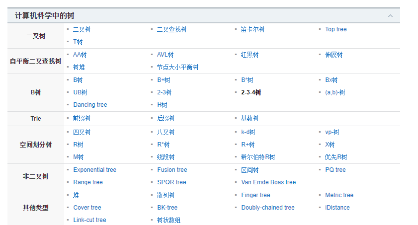

# B树和B+树和红黑树

[B树、B+树详解](https://www.cnblogs.com/lianzhilei/p/11250589.html)

[什么是B+树？](https://zhuanlan.zhihu.com/p/54102723)

[基于磁盘IO角度来看二叉树、B-tree树、B+树](https://www.cnblogs.com/spirited-away/p/11283790.html)

[为什么 MongoDB 索引选择B树，而 Mysql 选择B+树（精干总结）](https://zhuanlan.zhihu.com/p/102628897?utm_source=wechat_timeline)

[为什么mysql索引要使用B+树，而不是B树，红黑树](https://segmentfault.com/a/1190000021488885)

[红黑树和B树的区别](https://blog.csdn.net/N1314N/article/details/89413308)

[红黑树和B树区别](https://qqe2.com/java/post/1760.html)

[图文 红黑树,B树,B+树 本质区别及应用场景](https://blog.csdn.net/qq_29373285/article/details/88610654)

[AVL树，红黑树，B树，B+树，Trie树都分别应用在哪些现实场景中](https://www.zhihu.com/question/30527705)

## 红黑树的应用
红黑树为插入时间，删除时间和搜索时间提供了最坏的保证。 这不仅使它们在对时间敏感的应用程序（例如实时应用程序）中有价值，而且使它们在其他提供最坏情况保证的数据结构中有价值。 例如，计算几何中使用的许多数据结构可以基于红黑树。

AVL树是支持O（log n）搜索，插入和删除的另一种结构。 它比红黑树更严格地平衡，从而导致插入和删除速度较慢，但检索速度较快。

红黑树在函数式编程中也特别有价值，它们是最常见的持久性数据结构之一，用于构造关联数组和集合，这些数组和集合可以保留突变后的先前版本。 红黑树的持久版本除了时间以外，每次插入或删除都需要O（log n）空间。

## B树
在计算机科学中，B树是一种树数据结构，可对数据进行排序，并允许以对数摊销时间进行搜索，插入和删除。 它最常用于数据库和文件系统。

各式各样的树：
