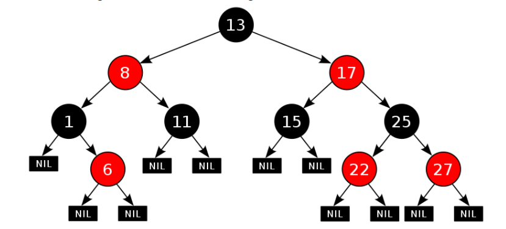
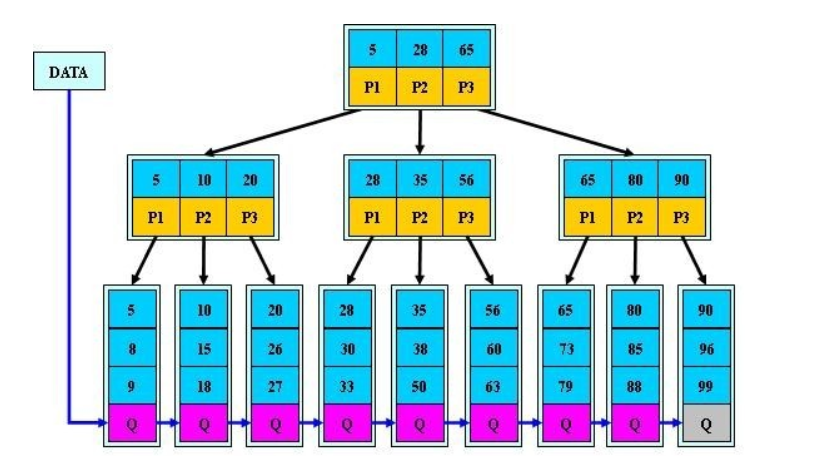

# 数据结构

[数据结构简介](https://github.com/Jack-Lee-Hiter/AlgorithmsByPython/blob/master/数据结构.md)

## 线性表
线性表是一种典型的线性结构。头结点无前驱有一个后继，尾结点无后继有一个前驱。

1. 线性表的顺序存储结构：把线性表的结点按逻辑顺序一次存放在一组地址连续的存储单元里，这称为**顺序表**。如数组。
2. 线性链表：用一组任意的存储单元来一次存放线性表的结点，这组存储单元既可以是连续的，也可以是不连续的。链表不需要事先估计存储空间大小。链表类型如下：

* 单链表：每个结点的存储地址是存放在其前驱结点next域名中，而开始结点无前驱，故应设头指针head指向开始结点。
* 静态链表：用一维数组来实现的线性链表。
* 循环链表：头尾相连的单链表。
* 双向链表：每个结点都有指向前驱的指针域，同时有指向后续结点的指针域。

## 栈
栈是限制在表的一端进行插入和删除运算的线性表。在栈顶插入和删除数据，先进后出。可用数组或链表实现。

对于n个元素的入栈问题，可能的出栈顺序有C(2n,n)/(n+1)个。

应用：
1. 进制转换
2. 括号匹配的检验
3. 行编辑程序
4. 迷宫求解：若当前位置“可通”，则纳入路径，继续前进;若当前位置“不可通”，则后退，换方向继续探索;若四周“均无通路”，则将当前位置从路径中删除出去。
5. 表达式求解：前缀、中缀、后缀。
操作数之间的相对次序不变;
运算符的相对次序不同;
中缀式丢失了括弧信息，致使运算的次序不确定
前缀式的运算规则为:连续出现的两个操作数和在它们之前且紧靠它们的运算符构成一个最小表达式
后缀式的运算规则为:运算符在式中出现的顺序恰为表达式的运算顺序;每个运算符和在它之前出现且紧靠它的两个操作数构成一个最小表达式。
6. 实现递归：多个函数嵌套调用的规则是：后调用先返回。
7. 浏览器历史纪录，Android中的最近任务，Activity的启动模式，CPU中栈的实现，Word自动保存，解析计算式，解析xml/json。解析XML时，需要校验节点是否闭合，节点闭合的话，有头尾符号相对应，遇到头符号将其放入栈中，遇到尾符号时，弹出栈的内容，看是否有与之对应的头符号，栈的特性刚好符合符号匹配的就近原则。

**不是所有的递归转化为非递归都要用到栈，转化为非递归主要有两种方法：对于尾递归或单向递归，可以用循环结构算法替代。**

## 队列
队列也是一种运算受限的线性表，它只允许在表的一端进行插入，在另一端进行删除。允许删除的一端称为队头，允许插入的一端称为队尾。先进先出。

1. 顺序队列：顺序存储结构。当头尾指针相等时队列为空。在非空队列里，头指针始终指向队头的前一个位置，而尾指针始终指向队尾元素的实际位置。

2. 循环队列：在循环队列中进行出队、入队操作时，头尾指针仍要加1，朝前移动。只不过当头尾指针指向向量上界时（MaxSize-1）时，其加1操作的结构时指向向量的下界0。除非向量空间真的被队列元素全被占用，否则不会上溢。因此，除了一些简单的应用外，真正实用的顺序队列是循环队列。故队空和队满时头尾指针均相等。因此无法通过头尾指针相等判断队列是空还是满。

3. 链队列：链式存储结构。

4. 设尾指针的循环链表表示队列，则入队和出队算法的时间复杂度为O(1)。队空条件为头指针等于尾指针。

## 树和二叉树
一种非线性结构。树是递归结构，在树的定义中又用到树的概念。

基本术语：
1. 树节点：包含一个元素及若干指向子树的分支
2. 孩子结点：结点的子树的根称为该结点的孩子
3. 双亲结点：B结点是A结点的孩子，则A结点是B结点的双亲
4. 兄弟结点：同一双亲的孩子结点
5. 堂兄结点：同一层上的结点
6. 结点层次：根结点的层定义为1；根的孩子为第二结点，以此类推
7. 树的高（深）度：树中最大的结点层
8. 结点的度：结点子树的个数
9. 树的度：树中最大的结点度
10. 叶子结点：度为0的结点
11. 分枝结点：度不为0的结点
12. 深林：互不相交的树集合
13. 有序树：子树有序的树
14. 无序树：不考虑树的顺序

### 二叉树
二叉树可以为空。二叉树结点的子树要区分左子树和右子树，即使只有一棵子树也要进行区分，说明它是左子树，还是右子树，这是二叉树与树的最主要差别。

平衡二叉树：对于树中的每个结点，它的左子树和右子树的高度差不大于1。

二叉查找树/二叉排序树/二叉搜索树：对于树中的每个结点，它的左子树的每个结点的值都小于它的值；它的右子树每个结点的值都大于它的值。

完全二叉树：除了最后一层，其他层都是满的，而且最后一层的的结点要靠左排列且中间不能有气泡。

完美二叉树：所有层的所有结点都必须是满的。

完满二叉树：对于树中的每个结点，要么有0个孩子，要么有2个结点。

二叉平衡（查找）树（AVL）：树中的兄弟结点之间的高度差不大于1。

二叉树的性质：
1. 在二叉树的第i层上至多有2^(i-1)个结点。
2. 深度为k的二叉树上至多含2^k-1个结点。
3. 对任何一棵二叉树，若它含有n0个叶子结点，n2个度为2的结点，则n0=n2+1。
4. 具有n个结点的完全二叉树的深度为[logn]+1，底为2，向下取整。
5. 如果对一棵有n个结点的完全二叉树的结点按层序编号，则对任一结点i（1<=i<=n）有：

* 如果i=1，则结点i无双亲，是二叉树的根，如果i>1；则其双亲的编号为i/2（整除）。
* 如果2i>n，无左孩子，否则其左孩子结点为2i。
* 如果2i+1>n，无右孩子，否则其右孩子结点为2i+1。

### 遍历二叉树和线索二叉树
遍历二叉树：使得每一个结点均被访问一次，而且仅被访问一次。

* 先序遍历：根结点->左子树->右子树。
* 中序遍历：左子树->根节点->右子树。中序遍历是一棵二叉树的逻辑存储顺序。
* 后序遍历：左子树->右子树->根节点。
* 层序遍历：按每层从左到右遍历。

先序遍历、中序遍历和后续遍历如果不适用递归实现遍历，则需要利用**栈**。而层序遍历需要利用**队列**。

线索二叉树：对二叉树所有结点做某种处理可在遍历过程中实现；检索（查找）二叉树某个结点，可通过遍历实现；如果将二叉树线索化，就可以简化算法，提高遍历速度，目的是加快查找结点的前驱或后继的速度。

对于二叉树的线索化，实际上就是遍历一次二叉树，只是在遍历的过程中，检查当前结点左、右指针域是否为空，若为空，将它们改为指向前驱结点或后继结点的线索。前驱就是在这一点之前走过的点，不是下一将要去往的点。

在二叉树上加上结点前驱、后续线索后，可利用线索对二叉树进行遍历，此时，不需要栈也需要递归。分为前序遍历线索二叉树、中序遍历线索二叉树、后序遍历线索二叉树。基本步骤：
1. p=T->lchild；T指向线索链表的根结点。
2. 若线索链表非空，循环：

* 循环，顺着p左孩子指针找到最左下结点，访问。
* 若p所指结点的右孩子域为线索，p的右孩子结点即为后继结点循环： p=p->rchild； 并访问p所指结点；（在此循环中，顺着后继线索访问二叉树中的结点）。
* 一旦线索“中断”，p所指结点的右孩子域为右孩子指针，p=p->rchild，使 p指向右孩子结点；

## 图
图搜索->形成搜索树
1. 穷举法
2. 贪心法。多步决策，每部选择使得构成一个问题的可能解，同时满足目标函数。
3. 回溯法。根据题意，选取度量标准，然后将可能的选择方法按度量标准所要求顺序排好，每次处理一个量，得到该意义下的最优解的分解处理。

无向图：
1. 回路或环：第一个顶点和最后一个顶点相同的路径。
2. 简单回路或简单环：除第一个顶带你和最后一个顶点之外，其余顶点不重复出现的回路。
3. 连通：两个结点之间必定存在路径。
4. 连通图：图中任意两个结点之间必定存在路径。
5. 连通分量：极大连通图，子图包含的顶点个数极大。
6. 所有顶带你度的和必须为偶数。

有向图：
1. 生成树：极小连通图。包含图的所有n个结点，但只含图的n-1条边。在生成树添加一条边之后，必定形成回路和或环。
2. 完全图：有n(n-1)/2条边的无向图。其中n是结点个数。必定是连通图。

### 图的存储形式：
1. 邻接矩阵和加权邻接矩阵。
2. 邻接表。

### 图的遍历
深度优先搜索（DFS）利用**栈**，广度优先搜索利用**队列**。

如果把树堪称一个无向图，那么它就是一个连通图。因此二叉树的前、中、后序遍历都需要利用栈（不利用递归的情况下），这些都属于DFS；而层序遍历需要利用队列，属于BFS。

### 生成树和最小生成树
每次遍历一个连通图将图的边分成遍历所经过的边和没有经过的边两部分，将遍历讲过的边同图的顶点构成一个子图，该子图称为生成树。因此有DFS生成树和BFS生成树。

生成树是连通图的极小子图，有n个顶带你的连通图的生成树必定有n-1条边，在生成树中任意增加一条边，必定产生回路。若砍去它的一条边，就会把生成树变成非连通子图。

最小生成树：生成树中边的权值（代价）之和最小的树。最小生成树问题是构造连通图的最小代价生成树。

Kruska算法：令最小生成树集合T初始状态为空，在有n个顶点的图中选取代价最小的边并从图中删去。若该边加到T中有回路则丢弃，否则留在T中；依次类推，直至T中有n-1条边为止。

Prim算法、Kruska算法和Dijkstra算法均属于贪心算法。
1. Dijkstra算法解决的是带权重的有向图上单源最短路径问题，该算法要求所有边的权重都为非负值。
2. Dijkstra算法解决了从某个原点刀其余各个顶点的最短路径问题，由嵌套循环可知该算法时间复杂度为O(n\*n)。若要求任一顶点到其余所有顶点的最短路径，一个比较简单的方法就是对每个顶点当做源点再运行一次该算法，时间复杂度为O(n\*n\*n)。
3. Bellman-Ford算法解决的是一般情况下的单源最短路径问题，在这里，边的权重可以为负值。该算法返回一个布尔值，以表明是否存在一个从源节点可以到达的权重为负的环路。如果存在这样一个环路，算法将告诉我们不存在解决方案。如果没有这种环路存在，算法将给出最短路径和它们的权重。

采用深度优先搜索算法可以判断出一个有向图是否有环（回路），搜索时只要在其中记录下搜索的节点数n，当n大于图中节点数时，可以得到有环（回路)。

## 查找
顺序查找、折半查找、索引查找、分块查找都是静态查找。动态查找有二叉排序树查找、最优二叉树查找、键树查找、哈希表查找。

### 静态查找表
1. 顺序查找：按顺序查找。
2. 折半查找（二分查找）：时间复杂度O(log2n)，只适用于表中元素有序的。
3. 分块查找：将表分成几块，块内无序，块间有序，即前一块中的最大值小于后一块中的最小值。并且有一张索引表，每一项存放每一块的最大值和指向该块第一个元素的指针。索引表有序，块内无序。所以，块间查找用二分查找，块内用顺序查找，效率介于顺序和二分之间；先确定待查记录所在块，再在块内查找。

* 用数组存放待查记录。
* 建立索引表，由每块中最大（小）的关键字及所属为止的信息组成。
* 当索引表较大时，可以采用二分查找
* 在数据量极大时，索引可以很多，可以考虑建立二级索引。

### 动态查找表
二叉排序树的结点删除：
1. x为叶子结点，则直接删除。
2. x只有左子树xL或只有右子树xR，则令xL或xR直接成为双亲结点f的子树。
3. x即有左子树xL也有右子树xR，在xL中选值最大的代替x，该数据按二叉排序树的性质应在最右边。

平衡二叉树：每个结点的平衡因子都为1、-1、0的二叉排序树。或者说每个结点的左右子树的高度最多差1的二叉排序树。

平衡二叉树的平衡：
1. 左调整（新结点插入到左子树上的调整）：

* LL（插入在结点左子树的左子树上）：旋转后前后高度都为h+1
* LR（新插入结点在左子树的右子树上）：旋转后前后高度仍为h+1

2. 右调整（新结点插入在右子树上进行的调整）：

* RR（插入在的右子树的右子树上）：处理方法和LL对称。
* RL（插入在右子树的左子树上）：处理方法和LR对称。

平衡树建立方法：
1. 按二叉排序树插入结点
2. 如引起结点平衡因子变为|2|，则缺点旋转点，该点是离根最远（或最接近于叶子的点）
3. 确定平衡类型后进行平衡处理，平衡后以平衡点为根的子树高不变
4. 最小二叉平衡树结点的公式如下F(n)=F(n-1)+F(n-2)+1，这个类似于一个递归的数列，参考斐波那契数列，1是根结点，F(n-1)是左子树的结点数量，F(n-2)是右子树的结点数量。

常见的平衡二叉树：
1. 红黑树（RB-Tree）是平衡二叉树，也就是左右子树是平衡的，高度大概相等。这种情况等价于一块完全二叉树的高度，查找的时间复杂度是树的高度，为O(log2n)，插入操作的平均时间复杂度为O(log2n)，最坏时间复杂度为O(log2n)。

* 结点是红色或黑色的。
* 根是黑色的。
* 所有叶子都是黑色（叶子是NIL结点，即NULL结点）。
* 每个红色结点的两个子结点都是黑色。（从每个叶子到根的所有路径不能有两个连续的红色结点）。
* 从任一结点到其每个叶子的所有简单路径都包含相同数目的黑色结点。

2. avl也是自平衡二叉树：当二叉树形成链表时，效率较差，这是AVL的效能更好。平衡二叉树红黑树和AVL树查找、插入、删除的时间复杂度相同；包含n个内部结点的红黑树的高度是O(log2n)；TreeMap是一个红黑树实现，能保证插入的值按序排列。
3. STL和linux多使用红黑树作为平衡树的实现：

* 如果插入一个node引起了树的不平衡，AVL和RB-Tree都是最多只需要2次旋转操作，即两者都是O(1)；但是在删除node引起树的不平衡时，最坏情况下，AVL需要维护从被删node到root这条路径上所有node的平衡性，**因此需要旋转的量级O(logn)，而RB-Tree最多只需3次旋转，只需要O(1)的复杂度。**
* 其次，AVL的结构相较RB-Tree来说更为平衡，在插入和删除node更容易引起Tree的不平衡，因此在大量需要插入或者删除时，AVL需要重平衡的频率会更高。**因此，RB-Tree在需要大量插入和删除node的场景下，效率更高。自然，由于AVL的高度平衡，因此AVL的搜索效率更高。**
* map的实现只是折衷了两者在查找、插入和删除下的效率。总体来说，RB-Tree的统计性能时高于AVL的。

### 查找总结
1. 既希望较快的查找又便于线性表动态变化的查找方法时哈希发查找。二叉排序树查找，最优二叉树查找，键树查找，哈希法查找是动态查找。分块、顺序、折半、索引顺序查找均为静态。分块法应该是将整个线性表分成若干块进行保存，若动态变化则可以添加在表的尾部（非顺序结构），时间复杂度是O(1)，查找复杂度为O(n)；若每个表内部为顺序结构，则可用二分法将查找时间复杂度降至O(logn)，但同时动态变化复杂度则变成O(n)；顺序法是挨个查找，这种方法最容易实现，不过查找时间复杂度都是O(n)，动态变化时可将保存值放入线性表尾部，则时间复杂度为O(1)；二分法是基于顺序表的一种查找方式，时间复杂度为O(logn)；通过哈希函数将值转化成存放该值的目标地址，O（1）
2. 二叉树的平均查找长度为O(log2n)——O(n).二叉排序树的查找效率与二叉树的高度有关，高度越低，查找效率越高。二叉树的查找成功的平均查找长度ASL不超过二叉树的高度。二叉树的高度与二叉树的形态有关，n个节点的完全二叉树高度最小，高度为[log2n]+1,n个节点的单只二叉树的高度最大，高度为n，此时查找成功的ASL为最大(n+1)/2，因此二叉树的高度范围为[log2n]+1——n.
3. 链式存储不能随机访问，必须顺序存储。

## B-树和B+树
### B-树
B-树就是B树，m阶B-树满足或空，或为满足下列性质的m叉树：

1. 树中每个结点最多有m棵子树
2. 根结点在不是叶子时，至少有两棵树
3. 根除外，所有非终端结点至少有m/2棵子树。
4. 有s个子树的非叶结点具有 n = s-1个关键字，结点的信息组织为:(n,A0,K1,A1,K2,A2 … Kn，An)。这里：n为关键字的个数，ki（i=1,2,…,n)为关键字，且满足Ki小于Ki+1,，Ai(i=0,1,..n)为指向子树的指针。
5. 所有的叶子结点都出现在同一层，不带信息。
6. 关键字集合分布在整棵树中。
7. 任何一个关键字出现且只出现在一个结点中。
8. 搜索有可能在非叶子结点结束
9. 其搜索性能等价于在关键字全集内左一次二分查找。
10. 只适用于随机检索，不适用于顺序检索。
11. 有结点的平衡因子都为零。
12. M阶B-树中含有N个关键字，最大深度为为log⎡m/2⎤(n+1)/2+2。

B-树中结点的插入
1. m代表B_树的阶，插入总发生在最低层
2. 插入后关键字个数小于等于 m-1,完成。
3. 插入后关键字个数等于m,结点分裂，以中点数据为界一分为二，中点数据放到双亲结点中。这样就有可能使得双亲结点的数据个数为m,引起双亲结点的分裂，最坏情况下一直波及到根，引起根的分裂——B_树长高。

3阶B_树的插入。每个结点最多3棵子树，2个数据；最少2棵子树，1个数据。所以3阶B_树也称为2-3树。

B_树中结点的删除
1.  删除发生在最底层

* 被删关键字所在结点中的关键字数目大于等于 m/2 ，直接删除。
* 删除后结点中数据为⎡m/2⎤-2，而相邻的左（右）兄弟中数据大于⎡m/2⎤-1，此时左（右兄弟）中最大（小）的数据上移到双亲中，双亲中接（靠）在它后（前）面的数据移到被删数据的结点中
* 其左右兄弟结点中数据都是⎡m/2⎤-1，此时和左（右）兄弟合并，合并时连同双亲中相关的关键字。此时，双亲中少了一项，因此又可能引起双亲的合并，最坏一直到根，使B-树降低一层。

2. 删除不在最底层
在大于被删数据中选最小的代替被删数据，问题转换成在最底层的删除

### B+树
在实际的文件系统中，用的是B+树或其变形。有关性质与操作类似与B_树。

差异：
1. 有n棵子树的结点中有n个关键字，每个关键字不保存数据，只用来索引，所有数据都保存在叶子结点。
2. 所有叶子结点中包含全部关键字信息，及对应记录为止信息及指向含有这些关键字记录的指针，且叶子结点本身依关键字的大小自小而大的顺序连链接。（而B树的叶子结点并没有包含全部需要查找的信息）
3. 所有非叶子为索引，结点中仅含有其子树根结点中最大（或最小）关键字。（而B树非终结点的包含需要查找的有效信息）。
4. 非叶最底层顺序联结，这样可以进行顺序查找。

B+特性
1. 所有关键字都出现在叶子结点的链表中（稠密索引），且链表中的关键字恰好时有序。
2. 不可能在非叶子结点命中。
3. 非叶子结点相当于叶子结点的索引（稀疏索引），叶子结点你相当于存储（关键字）数据的索引。
4. 更适合文件索引系统。
5. B+树插入操作的平均时间复杂度为O(log2n)，最坏时间复杂度为O(log2n)。

查找过程：
1. 在B+树上，既可以进行缩小范围的查找，也可以进行顺序查找；
2. 在进行缩小范围的查找时，不管成狗与否，都必须查到叶子结点才能结束。
3. 若在结点内查找时，给定值<=Ki，则应继续在Ai所指子树中进行查找。

为什么说B+树比B树更适合实际应用操作系统的文件索引和数据库索引。
1. B+树的磁盘读写代价更低

* B+树的内部结点并没有指向关键字具体信息的指针。如果把所有同一内部结点的关键字存放在同一盘内，那么盘块所能容纳的关键字数量也越多。一次性读入内存中的需要查找的关键字也就越多。相对而言IO读写次数也就降低了。
* 例如磁盘中的一盘块容纳16字节，而一个关键字2字节，一个关键字具体信息指针2字节，一棵9阶B树的内部结点需要2个盘块。而B+树内部结点只需要1个盘块。

2. B+树查询效率更稳定
由于非结点并不是最终指向文件内容的结点，而只是叶子结点中关键字的索引。所以任何关键字的查找必须走一条从根结点到叶子结点的路。所有关键字查询的路径长度相同，导致每一个数据的查询效率相当。

B树和B+树都是平衡的多擦函数。B树和B+树都可用于文件的索引结构。B树和B+树都能有效的支持随机检索。B+树既能索引查找也能顺序查找。

## 哈希表
1. 更适合查找，不适合频繁更新。
2. 只有无冲突的查询的时间复杂度是O(1)。一般为O(c)，c为哈希关键字冲突时查找的平均长度。

常用的哈希函数：
1. 直接定址法：仅适用于地址结合的大小等于关键字集合的大小。
2. 数字分析法：对关键字进行分析，取关键字的若干位或其组合作哈希地址。仅适合于能预先估计出全剪子的每一位上各种数字出现的频度。
3. 平方取中法：以关键字的平方值的中间几位作为存储地址。
4. 除留余数法：取关键字被某个不大于哈希表表长m的树p除后所得余数作哈希地址。H(key)=key%p，p<=m
5. 随机数法：取关键字的伪随机函数值作哈希地址，即H(key)=random(key)，适于关键字长度不等的情况。

冲突解决：
1. 开放定址法：当冲突发生时，形成一个探测序列；沿着这个序列逐个地址探查，直到找到一个空地址。分为线性探测再散列、二次探测再散列、伪随机探测再散列。
2. 链地址法：将所有关键字为同义词的存储再一个单链表中。
3. 再哈希法
4. 建立公共溢出区
5. 开哈希表-链式地址法；闭哈希表-开放地址法。开哈希和闭哈希主要的区别在于，随着哈希表的密度提高，使用哈希表时，不仅会与相同哈希值的元素发生冲突，还容易与不同哈希值的元素发生冲突；而开哈希则不受哈希表稀疏与否的影响，始终只会与相同哈希值的元素冲突而已。所以再密集度变大的哈希表查找时，显然开哈希的平均搜索长度不会增长。

有B+Tree/Hash_Map/STL Map三种数据结构。对于内存中数据，查找性能较好的数据结构是Hash_Map，对于磁盘中数据，查找性能较好的数据结构是B+Tree。Hash操作能根据散列值直接定位数据的存储地址，设计良好的hash表能在常数级时间下找到需要的数据，但是更适合于内存中的查找。B+树是一种是一种树状的数据结构，适合做索引，对磁盘数据来说，索引查找是比较高效的。STL_Map的内部实现是一颗红黑树，但是只是一颗在内存中建立二叉树树，不能用于磁盘操作，而其内存查找性能也比不上Hash查找。

## 排序
排序主要分为两种：
1. 内部排序：全部数据可同时放入内存进行的排序。
2. 文件中数据太多，无法全部调入内存进行排序。

### 内部排序
#### 插入类：
1. 直接插入排序。最坏情况时数据递减序，数据比较和移动量最大，达到O(n^2)，最好时数据量递增序，比较和移动最少为O(n)。
2. 折半插入排序：由于插入第i个元素到r[1]到r[i-1]之间时，前i个数据是有序的，所以可以用折半查找确定插入为止，然后插入。
3. 希尔排序：缩小增量排序。在实际应用中，步长的选取可简化为开始为表长n的一般（n/2），以后每次减半，最后为1.插入的改进，最后一趟已基本有序，比较次数和移动次数相比直接插入最后一趟更少。

#### 交换类
1. 冒泡排序：O(n^2)通常被认为是比较差的，可以加些改进，比如一趟中无数据的交换，则结束等措施。

* 在基本有序时，冒泡是一个较好的方法。
* 在数据量较少时，可以使用冒泡。
2. 快速排序：

* 时间复杂度，最好情况：每次支点总在中间，O(nlog2n)，平均(nlog2n)。最坏，数据已是递增或递减，O(n^2)。pivotkey的选择越靠近中间，即左右两个子序列长度越接近，排序速度越快。越无序越快。
* 空间复杂度：需栈空间以实现递归，最坏情况O(n)，一般情况O(log2n)。
* 在序列已是有序的情况下，时间复杂度提高。原因：支点选择不当。改进：碎金选取支点或最左、最右、中间三个元素的值处于中间的作为支点，通常可以避免最坏情况。所以，快速排序在表已经基本有序的情况下不适合。
* 在序列长度比较短时，采用直接插入排序、冒泡排序较好。

#### 选择类排序
1. 简单选择排序：O(n^2)。
2. 堆排序：建堆O(n)，筛选排序O(nlogn)。找出若干个数中最大/最小的前k个数，用堆排序是最好。堆本身是个完全二叉树。
3. 归并排序：时间与表长成对比。若一个表表长为m，另一个是n，则时间是O(m+n)。单独一个数组归并，时间复杂度是O(nlogn)，空间O(n)。归并算法比较占用内存，但却是效率高且稳定的排序算法。在外排序中使用，归并的次数是logn。
4. 基数排序：适用于以数字和字符串为关键字的情况。
5. 枚举排序：时间复杂度O(n^2)。

### 外部排序
1. 生成合并段：读入文件的部分记录到内存->在内存中进行内部排序->将排序好的这些记录写入外存，形成合并段->再读入该文件的下面的记录，往复进行，直至文件中的记录全部形成合并段为止。
2. 外部合并：将上一阶段生成的合并段调入内存，进行合并，直至最后形成一个有序的文件。
3. 外部排序指的是大文件的排序，即待排序的记录存储在外存储器上，待排序的文件无法一次装入内存，需要在内存和外部存储器之间进行多次数据交换，以达到排序整个文件的目的。外部排序最常用的算法是多路归并排序，即将原文件分解成多个能够一次性装入内存的部分，分别把每一部分调入内存完成排序。然后，对已经排序的子文件进行多路归并排序。
4. 不管初始序列是否有序，冒泡和选择排序时间复杂度是O(n^2)，归并和堆排序时间复杂度是O(nlogn)。
5. 外部排序的总时间=内部排序所需时间+外存信息读取时间+内部归并所需时间。
6. 外排中使用置换选择排序的目的是为了增加初始归并段的长短，减少外存读写次数需要减少归并次数。
7. 根据内存容量设若干输入缓冲区和一个输出缓冲区。若采用二路归并，用两个输入缓冲。
8. 归并的方法类似归并排序的归并算法。增加的是堆缓冲的监视，对于输入，一旦缓冲空，要到相应文件读后续数据，对于输出缓冲，一旦缓冲满，要将缓冲内容写到文件中。
9. 外排序和内排序不只是考虑内外排序算法的性能。还要考虑IO数据交换效率的问题。

## 有效的算法设计
1. 贪心法。Dijkstra的最短路径时间复杂度为O(n^2)；Prim求最小生成树邻接表存储时是O(n+e)，图O(n^2)，关键路径及关键活动的求法。
2. 回溯法。
3. 分支定界法。
4. 分治法。分割、求解、合并。二分查找、归并排序、快速排序。
5. 动态规划：Floyd-warshall算法求解图中所有点之间最短路径时间复杂度为O(n^3)。

动态规划解题的方法是一种高效率的方法，其时间复杂度通常为O(n^2)，O(n^3)等，可以解决相当大的信息量。
1. 适用原则：原则为优化原则，即整体优化可以分解为若干局部优化。
2. 动态规划比穷举法具有较少的计算次数。
3. 递归算法需要很大额栈空间，而动态规划不需要栈空间。

贪心和动态规划的差别：
1. 所谓贪心选择性质是指所求问题的整体最优解可以通过一系列局部最优的选择，即贪心选择来达到。这是贪心算法与动态规划算法的主要区别。
2. 在动态规划算法中，每步所作的选择往往依赖于相关子问题的解。因而只有在解出相关子问题后，才能做出选择。而在贪心算法中，仅当在当前状态作出最好选择，即局部最优选择，然后再去解作出这个选择后产生的相应的子问题。
3. 贪心算法所作的贪心选择可以依赖于以往所作过的选择，但绝不依赖于将来所作的选择，也不依赖于子问题的解。正是由于这种差别，动态规划算法通常以自底向上的方式解各子问题，而贪心算法则通常以自顶向下的方式进行，以迭代的方式作出相继的贪心选择，每做一次贪心选择就将所求问题简化为一个规模更小的子问题。

P问题
1. P问题，如果它可以通过运行多项式次(即运行时间至多是输入量大小的多项式函数的一种算法获得解决），可以找到一个能在多项式的时间里解决它的算法。----确定性问题
2. NP问题，虽然可以用计算机求解，但是对于任意常数k，它们不能在O(nk)时间内得到解答，可以在多项式的时间里验证一个解的问题。所有的P类问题都是NP问题。
3. NP完全问题，知道有效的非确定性算法，但是不知道是否存在有效的确定性算法，同时，不能证明这些问题中的任何一个不存在有效的确定性算法。这类问题称为NP完全问题。