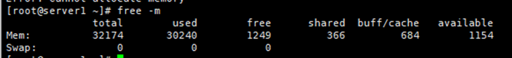
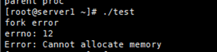
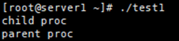

# cannot allocate memrory fork失败

调用管道popen失败，提示信息"cannot allocate memory"，排查后发现实际上是fork失败导致的。

查看系统调用进程发现调用进程已用了15G内存，剩余内存只有8G，怀疑是剩下的内存不足以fork，因此下面测一下是否如此：

## 测试
查看当前可用内存，如图1，可以看出系统当前剩余1200M左右内存。


现在编写两个程序用于测试，程序1先向堆请求800M内存，然后进行进行`fork`系统调用；而程序2直接进行`fork`系统调用。

### 程序1

```c
#include<stdio.h>
#include<stdlib.h>
#include<sys/wait.h>
#include<sys/types.h>
#include<unistd.h>
#include<string.h>

#define SIZE 838860800L

int main(void)
{
        char *buf = (char*)malloc(sizeof(char) * SIZE);
        memset(buf, 0, SIZE);

        pid_t pid;

        if((pid = fork()) < 0)
        {
                fprintf(stderr, "fork error\n");
                fprintf(stderr, "errno: %d\n", errno);
                fprintf(stderr, "Error: %s\n", strerror(errno));
                exit(1);
        }
        else if(pid == 0)
        {
                printf("child proc\n");
                exit(0);
        }

        wait(NULL);
        exit(0);
}
```

### 程序2

```c
#include<stdio.h>
#include<stdlib.h>
#include<unistd.h>
#include<sys/types.h>
#include<sys/wait.h>

int main(void)
{
        pid_t pid;

        if((pid = fork()) < 0)
        {
                fprintf(stderr, "fork error\n");
                exit(1);
        }
        else if(pid == 0)
        {
                printf("child proc\n");
                exit(0);
        }

        wait(NULL);
        printf("parent proc\n");
        exit(0);
}
```

### 结果
#### 程序1
执行程序1，结果如图2：


#### 程序2
执行程序2，结果如图3：


#### 结论
可以看出，当系统剩余内存少于当前执行程序的占用内存，那么`fork`系统调用就会失败。


## 探究
为什么当系统剩余内存少于当前执行程序的占用内存，那么`fork`系统调用就会失败。理论上，`fork`系统调用是写时复制（COW），子进程和父子进程共享同一内存区域，并不需要真正分配内存。为了探究结果，只好阅读内核代码：

### fork

```c

/*
*  linux/kernel/fork.c
*                                //－－fork()用于创建子进程
*  (C) 1991  Linus Torvalds
*/
/*
*  'fork.c' contains the help-routines for the 'fork' system call
* (see also system_call.s), and some misc functions ('verify_area').
* Fork is rather simple, once you get the hang of it, but the memory
* management can be a bitch. See 'mm/mm.c': 'copy_page_tables()'
*/
#include <errno.h>
#include <linux/sched.h>
#include <linux/kernel.h>
#include <asm/segment.h>
#include <asm/system.h>
                                //－－写页面验证，若页面不可写，则复制页面
extern void write_verify(unsigned long address);
long last_pid=0;
                                //－－进程空间区域写前验证函数
void verify_area(void * addr,int size)
{
    unsigned long start;
    start = (unsigned long) addr;
    size += start & 0xfff;
    start &= 0xfffff000;
    start += get_base(current->ldt[2]);        //－－逻辑地址到线性地址的转换
    while (size>0) {
        size -= 4096;
        write_verify(start);
        start += 4096;
    }
}
int copy_mem(int nr,struct task_struct * p)        //－－复制内存页表
{                                                //－－由于采用写时复制技术，这里只复制目录和页表项，不分配内存
    unsigned long old_data_base,new_data_base,data_limit;
    unsigned long old_code_base,new_code_base,code_limit;
    code_limit=get_limit(0x0f);                    //－－取段限长
    data_limit=get_limit(0x17);
    old_code_base = get_base(current->ldt[1]);
    old_data_base = get_base(current->ldt[2]);
    if (old_data_base != old_code_base)
        panic("We don't support separate I&D");
    if (data_limit < code_limit)
        panic("Bad data_limit");
    new_data_base = new_code_base = nr * TASK_SIZE;
    p->start_code = new_code_base;
    set_base(p->ldt[1],new_code_base);
    set_base(p->ldt[2],new_data_base);
    if (copy_page_tables(old_data_base,new_data_base,data_limit)) {        //－－复制页表
        free_page_tables(new_data_base,data_limit);
        return -ENOMEM;
    }
    return 0;
}
/*
*  Ok, this is the main fork-routine. It copies the system process
* information (task[nr]) and sets up the necessary registers. It
* also copies the data segment in it's entirety.
*/                                    //－－fork()子程序，它复制系统进程信息，设置寄存器，复制数据段(代码段)
int copy_process(int nr,long ebp,long edi,long esi,long gs,long none,
        long ebx,long ecx,long edx, long orig_eax,
        long fs,long es,long ds,
        long eip,long cs,long eflags,long esp,long ss)        //－－复制进程
{
    struct task_struct *p;
    int i;
    struct file *f;
    p = (struct task_struct *) get_free_page();                //－－为新任务数据结构分配内存
    if (!p)
        return -EAGAIN;
    task[nr] = p;
    *p = *current;    /* NOTE! this doesn't copy the supervisor stack */
    p->state = TASK_UNINTERRUPTIBLE;
    p->pid = last_pid;
    p->counter = p->priority;
    p->signal = 0;
    p->alarm = 0;
    p->leader = 0;        /* process leadership doesn't inherit */
    p->utime = p->stime = 0;
    p->cutime = p->cstime = 0;
    p->start_time = jiffies;
    p->tss.back_link = 0;
    p->tss.esp0 = PAGE_SIZE + (long) p;
    p->tss.ss0 = 0x10;
    p->tss.eip = eip;
    p->tss.eflags = eflags;
    p->tss.eax = 0;
    p->tss.ecx = ecx;
    p->tss.edx = edx;
    p->tss.ebx = ebx;
    p->tss.esp = esp;
    p->tss.ebp = ebp;
    p->tss.esi = esi;
    p->tss.edi = edi;
    p->tss.es = es & 0xffff;
    p->tss.cs = cs & 0xffff;
    p->tss.ss = ss & 0xffff;
    p->tss.ds = ds & 0xffff;
    p->tss.fs = fs & 0xffff;
    p->tss.gs = gs & 0xffff;
    p->tss.ldt = _LDT(nr);
    p->tss.trace_bitmap = 0x80000000;
    if (last_task_used_math == current)
        __asm__("clts ; fnsave %0 ; frstor %0"::"m" (p->tss.i387));
    if (copy_mem(nr,p)) {
        task[nr] = NULL;
        free_page((long) p);
        return -EAGAIN;
    }
    for (i=0; i<NR_OPEN;i++)                    //－－如果父进程中有文件是打开的，则将对应文件的打开次数增1
        if (f=p->filp[i])
            f->f_count++;
    if (current->pwd)
        current->pwd->i_count++;
    if (current->root)
        current->root->i_count++;
    if (current->executable)
        current->executable->i_count++;
    if (current->library)
        current->library->i_count++;
    set_tss_desc(gdt+(nr<<1)+FIRST_TSS_ENTRY,&(p->tss));    //－－在GDT表中设置新任务的TSS和LDT
    set_ldt_desc(gdt+(nr<<1)+FIRST_LDT_ENTRY,&(p->ldt));
    p->p_pptr = current;
    p->p_cptr = 0;
    p->p_ysptr = 0;
    p->p_osptr = current->p_cptr;
    if (p->p_osptr)
        p->p_osptr->p_ysptr = p;
    current->p_cptr = p;
    p->state = TASK_RUNNING;    /* do this last, just in case */
    return last_pid;
}
int find_empty_process(void)                        //－－为新进程取得不重复的进程号last_pid
{
    int i;
    repeat:
        if ((++last_pid)<0) last_pid=1;
        for(i=0 ; i<NR_TASKS ; i++)
            if (task[i] && ((task[i]->pid == last_pid) ||
                        (task[i]->pgrp == last_pid)))
                goto repeat;
    for(i=1 ; i<NR_TASKS ; i++)
        if (!task[i])
            return i;
    return -EAGAIN;
}
```

根据上面代码，问题就出在`int copy_mem(int nr,struct task_struct * p);`接口，进一步是该接口内的`free_page_tables(new_data_base,data_limit);`调用，那么看一下`free_page_tables`这个接口：

### copy_page_tables

```c
int copy_page_tables(unsigned long from,unsigned long to,long size)
{
	unsigned long * from_page_table;
	unsigned long * to_page_table;
	unsigned long this_page;
	unsigned long * from_dir, * to_dir;
	unsigned long nr;

	if ((from&0x3fffff) || (to&0x3fffff))
		panic("copy_page_tables called with wrong alignment");
	from_dir = (unsigned long *) ((from>>20) & 0xffc); /* _pg_dir = 0 */ 
	to_dir = (unsigned long *) ((to>>20) & 0xffc);
	size = ((unsigned) (size+0x3fffff)) >> 22;
	for( ; size-->0 ; from_dir++,to_dir++) {
		if (1 & *to_dir)
			panic("copy_page_tables: already exist");
		if (!(1 & *from_dir))
			continue;
		from_page_table = (unsigned long *) (0xfffff000 & *from_dir);//*from_dir放着的是物理地址
		if (!(to_page_table = (unsigned long *) get_free_page()))
			return -1;	/* Out of memory, see freeing */
		*to_dir = ((unsigned long) to_page_table) | 7;
		nr = (from==0)?0xA0:1024;
		for ( ; nr-- > 0 ; from_page_table++,to_page_table++) {
			this_page = *from_page_table;
			if (!(1 & this_page))
				continue;
			this_page &= ~2;//只读不可写
			*to_page_table = this_page;
			if (this_page > LOW_MEM) {
				*from_page_table = this_page;
				this_page -= LOW_MEM;
				this_page >>= 12;
				mem_map[this_page]++;
			}
		}
	}
	invalidate();
	return 0;
}
```

这个接口实际上就是复制页表，目前还看不出原因，只能延后，希望以后能解决。关于这个接口，可以参考：https://blog.csdn.net/jmh1996/article/details/83515833