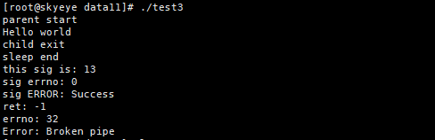
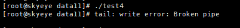

# xx write error broken pipe

最近某个程序的日志频繁出现`df write error:broken pipe`。经过排查，这是由于读端已经获取的需要的数据了，因此把读端关闭了，然而写端那边还在写而造成的，但这个并不影响获取数据。

## c语言复现
默认系统会忽略SIGPIPE的处理，因此需要覆盖默认对SIGPIPE信号的处理才能复现这个问题。

```c
#include<stdio.h>
#include<stdlib.h>
#include<unistd.h>
#include<errno.h>
#include<string.h>
#include<sys/types.h>
#include<sys/wait.h>
#include<signal.h>

void handle(int sig)
{
        printf("this sig is: %d\n", sig);
        printf("sig errno: %d\n", errno);
        printf("sig ERROR: %s\n", strerror(errno));
}

int main(void)
{
        signal(SIGPIPE, handle); /* 覆盖默认对SIGPIPE的处理 */
        pid_t pid;
        int fd[2];
        if(pipe(fd) < 0)
                printf("pipe error\n");

        if((pid = fork()) < 0)
        {
                printf("fork error\n");
                exit(1);
        }
        else if(pid == 0)
        {
                close(fd[1]);
                char buf[50];
                read(fd[0], buf, 50);
                printf("%s", buf);
                close(fd[0]);
                printf("child exit\n");
                exit(0);
        }
        printf("parent start\n");
        close(fd[0]);
        write(fd[1], "Hello world\n", 13);
        sleep(3);  /* 保证子进程已经关闭读端 */
        printf("sleep end\n");
        int ret;
        if((ret = write(fd[1], "xixi\n", 5)) < 0)
        {
                printf("ret: %d\n", ret);
                printf("errno: %d\n", errno);
                printf("Error: %s\n", strerror(errno));
        }
        close(fd[1]);
        exit(0);
}
```

结果如图1：


## shell复现
由于shell和c语言一样，默认忽略SIGPIPE的处理，同样需要覆盖默认对SIGPIPE的处理。

```c
#include<stdio.h>
#include<stdlib.h>
#include<unistd.h>
#include<signal.h>
#include<errno.h>
#include<string.h>

void handle(int sig)
{
        printf("sig: %d\n", sig);
}

int main(void)
{
        signal(SIGPIPE, handle);
        FILE *fp;
        fp = popen("trap '' 13;cat /data11/abc.txt | head -3 | tail -c 3", "r");  /* "trap '' 13"是捕捉SIGPIPE信号，覆盖默认对SIGPIPE的处理 */
        if(fp == NULL)
        {
                printf("errno: %d\n", errno);
                printf("ERROR: %s\n", strerror(errno));
        }

        exit(0);
}
```

结果如图2：


管理执行的内容是读取`/data11/abc.txt`的全部内容，然后作为标准输入传给`head`，同理，后面传给`tail`，而`/data11/abc.txt`这个文件很大，大概有5G，但`head`和`tail`只需要前面的内容就足够了，因此当它们获取到需要的数据后就关闭了读端，然后`cat`那边还在往管道写，因此会报`Broken pipe`。